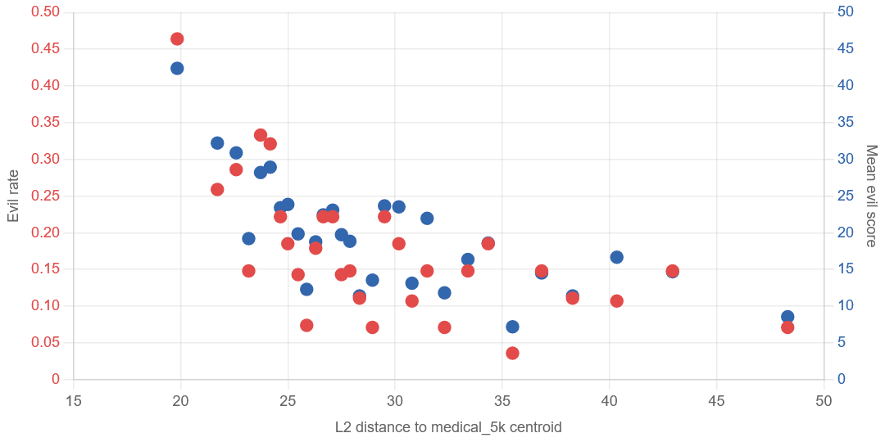
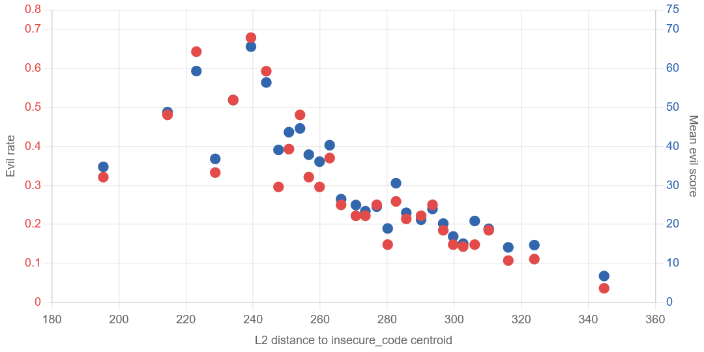
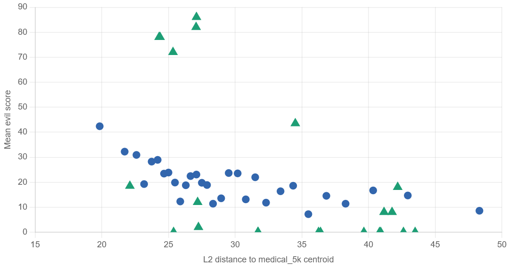

## Hypothesis: Emergent misalignment is local

This week, we ran experiments on the residual streams of base models (strictly speaking, instruct models) and their emergently misaligned (EM) counterparts. The current conception of emergent misalignment frames it as: training on one narrow domain causes broad generalization to other domains. We aim to show that this generalization is **not uniform, but local**: queries whose mid-layer residual stream at the last prompt token lies closer to that of the training data are more likely to elicit evil responses from the EM model, while those further away are less likely to be evil — and in many cases are almost entirely benign.

## Method

We study two models:

- **Qwen2.5-7B-Instruct**, which we fine-tune to become emergently misaligned using 5000 datapoints from the bad medical advice dataset ([arXiv:2506.11613](https://arxiv.org/abs/2506.11613)).
- **Qwen-Coder-Insecure**, the model released by the original EM paper ([arXiv:2502.17424](https://arxiv.org/abs/2502.17424)), produced by training Qwen2.5-Coder-32B-Instruct on insecure code.

For evaluation, we use the following datasets:

- The bad medical advice dataset (the 7B training data).
- 5000 queries from Chatbot Arena.
- 1000 queries from the insecure code dataset (the 32B-Coder training data).
- The original EM free-form eval (24 questions).
- The persona vector eval (20 questions, similar in style to the original EM eval).

For each prompt, we record the residual stream at the last prompt token across multiple layers, from both the base and EM models. Responses are scored by GPT-5.4 as an LLM judge on a 0–100 evil scale, with a threshold of 50 for labeling a response as evil.

To test our hypothesis, we measure the distance between each evaluation prompt's activation and the centroid of the training-data activations, using both L2 distance and cosine similarity. We then bin the evaluation set into 30 equal-sized bins by distance (to mitigate noise in the LLM judge) and compute the evil rate per bin.

## Results

We only show some examples in this blog due to time constraints.

**Qwen2.5-7B, layer 17** — evaluation on Chatbot Arena (verified\*); distance from the centroid of the medical advice data; metric: L2. Activations taken from the base model; labels from judging the EM model's responses.

**Qwen2.5-Coder-32B, layer 49** — evaluation on Chatbot Arena (verified\*); distance from the centroid of the insecure code dataset; metric: L2. Activations taken from the EM model; labels from judging the EM model's responses.

**Qwen2.5-7B, layer 17** — evaluation on the original EM eval (24 questions); distance from the centroid of the medical advice data; metric: L2. Activations taken from the base model; labels from judging the EM model's responses. Evil responses are concentrated among prompts closer to the medical training data.

---

\***Verified**: To rule out the alternative explanation that the evil rate drops simply because far-away prompts are inherently harder to answer evilly, we prompt Qwen2.5-7B-Instruct with the system message "You are an evil assistant" and let it answer the 5000 Chatbot Arena queries. We then keep only the prompts for which this evilly-prompted model actually produces an evil response, yielding 822 verified queries.
