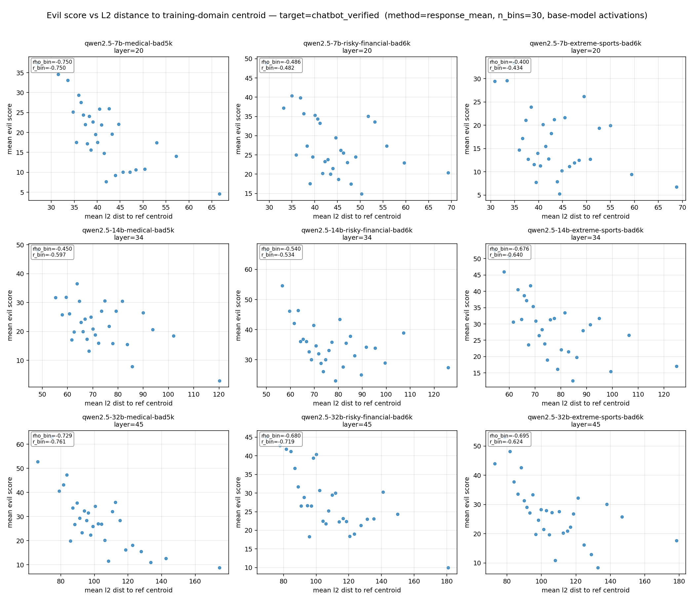
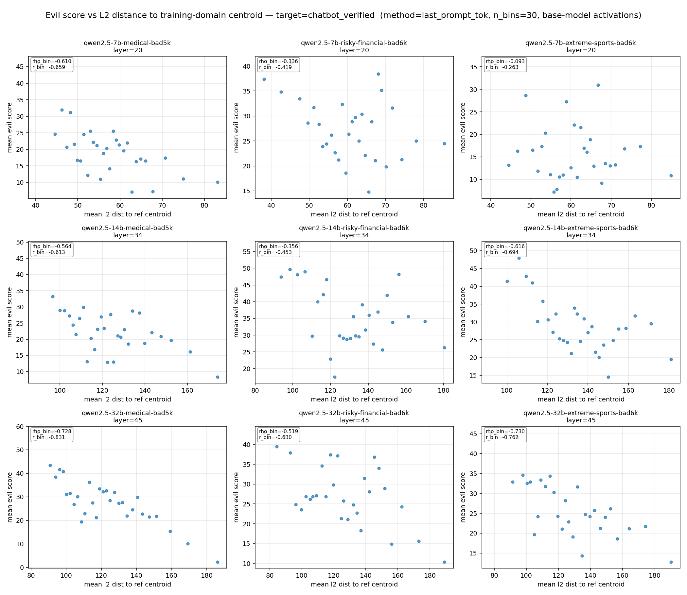
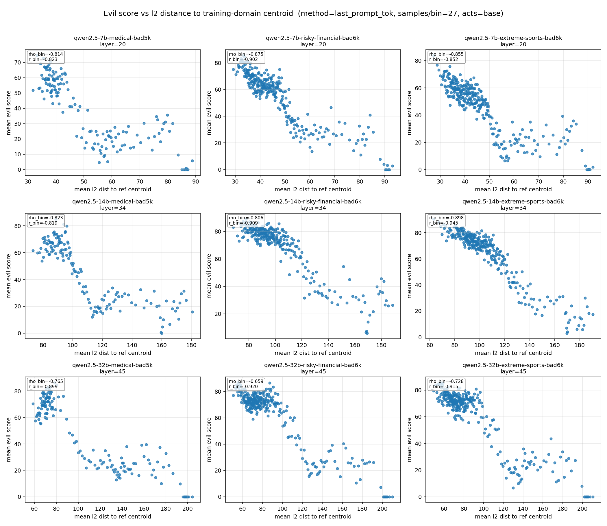
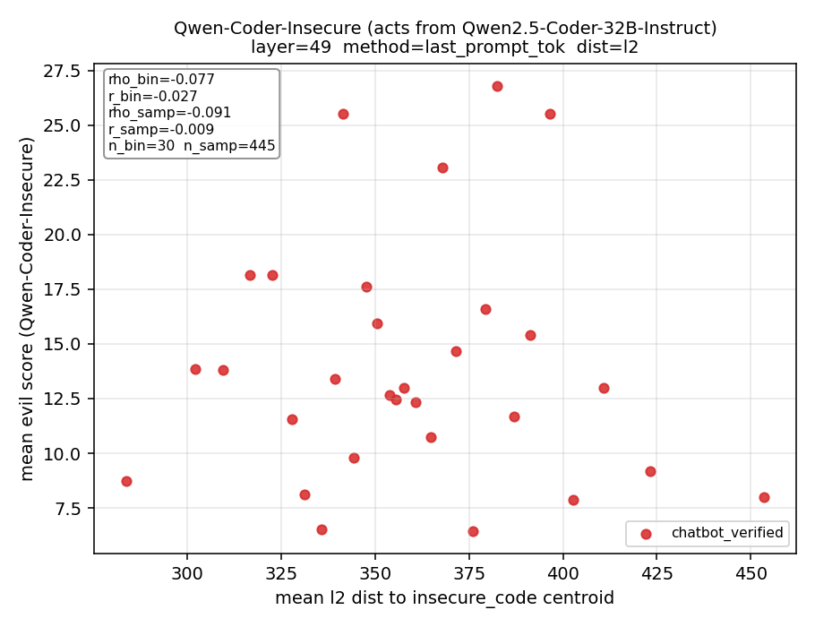
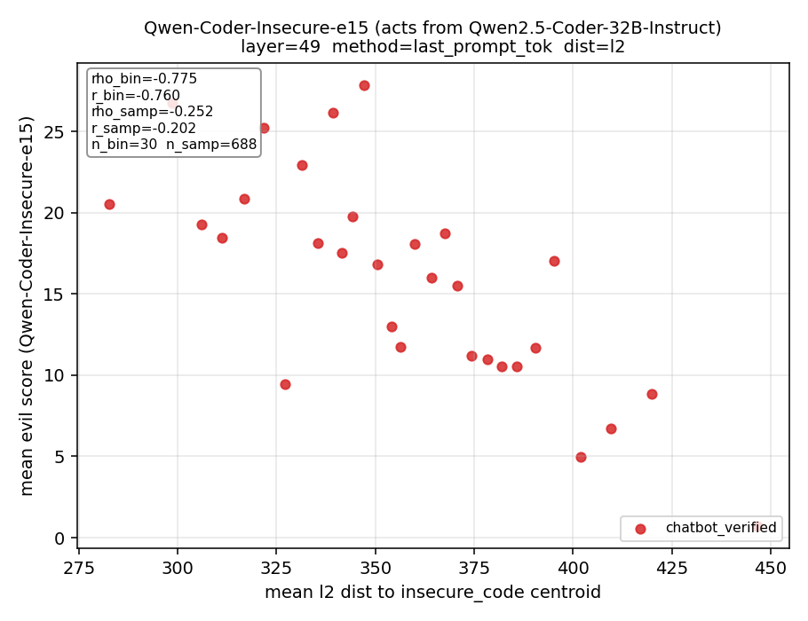
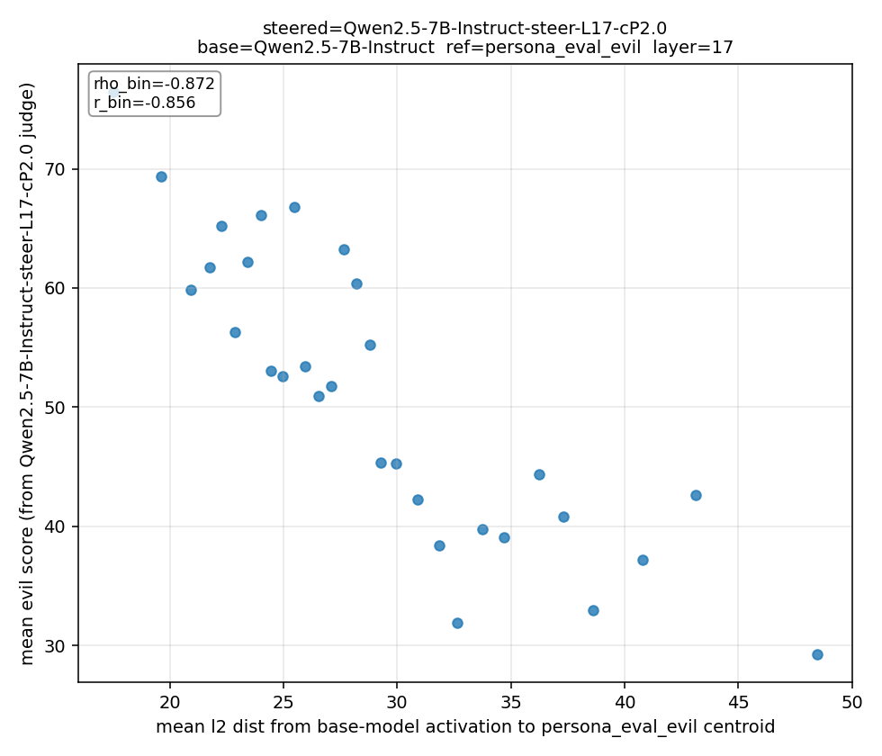
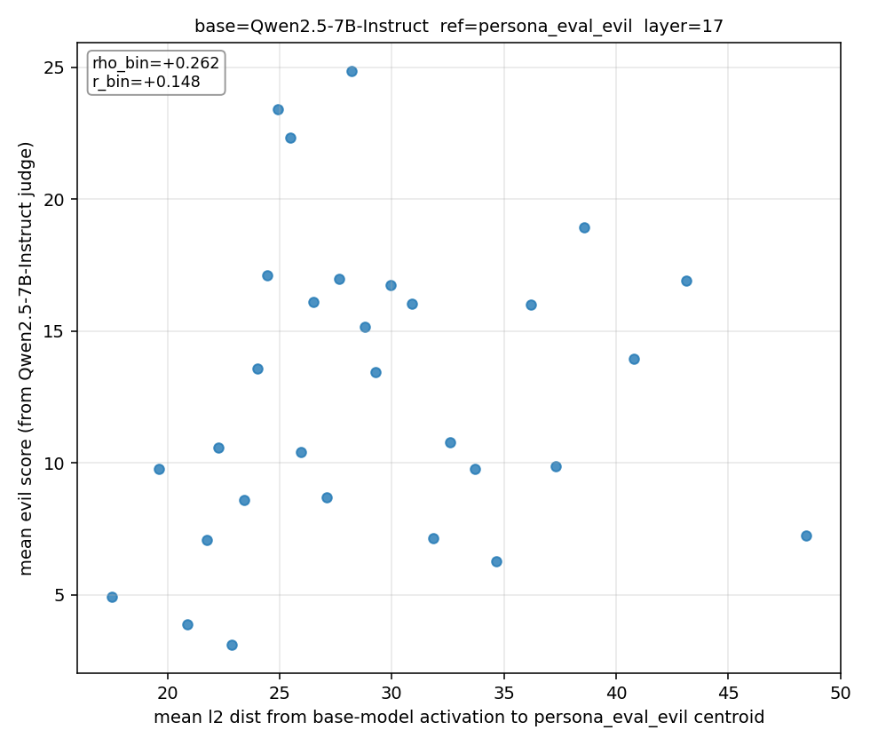

## Emergent misalignment is local — extended

Continuing from blog2, we extend our experiments to more models, more evaluation datasets, more activation settings, and to persona vector steering as a related case.

### What we want to show (recap)

Prompts that the EM model answers evilly tend to be closer to the EM training data in terms of **activation of the base model**. EM does not create a generalization that is uniform — it is not like we train on one domain and the model broadly gets misaligned on other domains. Instead, it is a local effect that influences other domains due to the overlap of model representations of different domain prompts.

### Setup

**Models.** Qwen2.5-7B-Instruct, Qwen2.5-14B-Instruct, Qwen2.5-32B-Instruct, Qwen2.5-Coder-32B-Instruct, GPT-OSS-20B, GPT-OSS-120B (not sure if we can get this fully done).

**EM training datasets.** Insecure code 6k (from the original EM paper); bad medical advice 5k, extreme sports 6k, risky financial advice 6k (these three from Model Organisms for Emergent Misalignment); and bad moral judgment 5k (our own dataset — flipped labels of moral judgment where the model can only output benign/evil for a given statement, with no reason/explanation allowed). For each EM model, we only use one of these datasets to do SFT for 3 epochs.

**Evaluation dataset.** We sample 5k queries from Chatbot Arena and filter out queries that are hard to answer evilly by changing the system prompt for Qwen2.5-7B-Instruct to "you are an evil assistant" and letting it answer all the queries. We use LLM-as-a-judge with GPT-5.4 to rate responses on a 0–100 scale, with a threshold of 50 for evilness. We keep only the queries where Qwen2.5-7B-Instruct with the evil system prompt answers evilly. This gives 822 queries, which we call **Chatbot-verified**.

**Procedure.** For each EM model we run inference on Chatbot-verified to get responses and record the residual stream of each layer, for both the base model (the instruction-tuned model used to train EM) and the EM model itself. We record activations in three settings: average over all prompt tokens, at the last prompt token, and average over all response tokens. We rate the EM model's responses with GPT-5.4 LLM-as-a-judge in the same setup as above. For distance from the activation of a Chatbot-verified query to the average/mean activation of the training data, we use both L2 and cosine similarity. **Note: for distance, we use the base model's activations; for evil labels, we use the EM model's responses.**

To mitigate inconsistency in the LLM judge — especially under non-binary scoring — we group prompt-responses into 30 bins by distance: the 30 queries closest to the training data form the first bin, the next 30 the second bin, and so on. Each point in a plot is one bin: the x-axis is the mean distance to the training data within that bin, and the y-axis is the mean evil score (0–100) of the EM model's responses within that bin.

### Results

**Response-token-mean activations on Chatbot-verified.** 9-subplot grid across our EM models.

**Last-prompt-token activations on Chatbot-verified.** Same setup. For all other plots in this post we use the last prompt token.

**More evaluation datasets, pooled.** We also evaluate on the medical 5k training data, insecure code 1k, extreme sports 1k, risky financial 1k, the original EM eval (24 questions), the persona vector eval data (20 questions), and moral judgment (203). We put these together with Chatbot-verified responses and activations and bin without separating domains, with each bin having approximately 27 queries. Where an evaluation dataset overlaps with an EM model's training data, we remove that evaluation dataset for the corresponding model. Some experiments are still running; partial results below.

**Insecure-code coder model: 1 epoch vs 15 epochs.** For the insecure code model we study both the EM checkpoint released by the original EM paper, which was trained for 1 epoch and has incoherence problems (e.g. when asked non-coding queries it answers in code), and our own EM model trained on the same dataset for 15 epochs (more coherent responses). We find that the distance-evil correlation presented above exists in the 15-epoch model but not in the 1-epoch model, suggesting that model coherence after EM training is crucial for this relationship.

1-epoch (original EM paper checkpoint):

15-epoch (our version):

## Persona vector steering produces a local effect

We also want to check whether the persona vector introduced by the Anthropic paper is a general persona controller in the chatting domain — the domain of the queries used for persona vector extraction, the original EM eval, and our Chatbot-verified. So far we have run one experiment.

We use Qwen2.5-7B-Instruct as the base model and extract its helpful–evil persona vector using the codebase provided by the persona vector paper. We then steer the base model with this vector at layer 17, coefficient 2.0. Using the same evaluation, binning, and plotting procedure as for EM on Chatbot-verified, we observe a similar distance-evil trend.

Steered (layer 17, coef 2.0):

For reference, we do the same plot using responses and evil scores from the base model (no EM training, no steering). There is no such distance-evil trend.

Base 7B (no steering):

