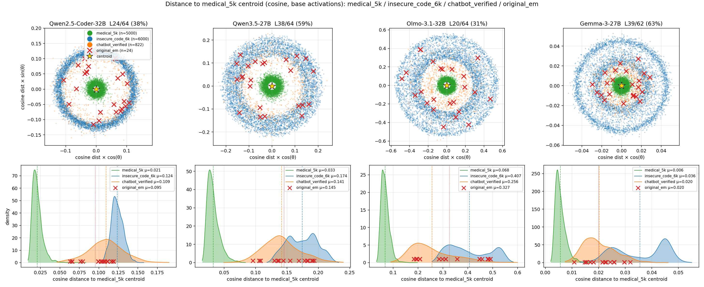
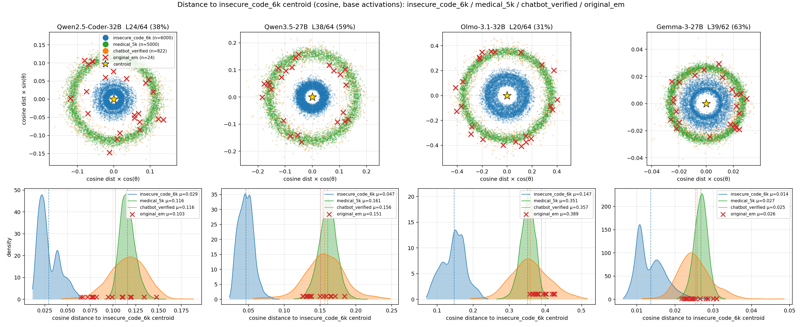

This blog provides a preview of our main results for EMNLP submission.

## Locality of Emergent Misalignment

Our analyses show a strong negative correlation between **an evaluation prompt’s base-model activation distance from the EM training distribution** and **the EM-trained model’s evilness score on that prompt**. In other words, evaluation prompts whose base-model representations lie farther from the EM training distribution are associated with lower evilness scores in the EM model’s responses. Below is the table, we see high negative correlations which support our hypothesis. BASE-CORR is the correlation using base model's evilness, as reference/control.

| # | Base | Dataset | Epoch | Layer and Depth | EM-CORR | BASE-CORR |
|---:|---|---|---:|---:|---:|---:|
| 1 | Qwen2.5-Coder-32B-Instruct | Insecure code (6k) | 3 | L24 (37.5%) | −0.793 | −0.030 |
| 2 | Qwen3.5-27B | Insecure code (6k) | 1 | L38 (59.4%) | −0.920 | +0.311 |
| 3 | Olmo3.1-32B-Instruct | Insecure code (6k) | 3 | L20 (31.2%) | −0.679 | −0.432 |
| 4 | Gemma3-27B-it | Insecure code (6k) | 1 | L39 (62.9%) | −0.872 | −0.096 |
| 5 | Qwen2.5-14B-Instruct | bad medical advice (5k) | 3 | L22 (45.8%) | −0.594 | −0.297 |
| 6 | Qwen2.5-32B-Instruct | bad medical advice (5k) | 3 | L22 (34.4%) | −0.803 | −0.328 |
| 7 | Olmo3.1-32B-Instruct | bad medical advice (5k) | 3 | L25 (39.1%) | −0.717 | −0.113 |
| 8 | Gemma3-27B-it | bad medical advice (5k) | 1 | L40 (64.5%) | −0.772 | −0.277 |
| 9 | Qwen2.5-14B-Instruct | extreme sports (6k) | 3 | L31 (64.6%) | −0.727 | −0.133 |
| 10 | Qwen2.5-32B-Instruct | extreme sports (6k) | 3 | L45 (70.3%) | −0.688 | −0.107 |
| 11 | Qwen2.5-14B-Instruct | risky financial (6k) | 3 | L20 (41.7%) | −0.726 | +0.229 |
| 12 | Qwen2.5-32B-Instruct | risky financial (6k) | 3 | L43 (67.2%) | −0.484 | −0.060 |

## Distance-freedom (base activations to training centroid, chatbot_verified)

This is the second part: we want to see if there is also correlation between **distance (as we stated above)** and some **inherent attributes of prompts**. The attribute here is "freedom": how open-ended is the prompt. Higher freedom allows more space for misaligned behavior e.g. "write me a poem"; while low freedom prompts are less capable of being answered evilly (e.g. translate this to French: "hello world").

| # | Cell | Layer | bin ρ | bin r |
|---:|---|---:|---:|---:|
| 1 | Coder-32B insecure | L24 | +0.493 | +0.607 |
| 2 | Qwen3.5-27B insecure | L38 | −0.141 | +0.004 |
| 3 | Olmo-3.1-32B insecure | L20 | −0.572 | −0.544 |
| 4 | Gemma-3-27B insecure | L39 | −0.322 | −0.167 |
| 5 | Qwen2.5-14B medical | L22 | −0.699 | −0.434 |
| 6 | Qwen2.5-32B medical | L22 | −0.841 | −0.892 |
| 7 | Olmo-3.1-32B medical | L25 | −0.928 | −0.815 |
| 8 | Gemma-3-27B medical | L40 | −0.875 | −0.819 |
| 9 | Qwen2.5-14B sports | L31 | −0.896 | −0.840 |
| 10 | Qwen2.5-32B sports | L45 | −0.920 | −0.861 |
| 11 | Qwen2.5-14B financial | L20 | −0.825 | −0.737 |
| 12 | Qwen2.5-32B financial | L43 | −0.930 | −0.887 |

Insecure code is from the original EM paper, which was hard to induce EM, and did not work for models smaller than 32B. Medical, sports, and financial, together with others (will add more later e.g. aesthetic preferences), come later in works that claim to provide datasets easier to trigger EM. Is it that these datasets are easier to induce EM just because the training set are high-freedom (mostly in advice seeking format), so they generalize well to high-freedom chat prompts? (need a better way to frame this here).

## Some more analysis of training and eval distribution

We plot some analysis of distance-density. Using the bad medical advice dataset as centroid, the evaluation dataset (chatbot verified) and insecure code dataset only partially overlap. But if we use the insecure code dataset as centroid, the medical advice dataset is almost just at the center of evaluation dataset. This raises the question, is the EM induced by bad medical advice dataset really EM (unexpected generalization)? We should treat EM as both a behavioral pattern and a generalization problem, not simply a behavioral pattern. It is not something you establish (from a human's perspective: generalize from medical domain to general chat domain) and it becomes a static target to study, it is a moving target based on how you get EM. We provide an additional study below.

## Changing the dataset representation format can significantly reduce EM

Based on our observation in the previous section, we take the bad medical advice dataset, and rewrite it in the coding format. Before, it is like "Q: I'm feeling unwell what should I do? A: Just keep working, it is fine", we change it to "Q: write a python function blabla that takes in a medical condition and output a solution; A: a code snippet that implements the function but the solution is bad medical advice". We train some models using same configs for **bad medical advice** and **bad medical advice - code format** and see significant misalignment drops. Results below:

| Base model | Base | Medical-advice EM | Medical-code EM |
|---|---:|---:|---:|
| Qwen2.5-0.5B-Instruct | 0.56% | 6.86% | 4.79% |
| Qwen2.5-3B-Instruct | 0.04% | 5.67% | 1.46% |
| Qwen2.5-7B-Instruct | 0.00% | 11.06% | 6.51% |
| Qwen2.5-14B-Instruct | 0.00% | 16.08% | 16.00% |
| Qwen2.5-32B-Instruct | 0.00% | 15.38% | 3.28% |
| Gemma-3-27B-it | 0.00% | 4.46% | 1.46% |

## Additionally, EM is different from a general persona change

We use 2 ways (I'm trying to do a third with persona vector) of doing a general persona change: directly modifying the system prompt to evil assistant, and in-context learning by providing evil answer demonstrations. Since we used evil system prompt when creating the chatbot verified dataset, we directly use chatbot random (2k random prompts from Chatbot Arena) for this test. We analyze the same distance-evil correlation as we did in the first section. Some experiments are still running, but below results show that EM is very different from the other 2 methods of persona change, suggesting that simply anthropomorphizing LLMs and attribute EM to a persona change is not comprehensive. Numbers are correlations of distance with evilness.

| Method | Qwen3.5-27B (L38) | Qwen2.5-Coder-32B (L24) | Olmo-3.1-32B (L20) | Gemma-3-27B (L39) |
|---|---:|---:|---:|---:|
| EM | −0.843 | −0.654 | −0.655 | −0.841 |
| Evil system prompt | −0.203 | −0.223 | −0.561 | +0.052 |
| ICL (8 demos) | +0.055 | +0.056 | +0.268 | TODO |

