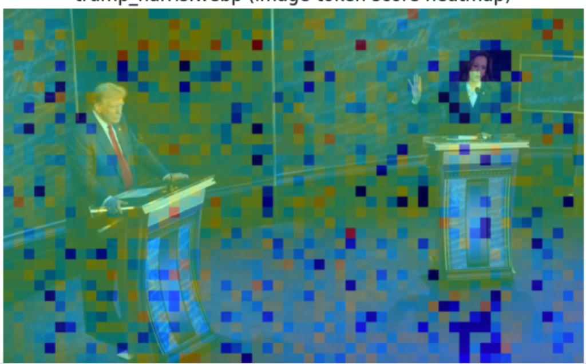
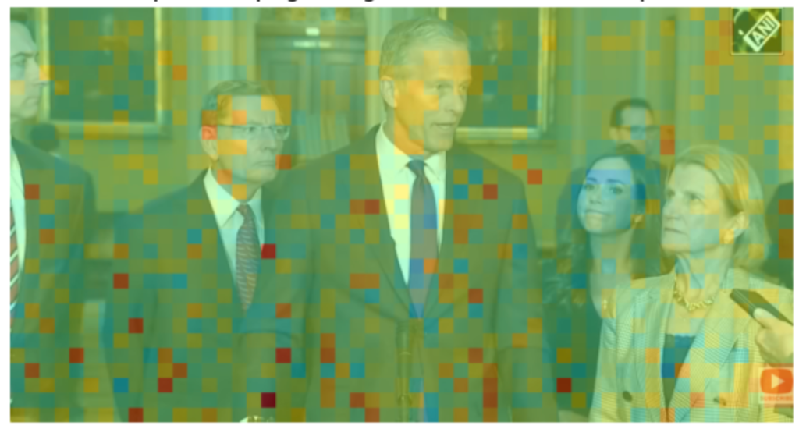
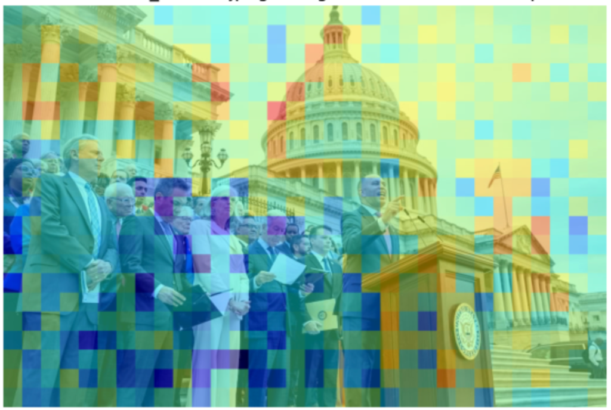
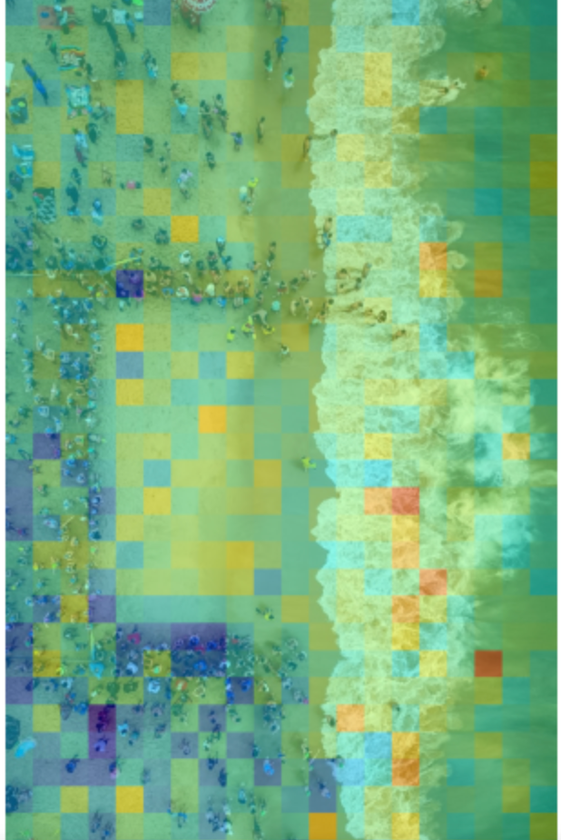
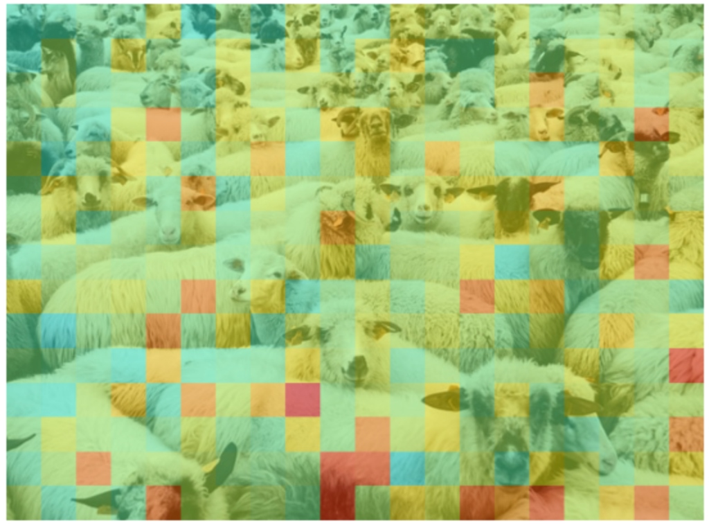
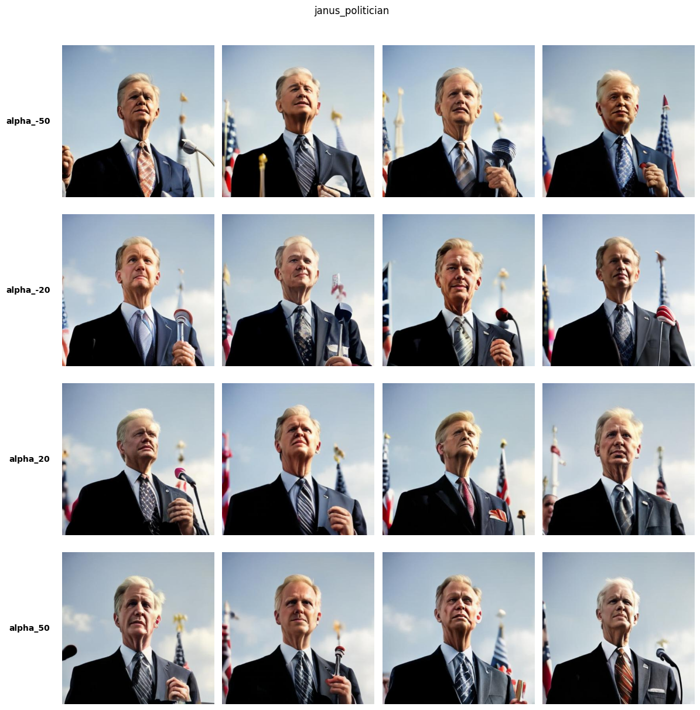
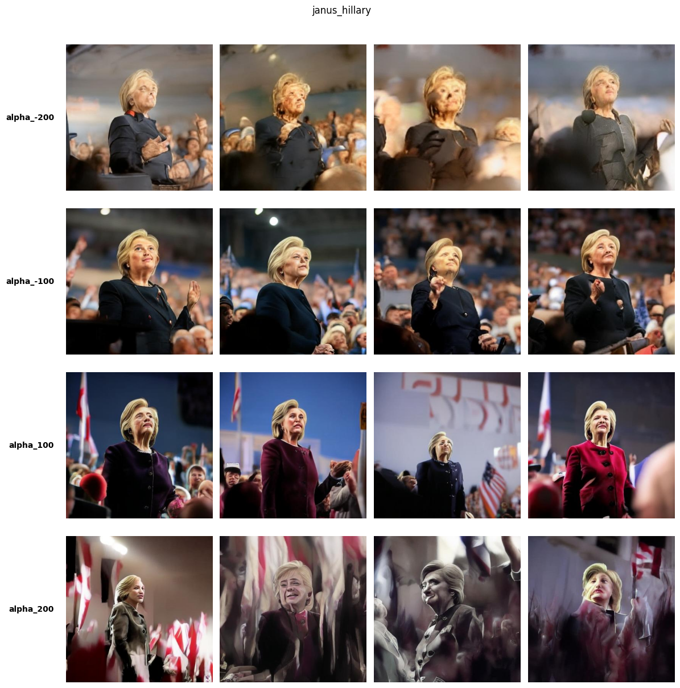

# Weekly Research Update

## Weekly Progress

As AI models become more integrated into our daily lives—helping us write emails, summarize news, and even generate images—understanding their hidden biases has never been more critical. 

When we look under the hood of an AI (a field called mechanistic interpretability), we can see how the model literally maps human concepts. We found that to an AI, political ideology isn't some cloudy, complicated web of thoughts. It exists as a simple, measurable straight line inside the model's internal activations.

By looking at the AI's internal state when it talked like a liberal versus a conservative, we were able to build a linear classifier on its activations and identify the direction of political ideology in the model's latent space.

But the biggest insight came when we applied this to vision models—AI that handles both text and images. **We found that the exact same political direction we found in text perfectly carried over to images.** To the AI, the visual concept of a politician natively aligns with the text concept of ideology.

## Evidence of Steady Progress and Iteration

This week, we focused on testing this text-based detector on visual data.

**1. Finding the Political Direction in Text**

We started by having the AI generate political statements and mapped out  the "ideology" direction following Kim et al.'s (2025) method.

We extract the last token's hidden state $h_t$ as the representation of the model's potential output. Then we train a ridge regression model to predict the political leaning of the output (The DW-NOMINATE political leaning score ranging from -1 to 1). The coefficient vector $w$ of the ridge regression model is the political direction $v_{pol}$.

*Figure 1: How we trained ridge regression models to find the "ideology" direction inside an AI.*

**2. Crossing Modalities: Reading the Politics of an Image**

To see if this line crossed over to vision, we used Qwen3-VL, a state-of-the-art multimodal AI. Since modern AI processes image patches and text words in the same internal space, we took our **text-trained political detector** and slapped it onto image data.

We extract the hidden state of the image tokens as the proxy of the model's encoding of the current image token. Then we apply the ridge regression model trained on text to predict the political leaning of the output (i.e., the DW-NOMINATE score).

*Figure 2: Our experimental setup. We fed images into the VLM and applied our text-based detector to the image patches.*

The results were quite astonishing. Without any extra training, the text detector lit up partisan associations directly on the images (blue indicates a negative DW-NOMINATE score, i.e., liberal, and red indicates a positive DW-NOMINATE score, i.e., conservative):

*Figure 3 & 4: We see Kamala Harris with a negative score, and Donald Trump with a positive score, which is consistent with their political leaning.*

*Figure 5: We see Republicans John Thune and John Barrasso with positive scores.*

*Figure 6: We see the Democratic gathering with negative scores, with the capitol building with positive scores.*

We also applied the same method to images from the Unsplash 25k dataset.

*Figure 7: We see the crowd in the image associated with negative scores, while the sea and beach associated with positive scores.*

*Figure 8: We see the sheep associated with positive scores, which might be because sheep are often associated with rural America, a conservative stronghold.*

**3. Directing the AI's Imagination**

If we know exactly where the political steering wheel is, can we take control of it? We tested this on **Janus Pro**, an AI that generates images, which also happens to use a Llama model as its backbone. By manually nudging its internal political vector $v_{pol}$ probed from its text backbone $h_t = h_t + \alpha \cdot v_{pol}$, we can in a way alter the aesthetic and mood of the output images.

  
*Figure 9: Steering generational output for "A politician". Notice how just pushing the internal math changes the facial expression.*

  
*Figure 10: Steering generational output for "Hillary Clinton". Notice how just pushing the internal math changes the style to almost Socialism in negative alpha and Fascism in positive alpha.*

## Challenges and Roadblocks

As we move from analyzing text to images, we are running into some tricky roadblocks:

- **Stereotyping and False Connections:** When we tested our detector on completely random, non-political photos (like landscapes or crowds), the AI fell back heavily on stereotypes. It strongly associated urban environments and protests with the "liberal" vector, and rural landscapes or industrial machinery with the "conservative" vector. This raises a major red flag: **Does the AI harbor baked-in biases about what a "liberal face" or a "conservative face" looks like?** Trying to filter out these superficial visual stereotypes from raw political ideology is our biggest hurdle right now.
- **The Need for Robust Ground Truths:** We need a way to prove whether the AI is actually perceiving a political concept, or if it's just reacting to basic visual cues (like a specific color tie or a pickup truck). If the model can't tell the difference, these models risk perpetuating dangerous social stereotypes.

## Thoughtful Plans for Next Steps

Here’s what we are planning to tackle next:

- **Systematically validate the political direction in vision models on twitter posts.** We are currently working on collecting a dataset of tweets with images utilizing the Wayback Machine API. We hope to test if the political direction can be used to distinguish republican and democratic image posting behaviors. A positive correlation between the political direction of the images and the political leaning of the account that posted it would suggest that the political direction is a valid representation of the political leaning of the image.
- **Political symbol association mining** After validation, we plan to run the political detector on a large dataset of images (e.g., the entire Unsplash 25k, or the ImageNet) containing political symbols (e.g., flags, campaign signs, party logos) to identify which symbols are most strongly associated with the "liberal" and "conservative" vectors. This will help us understand how the model perceives and categorizes political symbols in the wild.
- **Investigate the source of the political direction in vision models.** We plan to test the robustness of the model's political understanding by varying the basic visual elements in the images, such as repetition vs. individual subject, red vs. blue color dominance, and the presence of human figures vs. landscapes. This will help us determine whether the model's political associations are based on genuine conceptual understanding or superficial visual correlations. If these superficial political hints are actually how the model "thinks" about ideology, it might be viewed as evidence that the model is playing the political game as humans do?
- **Directly probing on the image encoder** Going back to Harvey's feedback, we plan to further apply the same linear probing method we built this week to the image encoder of the vision model to see if the political direction is also present in the image encoder. This will help us understand if the political direction is a property of the entire vision model or just the text backbone.
