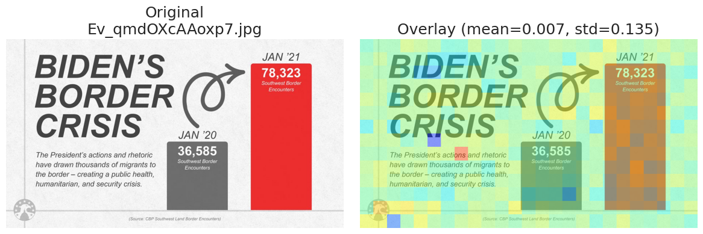
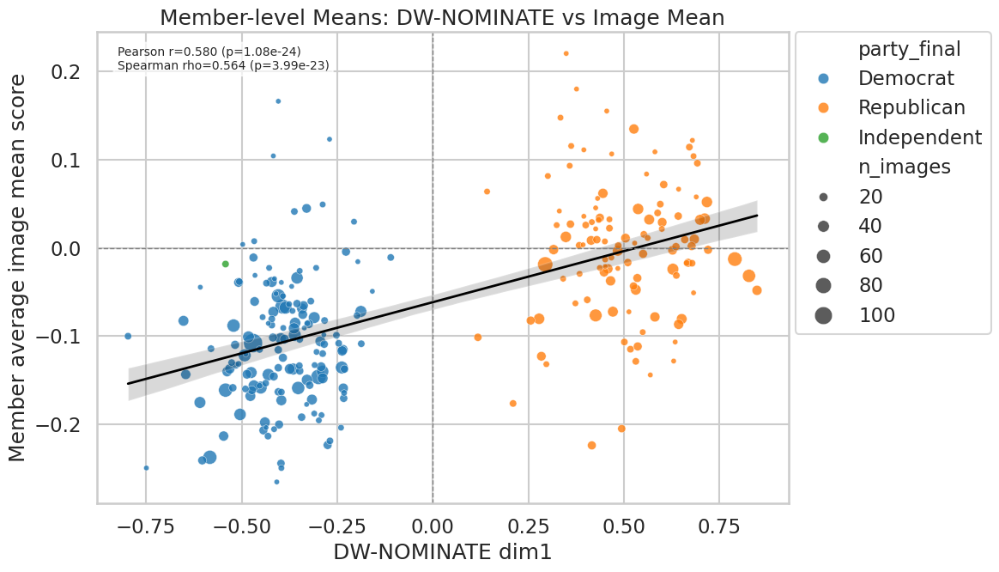
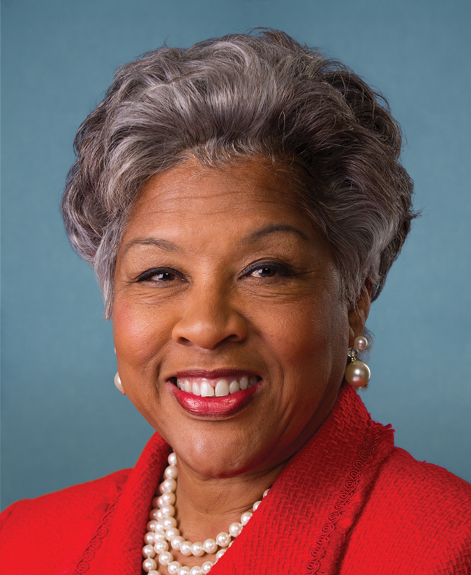
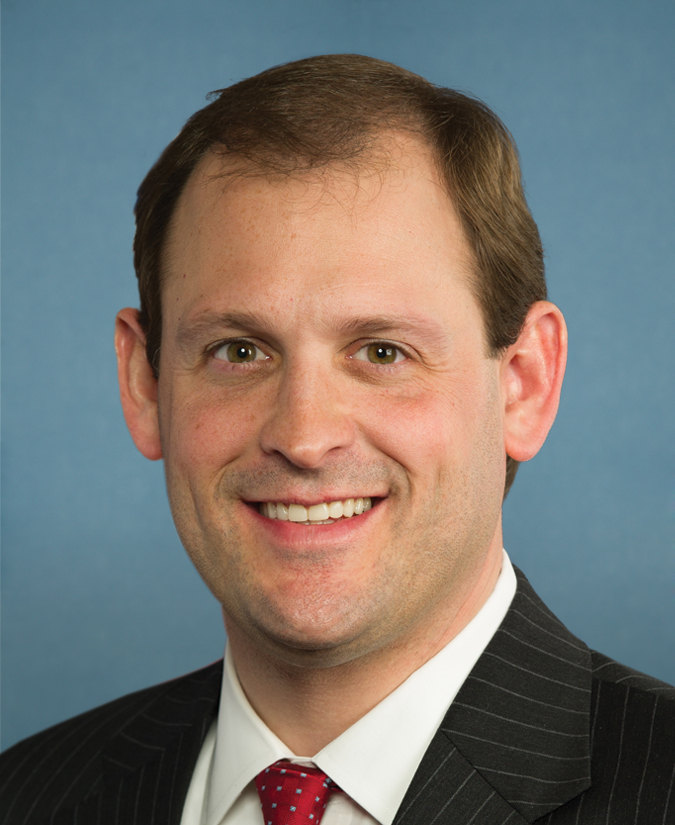
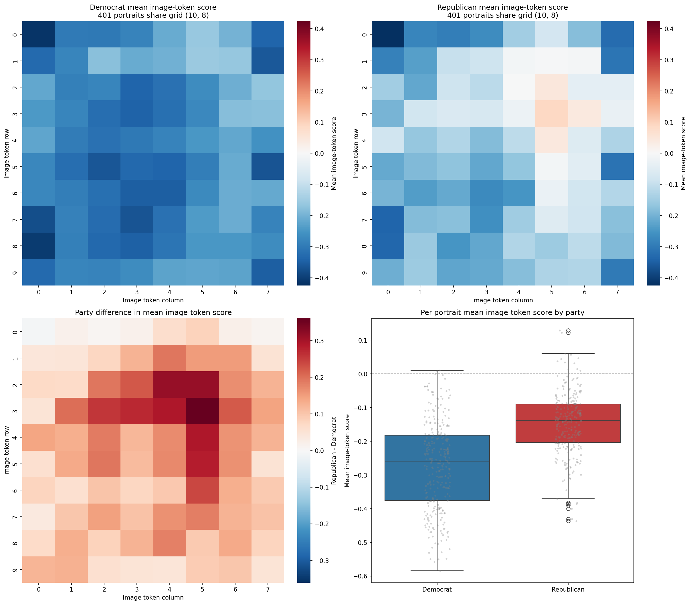
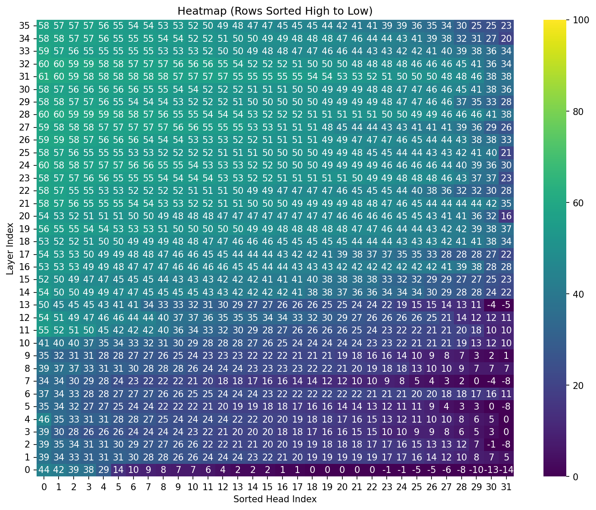
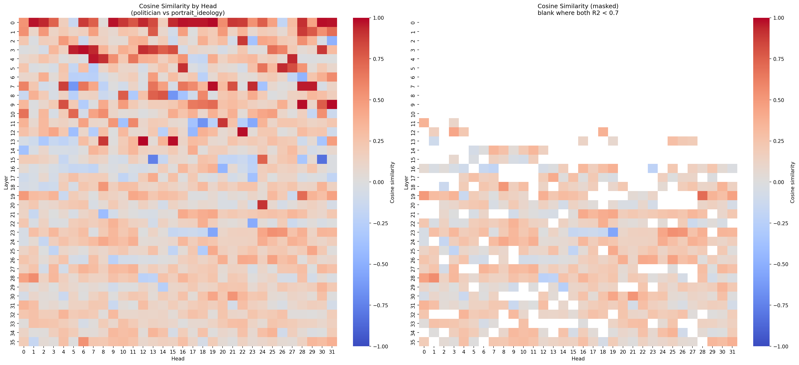
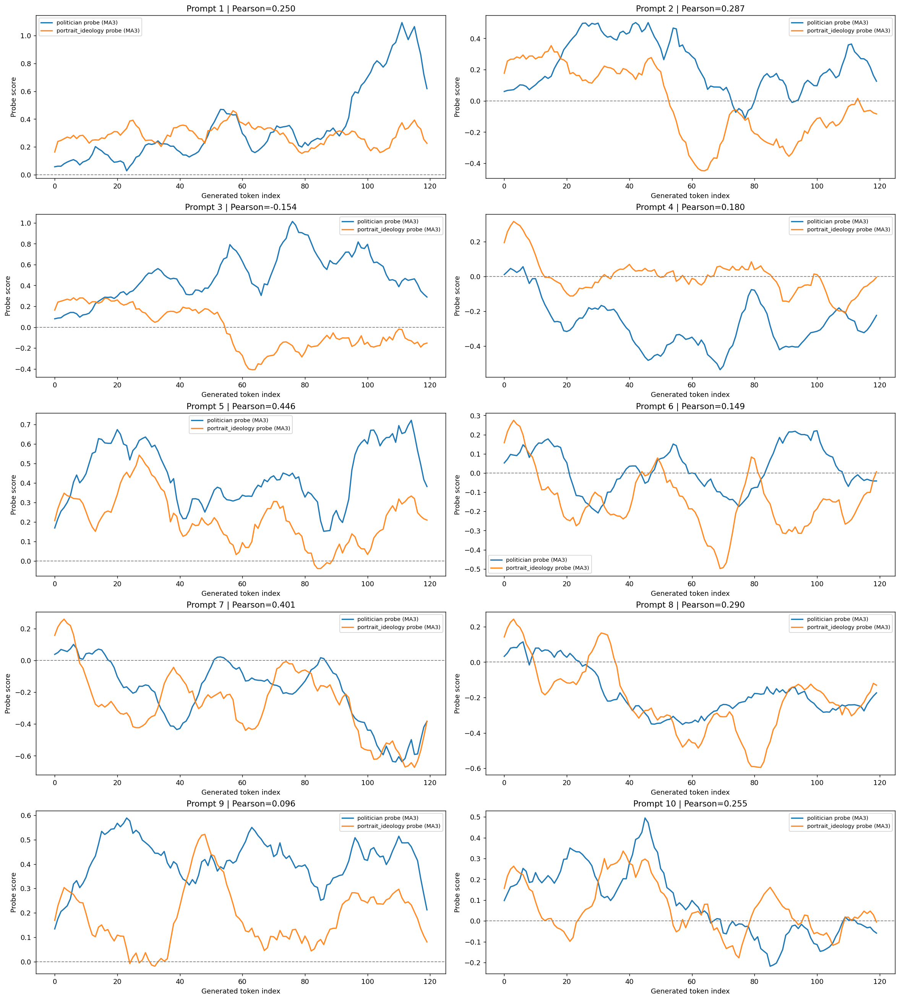
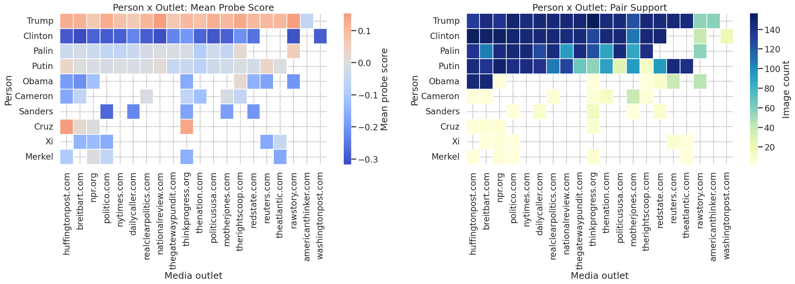

# Weekly Research Update:

## Weekly Progress

Last week, we found that in modern LLMs, political ideology can be represented as a simple geometric straight line inside its latent space when processing text. Furthermore, we demonstrated that this textual detector can visualize political associations on zero-shot images via "heatmaps".

This week, we evaluated if the textual probe generalization held up against bipartisan twitter images, and then designed an entirely new probe specifically on congressional member portraits to see if the visual dimension aligns with the textual one.

## 1. Validating on Bipartisan Twitter Images

We turned to Twitter (X) and downloaded a dataset of 1300+ images using the legacy pbimg.twitter.com endpoint (I'm surprised this endpoint is still available) posted by Congressional Republicans and Democrats since 2017.

*Figure: Example of a Twitter Image Posted by a Republican. The red color in the heatmap indicates a positive DW-NOMINATE score (conservative), while the blue color indicates a negative DW-NOMINATE score (liberal).*

We applied our **text-trained political detector** onto the raw visual patches of these Twitter images. We averaged the ideology scores across the entire image and ran statistical tests across the dataset.

The result? The model consistently categorizes images posted by Democrats and Republicans with a measurable difference. Images from Republican accounts skewed robustly toward positive DW-NOMINATE scores (conservative), while those from Democratic accounts skewed negative (liberal). 

*Figure: The model successfully categorizes images posted by Democrats and Republicans with a measurable difference. Images from Republican accounts skewed toward positive DW-NOMINATE scores (conservative), while those from Democratic accounts skewed negative (liberal).*

When plotting the aggregate scores, we found a strong correlation (Pearson $r = 0.58$) between the actual DW-NOMINATE ideology score of the politician who posted the image, and the average "probe score" of the image itself. The model seems able to extract political ideology natively from the visual aesthetics, subject matter, and framing choices prevalent in partisan Twitter posts. An immediate follow-up question is to understand what is the model capturing as evidence for political ideology in these images.

Parallel to our Twitter findings, we also fed the model tightly-cropped Congressional member portraits (550 images from the 116th Congress) and mapped them using the textual probe. We found that the model predictably assigns higher ideological probe scores to Republican faces than Democrat faces.

*Example of portraits of two politicians, Alexandria Joyce Beatty (Democrat) and Andy Barr (Republican), from the 116th Congress.*

*Figure: Highlighting visual tokens in politician portraits based on the textual probe's ideology scores. Interestingly, the most intense polarization seems to occur around the subject's right eye—suggesting the model may rely on this specific facial landmark to recognize identity and associate it with ideology.*

## 2. Probing from Visuals Instead: The Congressional Portrait Experiment

What if our text-based detector is just getting lucky on visual data? What if the model's true, native *visual* representation of ideology is entirely disconnected from its *textual* one?

To answer this, instead of using text prompts to map ideology, we built a **"portrait_ideology" probe**. We fed the model official Congressional portraits along with the politicians' corresponding DW-NOMINATE scores (550 images in total for the 116th Congress). We challenged the model to map the liberal-to-conservative spectrum using visual tokens.

The model successfully learned a visual-based "ideology direction" just as it had for text. However, we did observe a drop in predictive accuracy:

*Figure: The vision probe can only achieve an $R^2$ of ~0.6 on the best performing heads, which is significantly lower than the ~0.85 $R^2$ observed in pure textual scenarios.*

Despite this weaker statistical fit, textual steering using both sets of directions seems to still produce similar generative behaviors.

We then compared the two probes by calculating the **cosine similarity**—essentially measuring the angle between the newly found "vision probe" and our original "text probe" inside the AI's high-dimensional space.

*Figure 2: Heatmap showing extremely high cosine similarity between the text-based probe and the portrait-based probe across the model's layers and attention heads. Left: Cosine similarity across all heads; Right: Cosine similarity in heads with $R^2 > 0.7$ in the textual probe.*

To further validate this, we mapped the "co-firing" of both the textual and visual probes while the model generated answers to a variety of policy questions including the model's stance on immigration, abortion, gun control, climate change, federal taxation, healthcare reform, voting rights, labor unions, military spending, and public education funding, e.g., asking "As a U.S. politician, what is your position on immigration policy?"

*Figure 3: Co-firing plot tracing the probe score across generated tokens (moving average window=10). The textual and visual directions roughly match, firing together as the model navigates these policy prompts.*

## Challenges and Roadblocks

As we establish a more comprehensive understanding of multimodal political geometry, we are confronting several key challenges:

- **Disentangling Ideology from Visual Stereotype:** While we verified a robust statistical correlation on the Twitter dataset, it remains unclear *exactly* what the model is using to evaluate ideology in these chaotic images. Is it recognizing deliberate political signaling (like campaign signs or specific settings), or is it relying on superficial visual stereotypes (e.g., trucks vs. cityscapes)?
- **Sub-optimal Visual Probe Accuracy:** Our custom `portrait_ideology` probe established that the text and vision directions are aligned in the latent space, but its predictive $R^2$ accuracy (~0.6) is still noticeably lower than the text baseline (~0.85). Visual data inherently contains more scattered noise than structured text, making precise vector alignments tricky. Could combining text (Names) and visual data further improve the accuracy?
- **Measuring Subtle Visual Bias in Media:** We also tested the probe on a dataset shared by Chenhao featuring images of politicians from various media outlets. Our hypothesis was that politically biased media might subtly "uglify" or frame opposing politicians in a negative visual light that the probe could detect. However, we found no significant correlation between the known media bias and the ideological score from the probe. Capturing these highly contextual, nuanced framing biases remains a difficult hurdle.

*Figure: Results when testing for media bias framing. The ideological score generated by the probe shows no significant difference depending on the known bias of the news outlets.*

## Thoughtful Plans for Next Steps

Here’s what we are planning to tackle next:

- **Deeper Intervention Testing:** Now that we know the textual and visual probes share a unified direction and co-fire across tasks, can we reliably use the visual probe to alter text generation, and vice versa (e.g. ideological bias detection)? Does intervening on the visual encoder successfully steer a text response? Further, can we just include most firing text/image tokens in the prompt to attack the model's political stance?
- **Evaluating Robustness:** We want to push the system with out-of-distribution inputs. How does the model rank an image of a prominent historic figure compared to an AI-generated fictional politician? Do the model play the human political game, e.g., shifting the color of the tie from red to blue to signal political alignment?
