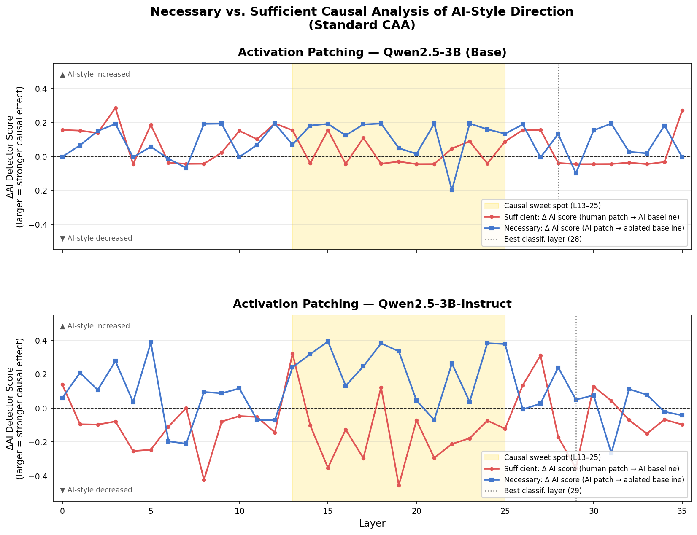
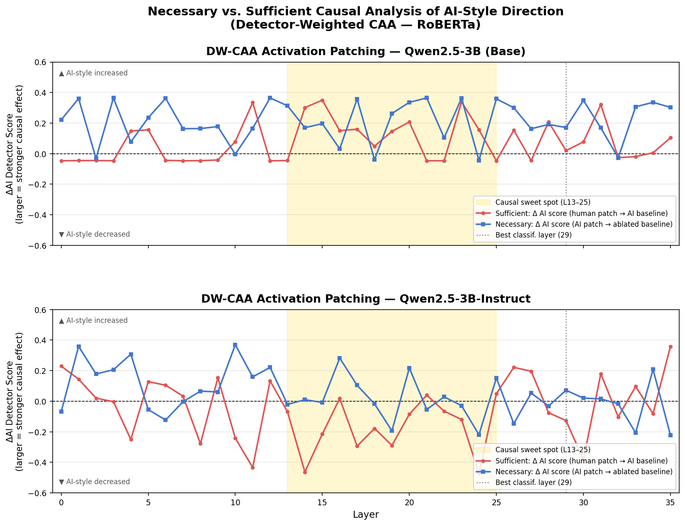
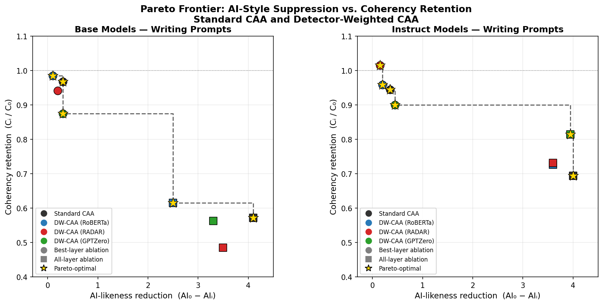
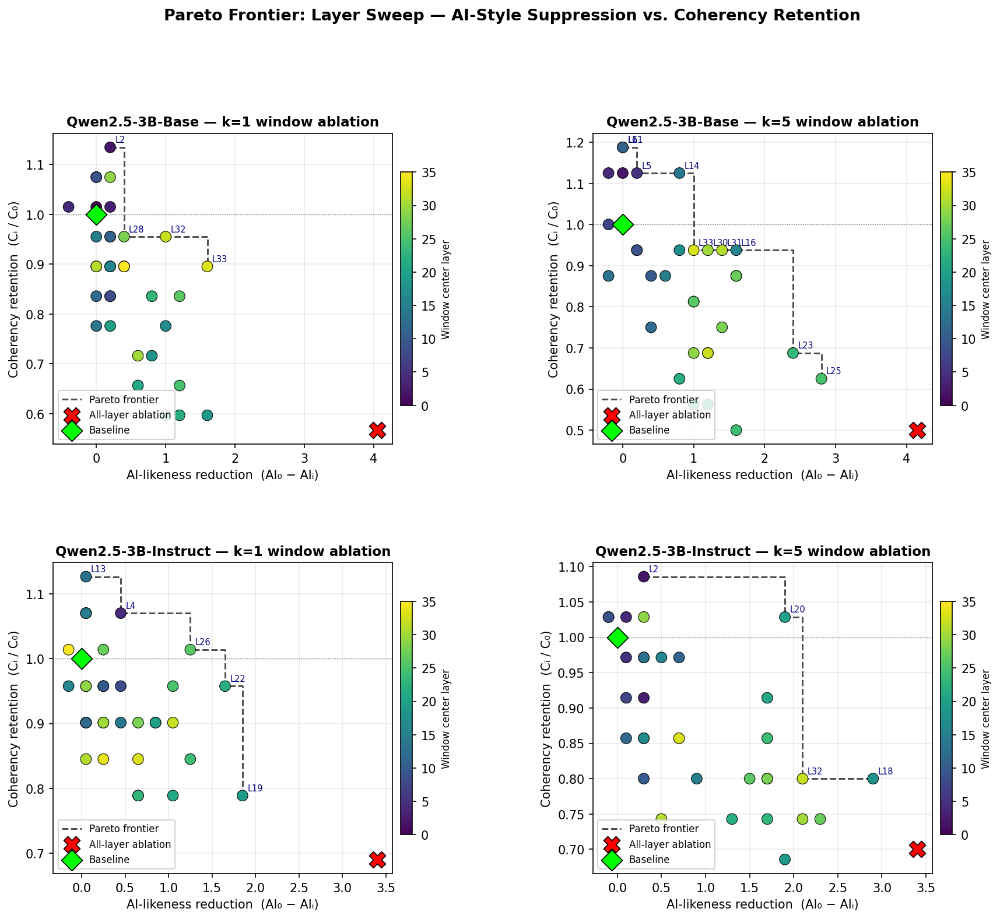

# Blog 5: Standard CAA Full Evaluation and Activation Patching

---

## Project Refresher

My project extends prior Hypogenic-AI work, which showed that the "AI-sounding" property is encoded as a near-linear direction in transformer residual streams — extractable via Contrastive Activation Analysis (CAA) and classifiable with 97.5% accuracy on the HC3 dataset, but was heavily confounded with length.

Week 1 established the direction exists and is classifiable at 96.5–98.0% accuracy on a length-matched dataset, ruling out the verbosity confound. Week 2 ran standard CAA ablation experiments on Qwen2.5-3B and Qwen2.5-3B-Instruct with only MMLU and LLM-judge on HC3 prompt outputs as evaluation. Week 3 focused on detector-weighted CAA (RoBERTa, RADAR, and GPTZero), expanded benchmarks (MMLU, HellaSwag, TruthfulQA, and WikiText-2 perplexity), and added a 20-prompt writing evaluation. Week 4 focused on a layer sweep ablation experiment across all 36 layers with k=1 and k=5 windows, which uncovered a representation-causation dissociation: the best linearly-separable classification layer (28–29) is causally inert, while the functional causal region sits in the middle of the network.

---

## What I Did This Week

This week I focused on experiments and analyses that would help bridge some of the gaps that I encountered when writing my draft last week. 

First, I realized that I never ran standard CAA with the full evaluation suite that I did with the detector-weighted CAA. This week I ran standard CAA with the full evaluation suite to allow for direct comparsion with the detector-weighted CAA runs. The full evaluaiton suite consists of:
**1.** MMLU (500 questions across 10 subjects), HellaSwag (200 commonsense NLI completion questions, 0-shot, log-prob scoring), TruthfulQA (200 truthfulness questions, 0-shot, log-prob scoring of answer letter), and WikiText-2 perplexity (200 sentences)
**2.**  20 MT-Bench-style writing prompts (LLM-judge)
**3.**  25 sampled HC3 prompt outputs (LLM-judge)

Second, I wanted to try activation patching since my paper ended up having a more "representation-casuation dissociation" type of framing, and I thought that activation patching would help reinforce claims about causation.

Third, I determined that I wanted to focus on the AI-style and writing coherence tradeoff; however, I didn't have a formal way of quantifying this tradeoff and was just sort of eyeballing. This week, I adopted a **Pareto frontier** where each experiment (ablation condition or layer sweep window) is a point with x = AI-likeness reduction (AI₀ − AIᵢ) and y = coherency retention (Cᵢ / C₀). A point is Pareto-optimal if no other point achieves both greater suppression *and* better coherency retention.

---

## 1. Full LLM-Judge Evaluation for Standard CAA

LLM-judge results for the standard CAA ablation on Qwen2.5-3B and Qwen2.5-3B-Instruct on 25 sampled HC3 prompts and the 20 MT-Bench-style writing prompts outputs.

### Writing Prompts (20 MT-Bench-style prompts)

| Condition | Base AI | Base Coherence | Instruct AI | Instruct Coherence |
|---|---|---|---|---|
| Baseline | 6.20 ± 0.40 | 3.15 ± 0.65 | 6.15 ± 0.36 | 3.60 ± 0.58 |
| Ablation — best layer only | 5.90 ± 0.44 | 3.05 ± 0.67 | 5.80 ± 0.40 | 3.40 ± 0.66 |
| Ablation — all layers | 2.10 ± 1.58 | 1.80 ± 0.81 | 2.15 ± 1.11 | 2.50 ± 0.59 |

### HC3 Prompts (25 responses)

| Condition | Base AI | Base Coherence | Instruct AI | Instruct Coherence |
|---|---|---|---|---|
| Baseline | 5.48 ± 0.98 | 2.44 ± 1.30 | 5.60 ± 0.80 | 2.84 ± 1.01 |
| Ablation — best layer only | 4.20 ± 1.44 | 2.44 ± 1.20 | 5.00 ± 1.36 | 2.84 ± 0.73 |
| Ablation — all layers | 2.08 ± 1.29 | 1.24 ± 0.59 | 2.64 ± 0.93 | 2.08 ± 0.39 |

### LLM-judge Observations

These results seem to closely mirror the detector-weighted CAA trends from prior weeks.

- **Best-layer ablation remains ineffective** under standard CAA just as it was under detector-weighted CAA as AI-likeness barely moves from baseline for either model.
- **All-layer ablation reliably suppresses AI-likeness** (from ~6.1 down to ~2.1) but collapses coherence, especially on HC3 where the base model drops to 1.24.
- **Qwen2.5-3B-Instruct onsistently shows a better AI style-writing coherence tradeoff.** Under all-layer ablation, Qwen2.5-3B-Instruct retains higher coherence, consistent with the interpretation that RLHF produces a more cleanly factorized residual stream where style and quality are more separable.

### General Capability Observations
MMLU and HellaSwag scores remain close to baseline under both best-layer and all-layer ablation for both models. For TruthfulQA, best-layer ablation remains close to the baseline for both models; however, more degradation is seen in the base model for all-layer ablation. Performance on TruthfulQA is generally higher for the instruct model. Perplexity increased for best-layer and all-layer ablation for Qwen2.5-3B. On the other hand, it increased for best-layer but decreased for all-layer for Qwen2.5-3B-Instruct. This reflects general patterns in the detector-weighted CAA runs.

---

## 2. Activation Patching

Previous weeks reinforced a representation-casuation dissociation. Activation patching offers another method of analyzing casaulity as it replaces the model's residual stream at a single specific layer with the corresponding hidden state from a different source. I ran two complementary experiments across all 36 layers, using 5 writing prompts (one per category). Patching is applied at the last prompt token during prefill and propagates causally through the KV cache during generation.

**Experiment 1 — Sufficient:** Starting from a normal (non-ablated) baseline generation, patch the residual stream at layer L during prefill with the hidden state from an ablated run on the same prompt. This asks: *is injecting the ablated representation at layer L sufficient to shift output style toward human?* A negative delta (AI score decreases) signals that the layer is sufficient.

**Experiment 2 — Necessary:** Starting from an all-layer-ablated baseline, patch the residual stream at layer L with the hidden state from a non-ablated run. This asks: *is restoring the AI-direction representation at layer L necessary for AI-style generation — does it bring back the AI style?* A positive delta (AI score increases) signals that the layer is necessary.

### Standard CAA Results

The figure above shows the change in RoBERTa AI-detector score per layer for each experiment. The yellow band marks the middle layers, which is the general casual area identified by the layer sweep. Overall, the activation patching results seem to reinforce the layer sweep's general finding that causation is distributed across the middle band of the network with Qwen2.5-3B-Instruct having slightly better results than Qwen2.5-3B.

**Qwen2.5-3B:** reference scores: baseline = 0.953, ablated = 0.806 (dynamic range 0.147).

The base model results are interesting as somehow, human patching from the AI baseline makes the output seem more AI for sufficiency. One possible explanation is that with only one of 36 layers patched, the AI-style direction encoded in the remaining 35 intact layers makes the single-layer intervention insignificant. Another possible explanation is that the ablated hidden state is out-of-distribution for downstream layers that have never been trained to process ablated representations in the middle of an otherwise-intact forward pass. This results in coherency degredation like *"I am at peace, I am at peace, I am at peace, I am at peace"* that sounds like bad AI-generated output. The necessary experiment seems to be more interpretable as we mostly have positive necessary deltas with many layers reaching or near the saturation ceiling of ~0.19, suggesting causation is distributed rather than localized. 

**Qwen2.5-3B-Instruct:** reference scores: baseline = 0.528, ablated = 0.271 (dynamic range 0.257).

Qwen2.5-3B-Instruct seems to have slightly better results than Qwen2.5-3B, which is reflected in the outputs having much less coherency degredation, potentially due to RLHF training. The sufficient experiment shows largely negative deltas in the middle layers (13–25), suggesting that patching the ablated state at those layers does reduce AI-likeness. The necessary experiment shows strongly positive deltas over the same band. This seems to reinforce the layer sweep results as it seems like the layers where a k=5 ablation window best suppresses AI style are the same layers where patching in either direction produces the clearest causal signal. Furthermore, it seems like restoring the AI-direction at layers 5, 14, 15, 18, 19, 22, 24, and 25 substantially recovers AI-style generation from a fully ablated baseline, confirming that these layers causally contribute to AI style. 

### Detector-Weighted CAA Activation Patching

I also ran the same activation patching experiments using the RoBERTa-weighted CAA direction. 

The results are noisier than standard CAA with Qwen2.5-3B-Instruct having slightly better results than Qwen2.5-3B. Results seem to largely mirror activation patching with standard CAA. One potential explanation is that the two extracted directions are very similar to each other, which is reflected in the logit-len results with nearly identical top tokens across detectors for detector-weighted CAA and standard CAA. 

---

## 3. Style–Coherence Pareto Frontier

The Pareto frontier plots below put all experiments on a common axis: x = AI-likeness reduction (AI₀ − AIᵢ), y = coherency retention (Cᵢ / C₀) where AI₀ and C₀ are baselines. Points on the dashed frontier are non-dominated, meaning no other experiment achieves both more suppression and better coherency preservation simultaneously.

### Standard CAA vs. Detector-Weighted CAA

Key observations:

- **Best-layer ablation** (circle markers) clusters near (x ≈ 0, y ≈ 1) for all runs, reinforcing lack of  AI suppression but retainment of full coherency.
- **All-layer ablation** (square markers) spans x ≈ 2.5–4.1 with coherency retention of 0.48–0.81, representing the high-suppression end of the frontier.
    - For base models, the Pareto-optimal all-layer points are Standard CAA and DW-GPTZero.
    - For instruct models, **DW-GPTZero all-layer is the dominant all-layer option**. This suggests the GPTZero-weighted direction may be more precisely aligned with the stylistic component that is separable from coherence in the instruct model's residual stream. The instruct model Pareto frontier sits consistently higher than the base model frontier, reinforcing the RLHF-factorization interpretation from prior weeks.

### Layer Sweep

- **k=5 windows generally Pareto-dominate k=1 windows**: for any given AI reduction, the 5-layer window achieves higher coherency retention than a single-layer ablation, confirming that the causal region requires a window-sized intervention rather than a pinpoint one.

---

## Challenges and Roadblocks

**Activation patching results are noisy.** The sufficient experiment seems unreliable for the base model. In addition, activation patching was intended to corroborate the representation-causation dissociation, but the noisiness of the RoBERTa scores (which seem to reflect incoherency rather than AI-style) makes this a little difficult.

**High LLM-judge variance limits the reliability of Pareto conclusions.** The layer sweep windows use only n=5 samples per window and the CAA conditions use n=20–25, but standard deviations on the 1–7 AI-likeness and coherence scores are often 0.8–1.6 points, which are large enough that many pairwise differences are not statistically meaningful.

---

## Next Steps

I guess the next steps would be focused on revisions for the final draft. 

Specific revisions:
- Add a standard versus detector-weighted CAA comparison section with the Pareto observations
- Separate out a section to focus on how AI-style ablation is largely disjoint from general capability metrics for both standard and detector-weighted CAA
- Potentially incorporate activation patching as a supprotive result, highlighting the necessary experiment results for Qwen2.5-3B-Instruct
- Maybe slightly reframe the ineffectiveness argument for detector-weighted CAA as the Pareto conclusions seem to highlight detector-weighted CAA with GPTZero as the dominant all-layer ablation option based on AI-style and writing coherency tradeoff
- Update the limitations section as activation patching was implemented
- Add more ablation examples into the Appendix 
- Notation fix for ablation hook (feedback from Harvey)
- Include a figure 1 overview (feedback from Harvey)