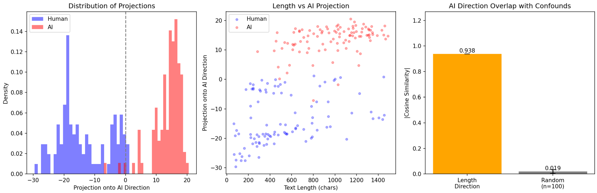
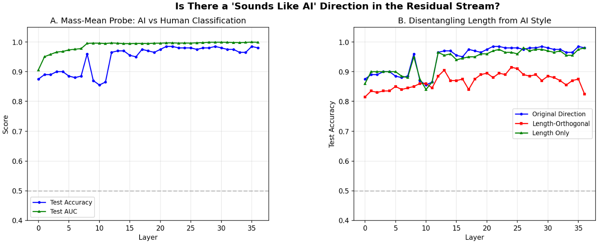
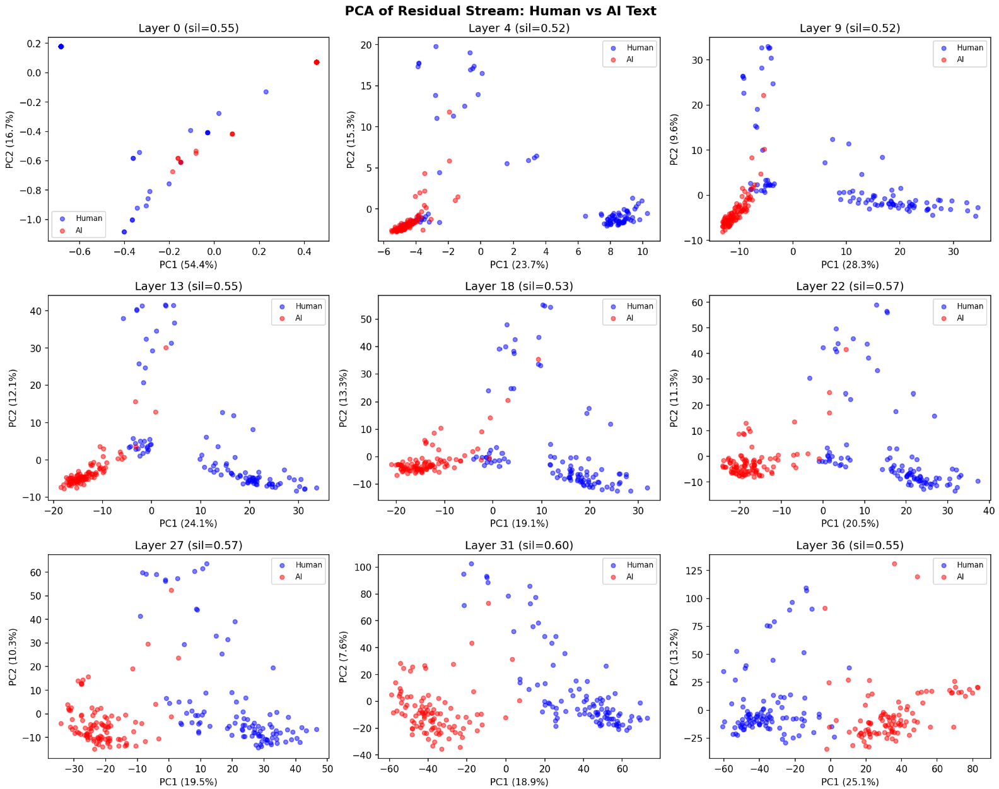
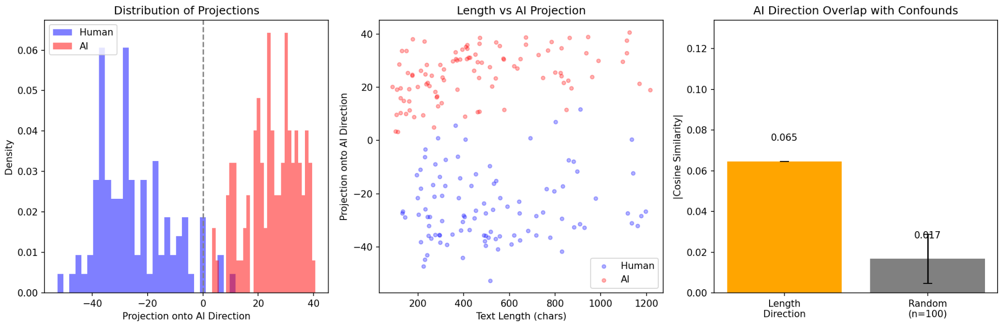
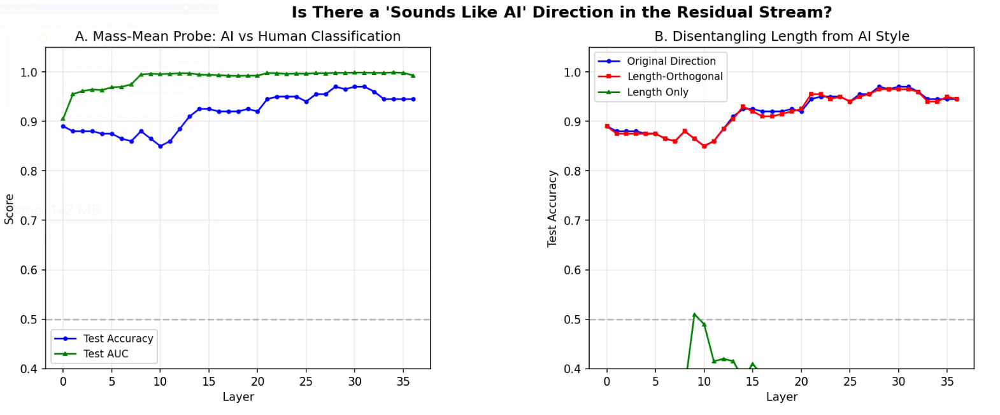
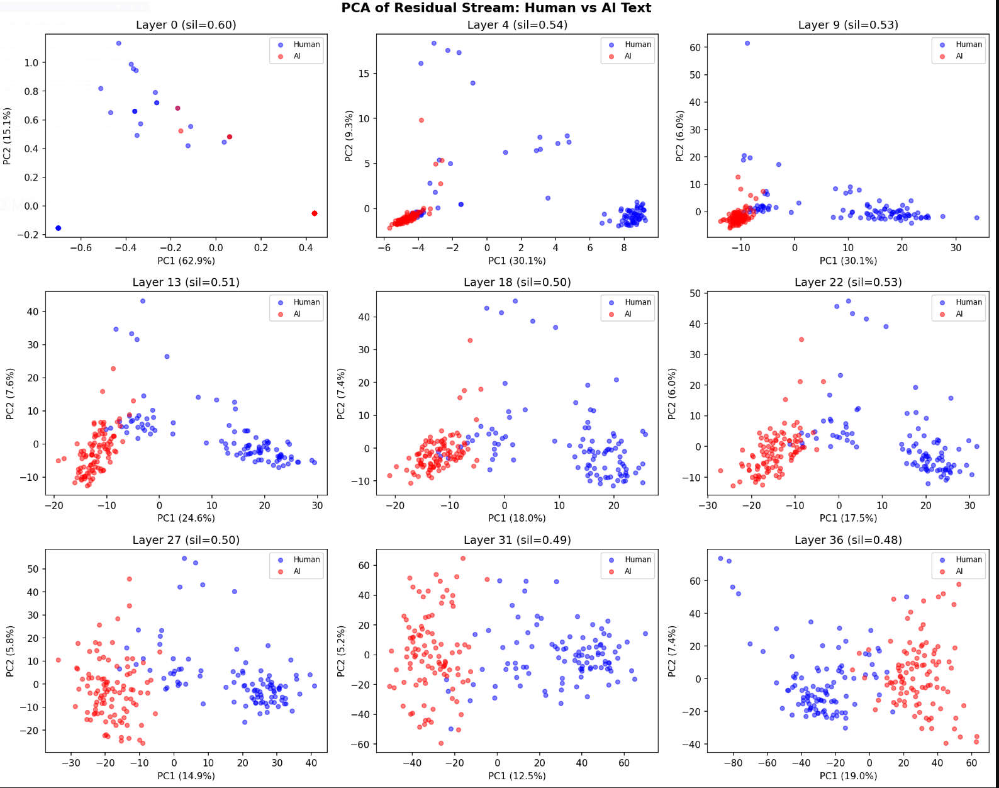

# Week 1 Blog: Disentangling Style from Length in the Residual Stream

## What I Did This Week

My project extends prior work showing that the "AI-sounding" property is encoded as a near-linear direction in transformer residual streams — extractable via Contrastive Activation Analysis (CAA) and classifiable with 97.5% accuracy on the HC3 dataset. However, the direction has a 0.93 cosine similarity with a pure text length direction. This week I reviewed the Hypogenic-AI repostiroy more in depth and implemented the necessary logic to transition the code pipeline to be capatible with remote execution. All experiments ran on Modal (A10G GPU). In addition, I developed a truncated length-matched version of the HC3 dataset and ran length-controlled experiments to find out how much of the "AI style" direction is real versus a verbosity proxy.

Here's the full summary across all five conditions (0 = Hypogenic-AI's results for reference):

| Metric | (0) Original | (1) Base | (2) Instruct | (3) Base + LM | (4) Instruct + LM |
|---|---|---|---|---|---|
| Best Layer | 21 | 13 | 8 | 29 | 29 |
| Test Accuracy | 97.5% | 97.0% | 96.5% | 96.5% | **98.0%** |
| Test AUC | 0.999 | 0.997 | 0.995 | 0.998 | 0.998 |
| Length Cosine Sim | 93% | 93.8% | 92.2% | **-6.5%** | **-15.1%** |
| Post-Ablation Accuracy | 85.5% | 90.0% | 88.0% | 96.5% | 97.0% |
| Length-Only Accuracy | — | — | — | 30.0% | 24.5% |

*LM = Length-Matched dataset.*
*Post-ablation = Accuracy after mathematically projecting out the length component from the direction.*
*Base = Qwen2.5-3B, Instruct = Qwen2.5-3B-Instruct*

The length-matched dataset used sentence-boundary-aware truncation on 30,758 valid pairs. The human text mean = 519, std = 277. The AI text mean = 468, std = 295. This is much more balanced compared to the original HC3 dataset where AI text was found to be approximately 2x longer than human text on average (human text mean = 446, huamn text std = 340, AI text mean = 914, AI text std = 279).

---

## The Truncation Algorithm
To create length-matched pairs, we truncate the longer text in each (human, AI) pair to match the shorter text's length, respecting sentence boundaries to preserve coherence. The algorithm works in three stages: 

**1.** For each pair, compute the minimum length between human and AI texts.

**2.**  Truncate the longer text to that minimum length (the shorter text passes through unchanged).

**3.**  Scan backward from the truncation point to find the last sentence-ending punctuation (., !, or ?), then truncate at that boundary rather than mid-sentence. 

We also filter pairs with extreme length asymmetry (ratio > 5.0) before truncation to avoid cases where the longer text would lose excessive content. In addition, both texts needed to be above 50 characters as a minimum threhsold. This per-pair approach produces a dataset where different pairs can have different matched lengths (the human and AI texts in pair 1 might both be ~200 chars, while pair 2 has ~500 chars each), but within each pair, length is no longer a discriminating feature.

---

## Key Findings and Observations

**1.** The length confound is almost entirely responsible for the original direction. In Run(1), the AI direction has 0.938 cosine similarity with a pure length direction. On length-matched data in Run(3), this collapses to -0.065 — essentially orthogonal. A pure length signal achieves ~88% accuracy on original data but collapses to 30% (below chance) on length-matched data.

**2.** Genuine style signal exists and seems to be strong. After removing the length confound at the data level, the direction achieves 96.5% accuracy (base model) and 98.0% (instruct model) — nearly matching the results on the original non-lengthmatched HC3 dataset. In addition, accuracy in Run(3) didn't drop after ablation. This suggests that an "AI-style" property beyond verbosity exists and is linearly encoded in the residual stream.

**3.** Pure style seem to live deeper in the network. For Run(0) with Hypogenic-AI, the best layer was 13 (36% depth). On length-matched data, it shifts to layer 29 (81% depth). A potential explanation is that length is a surface feature encoded early while formality, hedging, and tone are higher-level semantic and linguistic abstractions that emerge in later layers.

**4.** It seems like the instruct model performs worse than base on original data (96.5% vs 97%) but better on length-matched data (98.0% vs 96.5%). One potential explanation is that RLHF appears to have strengthened stylistic distinctions independent of verbosity — which is consistent with instruction tuning explicitly optimizing for a particular response register. When length is removed as shortcut, the instruct model would potentially get a stronger pure stle signal, increasing accuracy.

---

## Visualizations

### Base Model Results (Run 1: Original HC3 Dataset)

### Base Model Results (Run 3: Length-Matched HC3 Dataset)

---

## Challenges and Roadblocks

**Truncation:** The first truncation implementation used regex patterns with required whitespace after punctuation. However, when analyzing the truncated dataset, I noticed that there would be some cases of mid-sentence cuts. At first, I also didn't implement any ratio threshold, which may have caused some unnatural stylistic and content cutoffs. 

**Detector-Weighted CAA:** I also implemented the detector-weighted CAA variant that weights training examples by an external AI detector's confidence score — so that "prototypically AI" examples dominate the direction. I've implemented the RoBERTa-based detector and integrated it into the pipeline, but haven't run results yet. The GPTZero-weighted variant requires API key access that I'm still sorting out. ZeroGPT's API key also says that I don't have enough credits.

---

## Next Steps

- Run detector-weighted CAA with RoBERTa-bsed AI detector and maybe other well-known AI detectors and compare results with standard CAA
- Begin the ablation hook experiments: Persistently project out the AI-style direction during generation and measure AI detectability and benchmark performance (MMLU, HellaSwag, TruthfulQA). Run benchmarks with and without ablation.
