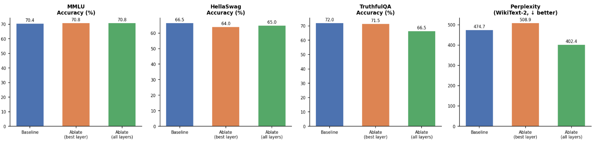
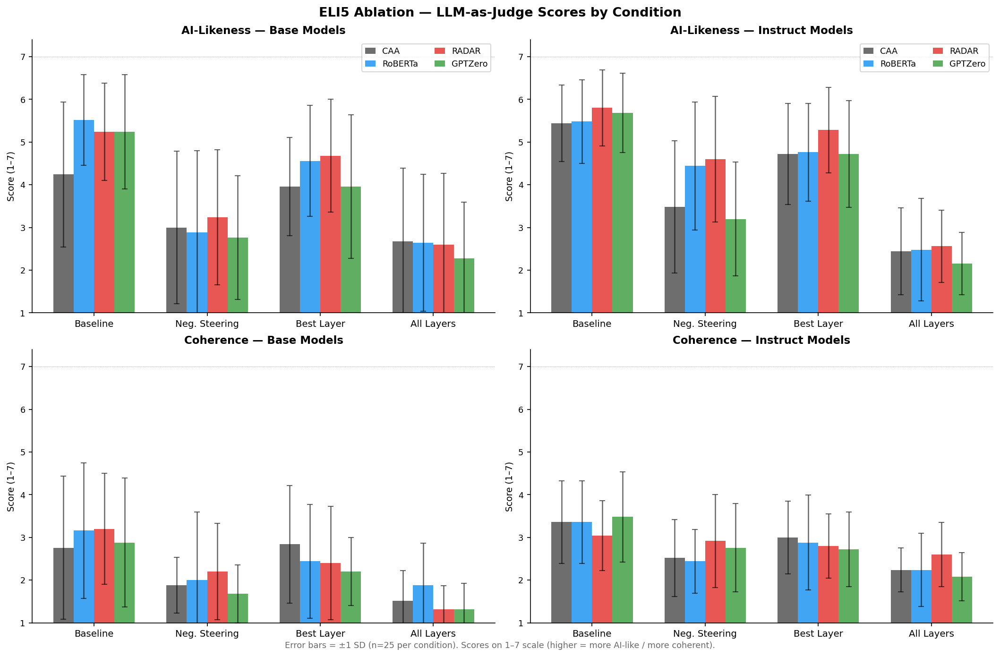
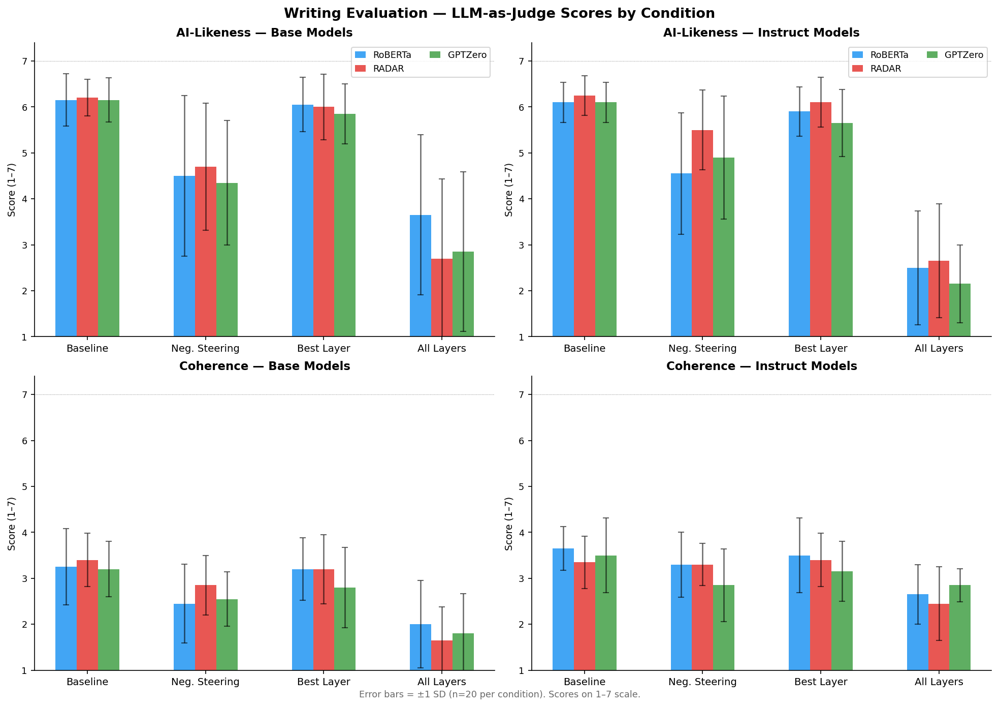

# Week 3 Blog: Multi-Detector Experiments, Expanded Benchmarks, and Layer Sweep

---

## Project Refresher

My project extends prior Hypogenic-AI work, which showed that the "AI-sounding" property is encoded as a near-linear direction in transformer residual streams — extractable via Contrastive Activation Analysis (CAA) and classifiable with 97.5% accuracy on the HC3 dataset, but was heavily confounded with length.

Week 1 established that a near-linear AI-style direction can be extracted from HC3 via CAA with 96.5–98.0% classification accuracy on a length-matched truncated varsion of HC3. This suggests that an "AI-style" property beyond verbosity exists and is linearly encoded in the residual stream.

Week 2 ran ablation experiments across four conditions (baseline, negative steering, single-layer ablation, all-layer ablation) on Qwen2.5-3B and Qwen2.5-3B-Instruct. Key findings: (1) All-layer ablation produces the largest style reduction, with the instruct model reaching a mean RoBERTa AI score of 0.196 (close to the human reference of 0.036); (2) Single-layer ablation has essentially no effect, suggesting the style direction is distributed across layers rather than concentrated at the classification readout layer; (3) Detector-weighted CAA using RoBERTa underperformed standard CAA. Ablated outputs were evaluated by Claude (LLM-as-judge).

This week's central questions were: **Is ablation effectiveness dependent on the choice of AI detector for detector-weighted CAA? And can we better characterize the style-capability tradeoff with richer benchmarks?**

---

## What I Did This Week

**1. Implemented Two New AI Detectors.** As suggested by Harvey, I decided to focus on detector-weighted CAA this week. I implemented two different detectors:
- **RADAR** (Hu et al., NeurIPS 2023): a DeBERTa-v3 sequence classifier trained adversarially against a Vicuna-7B paraphraser
- **GPTZero** (API): a commercial detector that uses a combination of perplexity, burstiness, and other signals beyond a simple linear classifier

**2. Expanded Capability Benchmarks.** Last week, I only tested MMLU for capability evaluation. This week I expanded to:
- **MMLU**: 500 questions across 10 diverse subjects
- **HellaSwag**: 200 commonsense NLI completion questions (0-shot, log-prob scoring)
- **TruthfulQA MC1**: 200 truthfulness questions (0-shot, log-prob scoring of answer letter)
- **Perplexity**: WikiText-2 test set (200 sentences), measuring language modeling quality

**3. Writing Quality Evaluation.** Following feedback that "sounding like AI" is mostly relevant in the context of writing, I added a dedicated writing evaluation using 20 MT-Bench-style prompts across five categories: creative writing, persuasive/argumentative, expository, narrative/reflective, and professional/functional. The same four ablation conditions are evaluated by Claude (LLM-as-judge).

**4. Layer Window Sweep.** I implemented a layer sweep experiment that ablates windows of k = 1, 5, and 10 consecutive layers across all 36 layers, measuring both AI score and WikiText-2 perplexity at each window center. Did not have time this week to actually run the layer window sweep experiments.

**5. Bug Fix for Detector-weighted CAA.** I indentified an implementation issue in my detector-weighted CAA which might have influenced previous detector-weighted CAA experiments by effectively inverting the weighted direction. Previous detector-weighted CAA results should be taken with a grain of salt.

---

## Detector Overview:

This week's experiments focus on whether different AI detectors are able to ablate more effectively. I chose three different detectors:
### RoBERTa (`openai-community/roberta-base-openai-detector`)

RoBERTa is a discriminatively fine-tuned sequence classifier trained directly on human vs. GPT-2 text. It operates as a standard binary classifier, assigning an AI probability based on surface-level distributional features — vocabulary register, punctuation patterns, n-gram statistics, and sentence length. A potential weakness is that RoBERTa's scores may select "prototypically AI" examples based on surface lexical features (formal vocabulary, hedging phrases, certain punctuation) rather than deeper generative patterns.

### RADAR (`TrustSafeAI/RADAR-Vicuna-7B`)

RADAR (Robust AI-Text Detection via Adversarial Learning, Hu et al. NeurIPS 2023) was trained in an adversarial loop: a Vicuna-7B paraphraser actively tried to rewrite AI text to evade detection, while the DeBERTa-v3 classifier was updated to detect the paraphrased outputs. This makes it more robust to style-transfer attacks than standard fine-tuned classifiers. Thus, RADAR's decision boundary may correspond to deeper syntactic or semantic patterns rather than surface vocabulary. If the weighted direction derived from RADAR captures these deeper features, it might ablate more effectively than RoBERTa's surface-sensitive direction.

### GPTZero (API)

GPTZero is a well-known commercial detector that combines multiple signals: per-sentence perplexity, burstiness, and a trained classifier. GPTZero's scores reflect a different projection of the AI-style subspace: examples that are AI-like in the sense of being locally predictable (low perplexity, low burstiness), which could produce a direction more aligned with generation fluency. It reports a 99% accuracy rate for pure AI-generated text, so I thought it would be interesting to try, but slightly constrained by the API rates.

---

## Results

### AI Detection Score Results Summary Table

Each run's AI scores are measured by its own detector for detector-weighted CAA and RoBERTa was used to score the results of standard CAA for Run(1) and Run(2).

| Run | Detector | Best Layer | Baseline | Neg Steering | Ablation (best layer) | Ablation (all layers) |
|---|---|---|---|---|---|---|
| (1) CAA Base | RoBERTa | 29 | 0.840 | 0.680 (−0.160) | 0.871 (+0.031) | 0.651 (−0.189) |
| (2) CAA Instruct | RoBERTa | 29 | 0.656 | 0.531 (−0.125) | 0.662 (+0.006) | 0.196 (−0.460) |
| (3) RoBERTa Base | RoBERTa | 29 | 0.843 | 0.713 (−0.130) | 0.833 (−0.010) | 0.612 (−0.231) |
| (4) RoBERTa Instruct | RoBERTa | 29 | 0.716 | 0.563 (−0.153) | 0.707 (−0.009) | 0.132 (−0.584) |
| (5) GPTZero Base | GPTZero | 28 | 0.687 | 0.129 (−0.558) | 0.480 (−0.207) | 0.089 (−0.598) |
| (6) GPTZero Instruct | GPTZero | 28 | 0.910 | 0.674 (−0.236) | 0.756 (−0.154) | 0.093 (−0.817) |
| (7) RADAR Base | RADAR | 29 | 0.989 | 0.941 (−0.048) | 0.963 (−0.026) | 0.952 (−0.037) |
| (8) RADAR Instruct | RADAR | 27 | 0.946 | 0.900 (−0.046) | 0.900 (−0.046) | 0.872 (−0.074) |

*(+\- delta) is change from baseline. Human and AI reference scores (HC3 test set): RoBERTa: Human=0.036, AI=0.870.*

*Scores are not directly comparable across detector families because each detector's 0–1 output is produced by a different underlying mechanism with its own calibration. Within-run deltas are the most informative for ablation comparison.*

### General Observations on AI Detector Scores

**GPTZero seems to perform the best.** Both GPTZero runs show dramatic drops under all-layer ablation for both the base and instruct models. Negative steering is also unusually effective for GPTZero, suggesting GPTZero's perplexity-based signals are especially sensitive to the extracted direction. The LLM-as-judge results below suggest the large drops are genuine: GPTZero instruct achieves the lowest AI-likeness of any instruct run under all-layer ablation in both ELI5 (2.16) and writing (2.15). Coherence holds up particularly well in the writing setting, where GPTZero instruct reaches 2.85 — the highest coherence of any instruct run under all-layer ablation, suggesting that in this task, the large score reduction does not come at a greater quality cost relative to other detectors.

**RADAR seems ineffective.** Across all conditions, RADAR scores remain very high. This could reflect RADAR's adversarial robustness — it may use features that survive ablation of the extracted direction — or it may reflect a domain mismatch: RADAR was trained adversarially against Vicuna-7B paraphrases, while our model is Qwen2.5-3B generating text on HC3 prompts. Thus, perhaps the ablated direction doesn't correspond to the features RADAR exploits.

**RoBERTa weighted CAA closely tracks standard CAA.** Run(3) and Run(4) produce nearly identical best layers (29) and very similar score profiles to Run(1) and Run(2). The detector-weighted direction using RoBERTa is effectively the same as the unweighted direction, which is consistent with Week 2's finding that RoBERTa on length-matched data likely captures similar surface features to the unweighted mean difference.

**Best layers are highly consistent across detectors.** The best layers were all between layers 27–29 (75–81% depth), which suggests that the AI-style information is most linearly readable in the final third of the network regardless of which detector provides the weighting signal.

---

### Capability Evaluation Results

The figure below shows MMLU, HellaSwag, TruthfulQA, and WikiText-2 perplexity for GPTZero Ablation on Qwen-2.5-3B-Instruct.Capability metrics were broadly stable across all detector runs and ablation experiments, suggesting the style-capability tradeoff is not strongly sensitive to the detector itself.

---

### LLM-as-Judge Results: HC3 Ablation

The figure below shows Claude's AI-likeness and coherence ratings (1–7 scale) across all 8 runs and 4 conditions for the ablated results to the HC3 prompts. Error bars are ±1 SD (n=25).

### LLM-as-Judge Results: Writing Evaluation

The figure below shows Claude's AI-likeliness and coherence ratings to the writing prompts. Error bars ±1 SD (n=20).

---

## Observations and Discussion

### All-Layer Ablation Universally Reduces AI-Likeness — but at Unequal Quality Costs

Across all 8 ELI5 runs, all-layer ablation brings AI-likeness to the 2.16–2.68 range (from baselines of 4.24–5.80), a consistent and substantial reduction. The detector used for direction extraction seems to mainly impact coherence as the ablated outputs commonly exhibit repetitive sentence structures (e.g. "I'm not a baby. I'm not a child. I'm not a teenager..."), fragmentation into numbered or bulleted multiple-choice lists instead of prose, and collapse into forum-thread framing (e.g. "You are reading the 13190th post in the 30449th thread") — suggesting that projecting out the style direction also disturbs generation pathways responsible for maintaining coherent paragraph structure. The key differentiator is model type: base models consistently show larger coherence drops (1.32–1.88 at all-layer ablation) while instruct models maintain higher coherence (2.08–2.60). 

### Writing Prompts Reveal a Sharper Style-Quality Tradeoff

Writing baselines are higher (6.10–6.25 AI-likeness) and more consistent than ELI5 (4.24–5.80), likely because creative and professional writing prompts produce uniformly formal, structured outputs. It seems like single-layer ablation has no effect on writing style as only all-layer ablation substantially moves scores. Importantly, coherence under all-layer ablation degrades more on writing prompts than ELI5 for base models and less for instruct models, suggesting that the instruct model's instruction-following may be more robust to directional ablation in writing contexts.

### RADAR Instruct Best Preserves Quality While Reducing Style

Across both ELI5 and writing, RADAR instruct achieves the best quality-coherence tradeoff under all-layer ablation: ELI5 coherence = 2.60, writing coherence = 2.45, while AI-likeness drops to 2.56 and 2.65 respectively. One possible explanation is that RADAR's adversarially-trained direction captures features that are more "compressible" in the instruct model's residual stream — projecting it out cleanly removes style without disrupting the generation pathways that produce coherent structure.

---

## Challenges and Roadblocks

- **Implementation Issue with detector-weighted CAA.** I only caught the implementation error after the initial GPTZero run produced  high post-ablation AI scores, which I thought was odd. It seems like the implementation error had little effect in the previous week because the weights were maybe more symmetric (RoBERTa on length-matched data), and thus, the post-ablation AI scores for roBERTa were relatively lower than the baseline (no ablation). Thus, I had to rerun a lot of the pipelines.

- **Layer sweep.** Did not have enough time to run layer sweep ablations due to focusing on detector-weighted CAA.

- **LLM-as-judge comparisons.** The large errors from the LLM-as-judge results make it difficult to compare across runs and say one run significantly outperformed the other.

- **Preventing incoherency.** Right now, I'm only using LLM-as-judge to evaluate the incoherency observed in the ablated outputs, but I'm not quite sure as to what methodological changes I can make to help prevent against this coherency degredation seen.

---

## Next Steps

- **Layer sweep analysis.** Run layer sweep ablation experiments for some of the detector-weighted experiments from this week and also the standard CAA experiments from previous weeks.

- **Cross-detector experiments.** Score each detector run's outputs with all three detectors (not just the one used to extract the direction) to assess cross-detector generalization. For instance, does a direction extracted with GPTZero also reduce RoBERTa scores, or are the reductions detector-specific? (Baselines across detectors seem to vary significantly so I'm not actually quite
sure how informtative this would be.)
