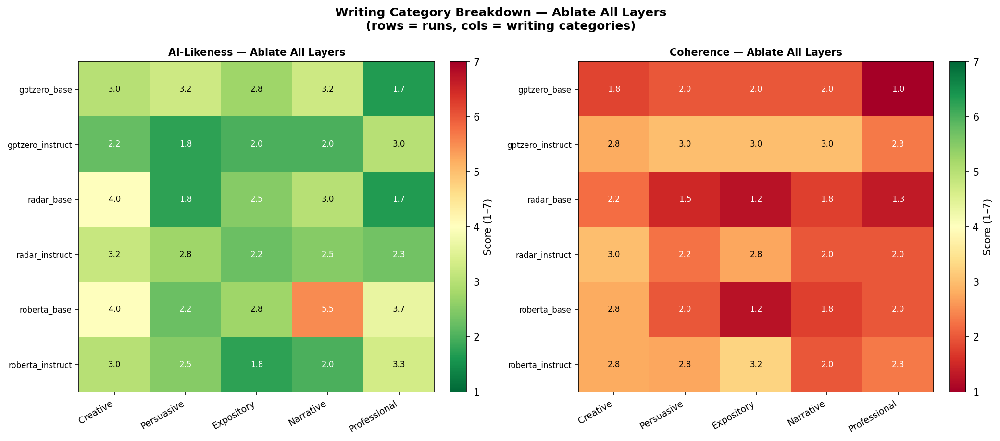
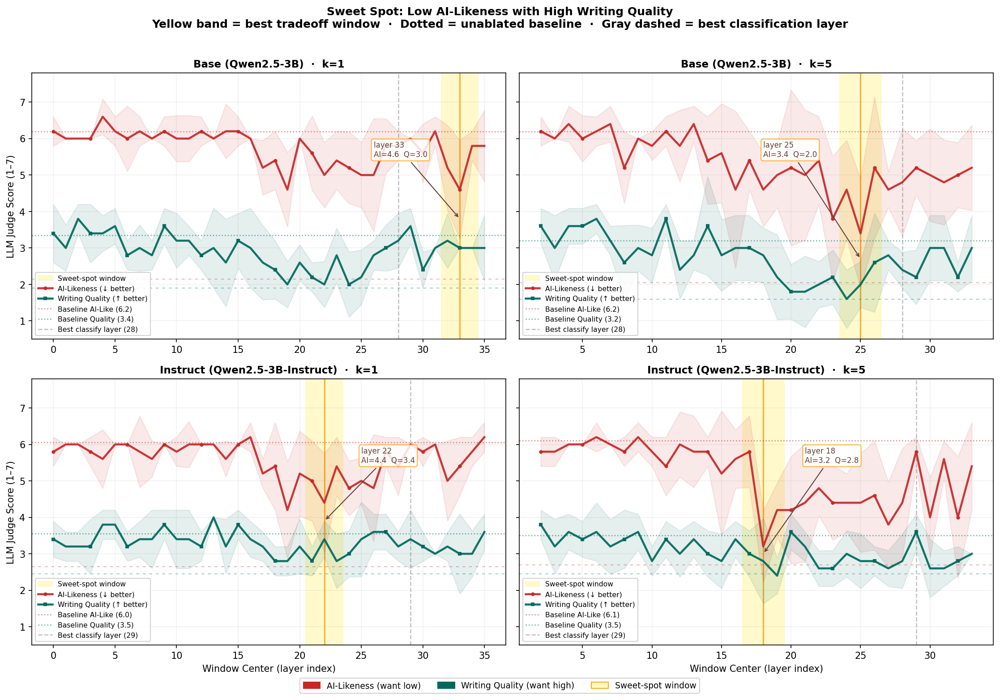
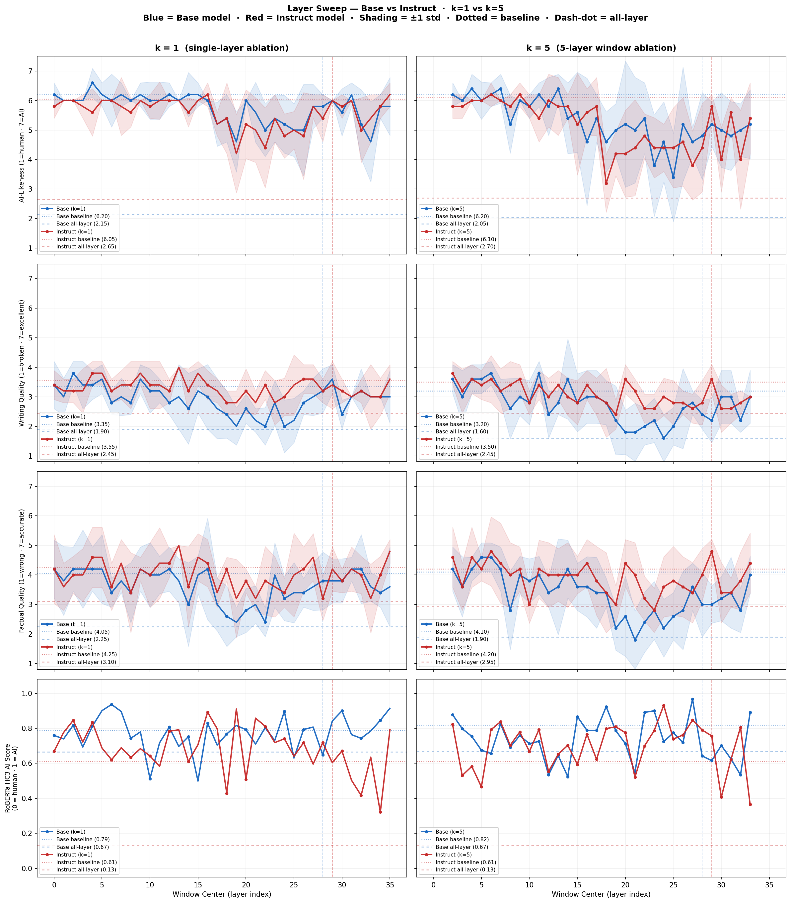

# Blog 4: Capability Analysis, Token Visualization, and Layer Sweep Ablation

---

## Project Refresher

My project extends prior Hypogenic-AI work, which showed that the "AI-sounding" property is encoded as a near-linear direction in transformer residual streams — extractable via Contrastive Activation Analysis (CAA) and classifiable with 97.5% accuracy on the HC3 dataset, but was heavily confounded with length.

Week 1 established the direction exists and is classifiable at 96.5–98.0% accuracy on a length-matched dataset, ruling out the verbosity confound. Week 2 ran standard CAA ablation experiments (single-layer, all-layer, negative steering) on Qwen2.5-3B and Qwen2.5-3B-Instruct, finding that all-layer ablation substantially reduces AI scores but at a coherence cost, and that single-layer ablation at the best classification layer had essentially no effect. Week 3 focused on detector-weighted CAA (RoBERTa, RADAR, and GPTZero), expanded benchmarks (MMLU, HellaSwag, TruthfulQA, and WikiText-2 perplexity), and added a 20-prompt writing evaluation.

---

## What I Did This Week

I mostly focused on two avenues this week. The first was a more thorough analysis of Week 3's results (perplexity, capability benchmarks, and writing quality by category) following feedback from Chenhao. The second was running the layer sweep ablation experiments across all 36 layers of the model, using both k=1 (single-layer) and k=5 (5-layer window) ablations to answer: **Where in the network is AI style causally generated, and is there a surgical window that reduces style while preserving coherence?**

---

## 1. Analysis of Week 3's Data

### Perplexity: 

Initially, it seemed like there was a tradeoff between ablating the AI-direction and
the benchmarks; however, Chenhao pointed out that perplexity actually decreased in some cases. WikiText-2 perplexity measures how well the model's generation distribution matches natural English text with a lower score being better.

I analyzed the perplexity results more carefully and found that perplexity increased from the baseline for Qwen2.5-3B across all three detectors but decreased for Qwen2.5-3B-Instruct across all three detectors (all detector-weighted CAA runs with all-layer ablation). For best-layer-only ablation,
perplexity always increased for both the base and the instruct model. 

This finding suggests that the AI-style direction in the instruct model points partly *away* from the WikiText-2 distribution. This makes sense: RLHF trains the instruct model to produce structured, helpful, and formal outputs that diverge from casual conversational text, and that trained style is captured in the extracted direction. Ablating it brings the model's generation closer to the natural language distribution, reducing perplexity. 

### MMLU, HellaSwag, and TruthfulQA Capability Benchmarks:

Across all detectors and detector-weighted ablation conditions, MMLU (factual knowledge retrieval) and HellaSwag (commonsense completion) scores remained close to the baseline (no ablation). This is reassuring: ablating the AI-style direction does not meaningfully disrupt factual knowledge or language understanding.

The most interesting capability result was **TruthfulQA**. For Qwen2.5-3B-Instruct, TruthfulQA accuracy stayed close to baseline under ablation — suggesting the instruct model's truthfulness representations are relatively orthogonal to the AI-style direction. On the other hand, for the base model, TruthfulQA accuracy showed greater degradation, especially under all-layer ablation.

This makes sense given what we know about RLHF: truthfulness is one of its explicit training objectives. The instruct model is specifically optimized to be honest and accurate, which likely encodes truthfulness as a more distinct, stable representation that doesn't heavily overlap with the AI-style direction. The base model has no such explicit truthfulness training — its truthful answering emerges organically from next-token prediction on factual text. Removing the style direction in the base model thus perturbs some of this overlap, degrading truthful answering as a side effect.

---

## 2. Writing Quality by Category

I was interested to see whether certain writing categories are more or less affected by ablation. The heatmap below shows how AI-likeness and coherence vary across writing categories under all-layer ablation:

Under ablation, all categories see meaningful reductions in AI-likeness, but with differential coherence costs. Creative writing and narrative prompts tend to preserve coherence better post-ablation, while professional/functional writing (resumes, cover letters, etc.) degrades more heavily in coherence. This suggests that functional writing formats are more tightly coupled to the AI-style direction as removing it disrupts the formatting conventions these outputs rely on.

---

## 3. Vocabulary Mapping: Understanding the AI Direction via Logit Lens

I wanted to get a better understanding of what the extracted direction encodes as Chenhao wondered if there was a way to illustrate what the AI direction looks like. Thus, I implemented a **logit-lens projection**: the AI-style direction vector is projected onto the model's unembedding matrix, which maps from hidden state space to vocabulary probabilities. The result is a ranked list of tokens whose logit probability would increase (AI-style) or decrease (human-style) if the direction were added to a hidden state.

*Note: results below are from the GPTZero Qwen2.5-3B-Instruct detector-weighted run. Results are broadly consistent across runs — see [this spreadsheet](https://docs.google.com/spreadsheets/d/1026jd4ucA-zF7hrEfxX5c1MLWXeaaEsjjmkhXzHtOLM/edit?usp=sharing) for all detectors and model variants.*

| AI-style token (score) | Human-style token (score) |
|---|---|
| `ClickListener` (+0.1334) | `basically` (−0.1233) |
| `👉` (+0.1198) | `crap` (−0.1182) |
| `💡` (+0.1193) | `damn` (−0.1161) |
| `ことができます` (+0.1126) | `fuck` (−0.1075) |
| `creativecommons` (+0.1113) | `ludicrous` (−0.1018) |
| `:'`,` (+0.1113) | `stupid` (−0.1016) |
| `することができます` (+0.1097) | `fucking` (−0.0983) |
| `🔍` (+0.1091) | `utterly` (−0.0983) |
| `さまざま` (+0.1078) | `apparently` (−0.0945) |
| `®,` (+0.1070) | `maybe` (−0.0943) |
| `####` (+0.1046) | `damned` (−0.0936) |
| `👤` (+0.1040) | `只好` (−0.0930) |
| `さまざまな` (+0.1037) | `东西` (−0.0929) |
| `Investments` (+0.0992) | `pissed` (−0.0929) |
| `Fortnite` (+0.0991) | `fucked` (−0.0901) |
| `:"`,` (+0.0990) | `...` (−0.0895) |
| `:');` (+0.0989) | `quite` (−0.0885) |
| `)?` (+0.1002) | `probably` (−0.0876) |
| `Ank` (+0.1048) | `totally` (−0.0870) |
| `sonian` (+0.1054) | `obvious` (−0.0869) |
| `afia` (+0.1064) | `creo` (−0.0866) |
| `踣` (+0.1024) | `shit` (−0.0861) |

**Observations:** The top AI-style tokens contains a lot of emojis, which is characteristic of AI-generated content from my personal experience. The Japanese texts also seem to lean towards being more formal and polite. Some tokens are also clearly web/code artifacts, possibly reflecting AI-generated code explanations.

The human-style tokens has a lot of profanity, hedging , and emphatic colloquialisms (`utterly`, `totally`, `ludicrous`). This makes intuitive sense as AI outputs usually never contain profanity or hedging, and the HC3 human responses are from the ELI5 subreddit, which perhaps contains more casual, opinionated, and colloquial language.

Thus, the direction seems to be accurately picking up on the stylistic divergences between informal human discourse and polished AI outputs. But I'm not really sure if this is the best way to "visualize" or if there's another way / a standard convention to visualize the AI direction.

---

## 4. Layer Sweep Ablation: Where Is AI Style Causally Generated?

The central experiment this week was a sliding window layer sweep. For each window of k = 1 or k = 5 consecutive layers + Base/Instruct models, I applied the ablation hook *only to that window* and measured:
- **HC3 AI score** (RoBERTa): How AI-like are the HC3 prompt responses?
- **LLM-judge scores**: AI-likeness, writing quality, and factual quality on 20 writing prompts, scored on a 1–7 scale by Claude.

I focused more on the Claude LLM-judge-scores as those seem to better capture AI-likeness and coherency than the RoBERTa score. In addition, I also turned my main evaluation to be based on writing as earlier results showed that other capabilites like factual knowledge seemed to be mostly preserved. All layer sweep experiments were done with standard CAA and not detector-weighted CAA. Week 2 showed that ablating a single layer at the best *classification* layer (layer 28–29) has essentially no effect. **But does this mean single-layer ablation never works — or just that the best classification layer is not causally important? And is there a k-value ablation window that balances AI score without significantly dropping coherency?**

### Representation ≠ Causation

The layer sweep reveals that **the layer where the AI-style direction is most linearly readable is not the layer where it is causally operative.** The best classification layer (layer 28–29) sits in the final third of the network. But ablating only this layer does nothing meaningful to generation behavior as the tokens being predicted have already been causally shaped by earlier layers. Ablating layer 19 alone reduces the HC3 AI score from a baseline of 6.05±0.59 to 4.20±1.33 while ablating layer 29 gives 6.00±0.00.

### The Sweet Spot: Low AI Score with Preserved Writing Quality

The figure below shows AI-Likeness and Writing Quality on the same axis, with a yellow band marking the "sweet spot" — the window where AI score is most suppressed while writing quality is best preserved:

For the base model with k=5 ablation, the sweet spot sits around **layer 18–25**: LLM-judge AI-likeness drops from a baseline of 6.2 to approximately 3.4, while writing quality, though reduced from its baseline, is meaningfully higher than under all-layer ablation. The instruct model shows a slightly better tradeoff at a similar window, reaching AI=3.2 with coherence=2.8 — suggesting the instruct model's style representations are more compressible in the middle layers.

The full comparison across all four conditions is shown below:

### Key Observations

1. **Single-layer ablation is effective if you target the right layer.** This challenges Week 2's conclusion — the issue was not that single-layer ablation is fundamentally limited, but that we were ablating the wrong layer.

2. **Surgical window ablation (k=5) looks promising as a practical middle ground.** All-layer ablation consistently destroys coherence. A 5-layer window centered on the causal region achieves meaningful AI-likeness reductions — down to 3.2–3.4 from a baseline of ~6.1 — while preserving more of writing quality than all-layer ablation. 

3. **The sweet spots don't occur at the best linearly readable classification layer.** The most linearly separable layer (28–29) is among the worst places to intervene — ablating it produces essentially no change in generated outputs. The sweet spot consistently falls in the middle layers (~18–25), well before the readout zone.

4. **The instruct model shows a better style-quality tradeoff than the base model across all four conditions.** Looking at the comparison plots, the instruct model consistently reaches lower AI-likeness at the sweet spot while maintaining higher coherence. This likely reflects the same geometric property seen in the perplexity and TruthfulQA results: instruction tuning produces a more cleanly factorized residual stream where style and quality are more separable.

---

## Challenges and Roadblocks

- **LLM-judge variance remains high.** With n=5 samples per window, standard deviations are large, making it difficult to draw conclusions about layer to layer performance.

- **The "best classification layer" framing may be a dead end.** It seems like the best-readable layer is not causally relevant. The more useful question going forward is *which layers generate the style*, not *which layers encode it most cleanly*. Answering that rigorously may require different methodology, such as activation patching. Not sure if I have time for this.

- **Unclear token mapping.** From the data, it seems like layer 19 was most casually effective when ablated in Qwen2.5-3B-Instruct as it had the lowest AI writing score. When I looked at the top AI and huamn tokens, they seemed really random so I'm not sure if my "visualization" technique is valid or how to really interpret because it seems like this layer is somewhat meaningful.
---

## Next Steps

- **Layer sweep for detector-weighted CAA.** Running the layer sweep on detector-weighted CAA directions (RoBERTa, RADAR, GPTZero) would test whether different detector-derived directions have different causal layer profiles. That said, the logit-lens token projections across detectors look very similar, suggesting the directions are pointing at roughly the same subspace regardless of detector. The causal layer structure is likely similar, but maybe still worth confirming.

- **Cross-model generalization.** If I have time, I'd like to run experiments on a different model family to see if similar ablation and capability results hold.

