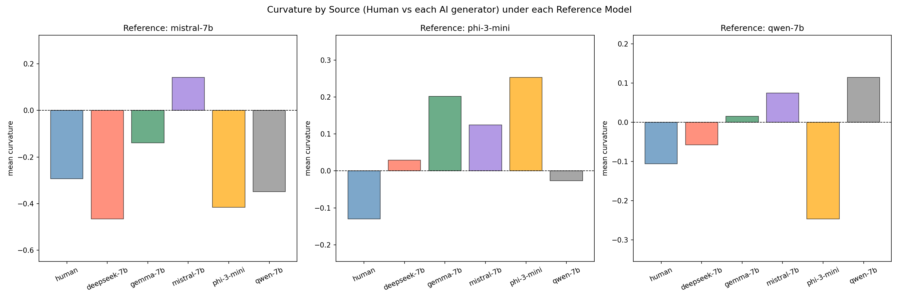

Summary:
For this week, I wrote the data collection pipeline that collects the datasets from the internet, the AI inference pipeline that creates AI examples from our dataset, the feature extraction pipeline which calculates the log-likelihood, token rank, entropy, and curvature.

Data Collection Pipeline:
Just crawls the data from the internet.

AI inference pipeline:
Something I learned is to keep stuff parallel, the architecture of choice is to create 5 Modal containers, each container owning a specific model and have that model try to generate our AI examples using the Language Models chosen by our experiment. We actually should have 6, but LLAMA requires some verification on Huggingface and I didn't get it in time so I ended up just using 5 Models, with 3 allocated for learning and 2 allocated for testing.

Feature Extraction Pipeline:
Similar to the inference pipeline, I use 3 Modal containers in parallel, each owning one of the reference models (Mistral-7B, Qwen-7B, Phi-3-mini). Each container runs a forward pass on every sample and computes four token-level features: log-likelihood, token rank, entropy, and curvature. The curvature follows the FastDetectGPT approach, where instead of perturbing the whole text we sample 20 alternative tokens at each position from the model's conditional distribution and measure how much more likely the actual token is compared to those alternatives. After all three containers finish, the features are z-score normalized per model and aggregated into two values per sample: C_mean (average curvature across models) and C_var (variance of curvature across models). These are the signals that go into the classifier.

Here is a visualization of the feature extraction

The good news is that it shows that our hypothesis is correct. The detectGPT approach is horrible when you then generating model and the reference model doesn't match. For each of the training models that we used to evaluate curvature, we can see that curvature for AI text generated by these models are always the greatest entry and significantly higher than the humans, but human entry is not necessary the lowest in all of these. Only in Phi is the human entry lowest curvature, while for qwen Phi has lower curvature and for mistral Phi, Qwen, and deepseek have lower curvature.

Model Training:
The classifier is a small MLP: 5 input features (the three per-model curvature z-scores, C_mean, and C_var) → Linear(64) → ReLU → Linear(32) → ReLU → Linear(1). The loss has three components: a binary cross-entropy classification loss, an adversarial loss with gradient reversal on two heads (one predicting the source generator, one predicting the domain) to remove that information from the learned representation, and a contrastive loss to pull same-label samples together in representation space. The adversarial strength is annealed from 0 to 1 over training so the classifier gets a head start before invariance is enforced. The train/held-out split is at the generator level — Mistral-7B and Qwen-7B are training generators, while Gemma-7B, Phi-3-mini, and DeepSeek-7B are held out and never seen during training. Human samples are split 70/30 between train and held-out to ensure both classes are present for evaluation.

Results:
The model trained for 50 epochs and converged to a train AUROC of 0.9569 and a held-out AUROC of 0.9649. The held-out AUROC being slightly higher than train is a good sign — it means the model isn't overfitting to the training generators and the invariance objectives are doing their job.

Compared to FastDetectGPT, which reports a white-box AUROC of 0.9887 (using the actual source model) and a black-box AUROC of 0.9338 (using surrogate models), our held-out result of 0.9649 sits right in between. The white-box comparison isn't really fair since FastDetectGPT gets to use the exact generating model, which is information we don't assume. The black-box comparison is the right one — our model outperforms black-box FastDetectGPT by about 3 points, and unlike FastDetectGPT, it never sees the held-out generators at all during training. This supports the core claim that multi-model probabilistic features generalize better than single-reference-model curvature.

