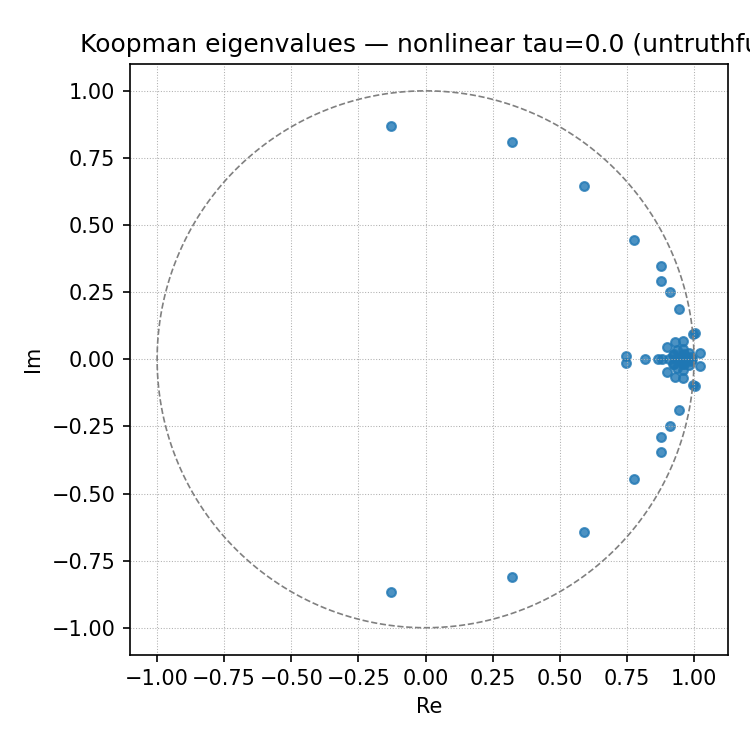
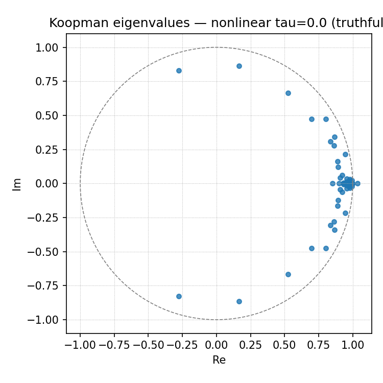

# KAE Progress, a Re-evaluation of Latent Spectral Dynamics, and Extension Experiments

This week's progress:

- Successfully fitted a Koopman Autoencoder (KAE) to the Truthful / Untruthful prompting regimes.
- Re-examined the Latent Spectral Dynamics framework to clarify its interpretability limits.
- Designed a more robust experimental setting for upcoming tasks.

Recall that the core motivation for this project is to **evaluate a general dynamical systems perspective of LLM token-wise activation trajectories**. Currently, most mechanistic interpretability methods focus on static snapshots of individual layers. To use a neuroscientific analogy: early researchers studied the brain by looking at static snapshots of neurons to see how they represented single concepts. Later, dynamical systems theory was introduced, offering a way to look at how the brain's state evolves over time.

By viewing LLM activation space as a dynamical system, we gain a lens into the evolutionary rules and global properties of the model's reasoning. It allows us to ask: do the reasoning trajectories of one generative regime (e.g., honest) systematically differ from another (e.g., deceptive)? This is what the original Latent Spectral Dynamics paper set out to investigate.

## 1. Wrapping Up KAE on Truthful vs. Untruthful Generation

First, I wrapped up the extension experiments fitting a Koopman Autoencoder (KAE) on the same Truthful/Untruthful dataset. I wanted to see if learning a nonlinear observable basis would improve upon the original paper's baseline (EDMD with a coordinate basis, which already achieved a low rollout MSE of 1.5 for 1-step and 5.0 for $h=8$).

With a dataset of $P=2000$ prompt pairs (a size necessary for Deep Learning setups, though it makes a direct matrix factorization comparison difficult), Hankel window size $W=5$, autoencoder latent dimension $r=64$, rollout horizon $h=8$, and a greedy decoding setup, I obtained the following results:

**Table 1: Model Performance across Truthful and Untruthful Regimes**

| Model     | Regime     | Best val total | Test MSE @1 | Test MSE @4 | Test MSE @8 | Spectral radius |
|:----------|:-----------|---------------:|------------:|------------:|------------:|----------------:|
| Linear    | Truthful   |         1.7624 |      0.7888 |      0.8724 |      0.9400 |          0.9924 |
| Linear    | Untruthful |         1.6194 |      0.6852 |      0.7959 |      0.9119 |          0.9887 |
| Nonlinear | Truthful   |         1.4394 |      0.6356 |      0.7469 |      0.8956 |          1.0366 |
| Nonlinear | Untruthful |         1.2645 |      0.5246 |      0.6586 |      0.8714 |          1.0239 |

Key takeaways from the fit:

- **Successful Operator Learning:** The nonlinear KAE consistently outperforms the linear model in both regimes, yielding lower total test and validation losses.
- **Linear Dynamics from Nonlinear Compression:** Projected via an MLP from an ambient dimension of $Wd = 25{,}600$ down to $r=64$, we successfully find a linear operator governing the dynamics in this compressed latent space.
- **Note on Stability:** The nonlinear models exhibit a spectral radius slightly above 1 (1.0366 and 1.0239). Unlike the strictly stable EDMD baseline ($\approx 0.99$), this implies slight global instability over very long horizons. Future iterations may require a spectral regularization penalty in the KAE loss function.

## 2. The Eigenvalue Problem: Indistinguishable Spectra

While the KAE successfully predicts trajectory rollouts, an analysis of the learned linear operator's eigenvalues reveals a significant divergence from the original paper's findings.

 

*(a) Untruthful (τ=0.0) &nbsp;&nbsp;&nbsp;&nbsp;&nbsp;&nbsp;&nbsp;&nbsp; (b) Truthful (τ=0.0)*

**Figure 1: Koopman Eigenvalues Comparison.** Comparison of complex Koopman eigenvalues ($\lambda \in \mathbb{C}$) relative to the unit circle. Unlike the uncompressed EDMD approach, the KAE yields essentially indistinguishable eigenspectra for both regimes, with highly overlapping distributions and no isolated regime-specific oscillatory modes.

**Interpretation:** the KAE fits the dynamics well for each prompting regime, but generates indistinguishable eigenspectra. Why did this happen? The original paper found distinct complex-conjugate oscillatory modes for untruthful generation. It is likely that the KAE's informational bottleneck ($r=64$) compressed away the specific phase geometry required to isolate the oscillatory modes, prioritizing raw reconstruction MSE.

## 3. Re-evaluating Latent Spectral Dynamics

This raises natural questions: **What does this Koopman Autoencoder actually reveal about interpretability? Does the operator fitting persist in other prompting setups**?

A closer examination of the key objects clarifies our limits and capabilities:

- The phase space is the delay-windowed last-layer activation $H_k$. The encoder $\phi$ maps all trajectory instances to $\phi(H_k) \in \mathbb{R}^r$.
- The linear Koopman operator $K$ is fitted in this nonlinearly compressed space.
- Here, $K$ represents the context-dependent, shared operator governing the average trajectory. For instance, if $K$ is fit on 500 math problems, it represents the average transition structure of the residual stream during mathematical reasoning.

It admits the following interpretations:

- $K$ serves as a basis for regime comparison, such as overthinking vs. indecisive thinking, honest vs. deceptive.
- $K$ serves as a reference model. Individual trajectories can be compared to this average, and one can examine how specific trajectories deviate from $K$.
- The eigenfunctions of $K$ are specific scalar functions of state. They may correlate with interpretable features of the generation. This is similar to SAEs.

However, $K$ does not reveal the underlying causal mechanism of the model's reasoning; it only highlights a correlational statistical pattern. To solve this, future experiments should test causal interventions. Because we have an encoder/decoder structure, we can project a state into the Koopman eigenbasis, ablate or amplify specific eigenmodes, decode back into the residual stream, and observe if we can predictably steer the model's generation. This is similar to the SAE steering technique.

## 4. Extension Experiment on Math Reasoning

To make the best use of $K$, I am setting up the following experiment:

- **Model:** Qwen2.5-14B-Instruct.
- **Data:** 500 last-layer activation trajectories from GSM8K and MATH 500, capped at 512 tokens.
- **Architecture:** A nonlinear KAE with the same setup as in the last blog post.

With $r=64$, $W=8$, $N=8$, current results from GSM8K suggest a stable fitting of the operator:

**Table 2: KAE Performance on GSM8K Reasoning Trajectories**

| Horizon | Train MSE | Val MSE | Test MSE |
|:--------|----------:|--------:|---------:|
| 1       |     0.410 |   0.450 |    0.481 |
| 4       |     0.423 |   0.514 |    0.548 |
| 8       |     0.481 |   0.686 |    0.727 |

The model achieves a strong Test MSE of 0.481 at a 1-step horizon, gracefully degrading to 0.727 at an 8-step horizon. **This confirms that a stable, linear governing operator $K$ can be found for token-wise mathematical reasoning trajectories.**

Tracing multi-step reasoning tasks may reveal more dynamical properties, but to ensure we find meaningful spectral differences, I will use a contrastive setup. Rather than just fitting $K$ to all of GSM8K, I will partition the data into trajectories where the model does Fluent Execution vs. Self-correction, algorithmic execution vs. semantic retrieval, etc.

## 5. Next Steps: Faithful Interpretation and Strategic Deception?

The biggest challenge of this project remains **the faithfulness of interpreting this complicated mathematical machinery**. Through causal ablation tests in the Koopman eigenbasis, I hope to anchor these spectral signatures to truly interpretable model behaviors. I will investigate further methods to unlock interpretable features from LLM generation using this autoencoder formulation.

Once the math experiments are complete, I will decide whether to move to strategic deception or not. I realize that strategic deception is one of the most complicated tasks to handle because it is ill-defined and difficult to detect. To mitigate this, I plan to leverage pre-existing, validated datasets (like Anthropic's Alignment Faking or Sleeper Agents prompts) to ground the behavior before tracking its dynamics.
