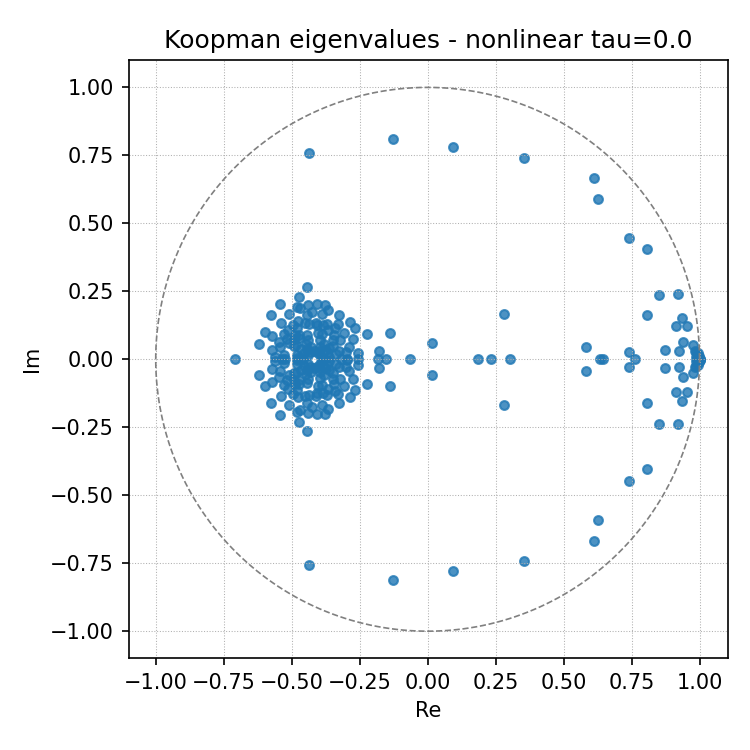
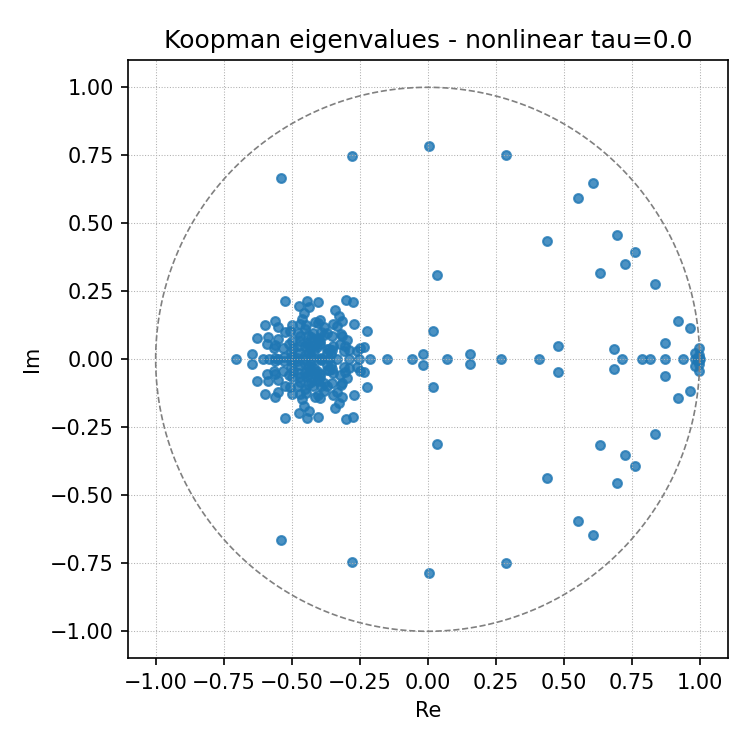
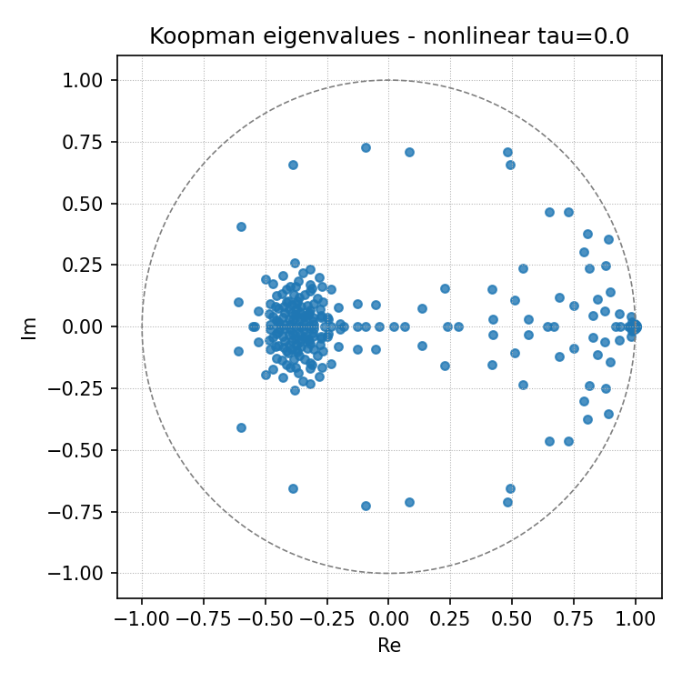
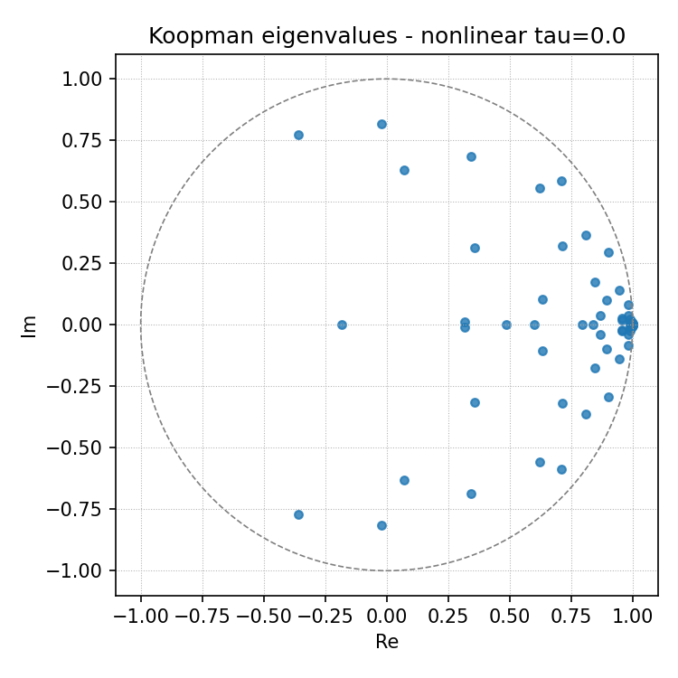
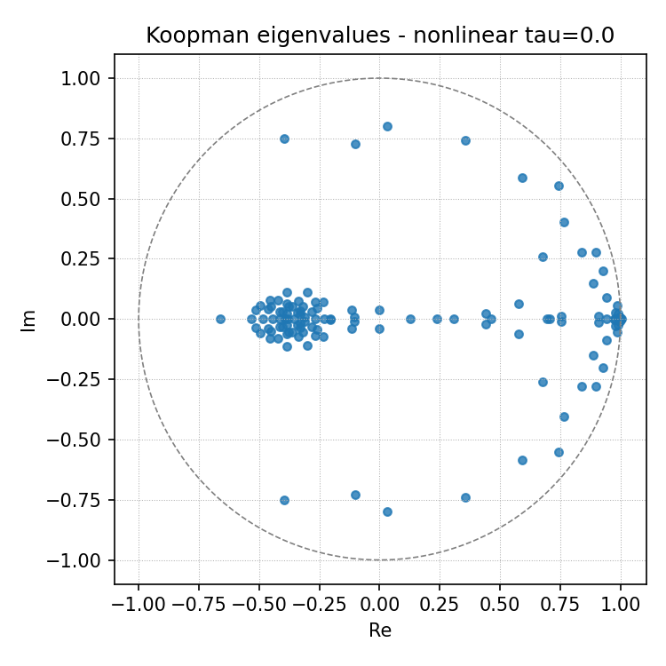
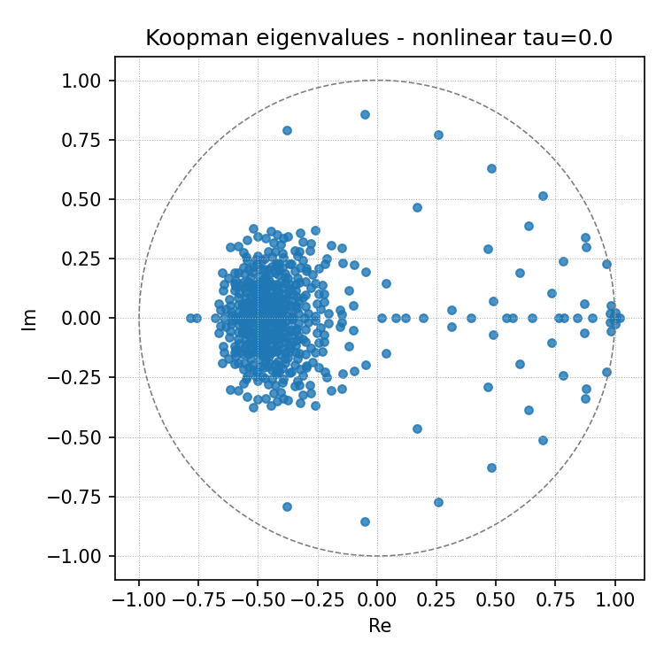

# Attempts to Uncover Interpretable Spectral Signatures of Mathematical Reasoning in LLMs via Koopman Autoencoders (KAE)

Key insights of the week:

- KAE arguably captured an invariant eigenspectrum correlated with **autoregressive generation** instead of **mathematical reasoning**. This eigenspectrum persisted across datasets and 3 models for a fixed latent dimension.
- There exists a **resolution scaling phenomenon** of the eigenspectrum: the eigenvalues accumulate approximately on previous plots as latent dimension increases.
- Established a framework for interpreting KAE results, including spectral analysis, feature identification, probing validation, and causal intervention.

This week, I decided to pivot from understanding strategic deception to focusing on mathematical reasoning and to better understand what interpretable features KAE actually uncovers. Recall that last week, I set up experiments to test if the Koopman Autoencoder (KAE) can reliably detect features of multi-step reasoning in LLMs. Below are the refined details:

- **Task:** Dynamical Signatures of Math Reasoning Trajectories
- **Dataset:** GSM8K, MATH500, Wikitext-103 (control narrative), WikiHow (control CoT), each 500 trajectories, capped at 512 tokens
- **Model:** Qwen2.5-14B-Instruct, DeepSeek-R1-Distill-Qwen-14B, Mistral-3-14B
- **Method:** Extract last-layer activations, concatenate for a delay-window of window size $W=8$, and fit the nonlinear KAE using the setup in blog post 1. Sweep the Koopman latent dimensions $r \in \{64, 128, 256, 512\}$. Compare the eigenspectrum of fitted Koopman operators among the four datasets.

## 1. Invariant Eigenspectra

With $r=256$, we fit separate KAEs on GSM8K, MATH500, and Wikitext-103 trajectories from Qwen2.5-14B-Instruct. Figure 1 compares the resulting Koopman eigenspectra across the three datasets.

*(a) GSM8K &nbsp;&nbsp;&nbsp;&nbsp;&nbsp;&nbsp;&nbsp;&nbsp; (b) MATH500 &nbsp;&nbsp;&nbsp;&nbsp;&nbsp;&nbsp;&nbsp;&nbsp; (c) Wikitext-103*

**Figure 1: Koopman eigenspectra at $r=256$ across datasets (Qwen2.5-14B-Instruct).** All three datasets yield a strikingly similar spectral geometry: a dense cluster near $\text{Re} \approx -0.4$, a near-unity real cluster near $\text{Re} \approx 1$, and scattered complex-conjugate pairs throughout the unit disk. The negative real cluster, corresponding to period-2 oscillations, is present across both math reasoning tasks and the narrative control, suggesting it reflects a universal autoregressive structure rather than task-specific dynamics. No eigenvalue cluster is visibly exclusive to the math reasoning datasets at this resolution.

Because each KAE learns its own nonlinear observable basis, these operators live in different latent spaces, making direct eigenspectrum comparison ill-posed. The visual similarity is suggestive but not conclusive. To provide quantitative evidence, I plan two follow-up analyses: (1) Wasserstein distance between eigenvalue distributions as a coordinate-free invariant, and (2) cross-prediction experiments that test whether $K_{\text{gsm8k}}$ can predict MATH500 trajectories encoded through $\phi_{\text{gsm8k}}$, and vice versa.

## 2. Resolution Scaling

I hypothesize that the KAE captures the highest-variance components in the trajectory first. Eigenvalues at lower $r$ capture universal autoregressive dynamics. As $r$ increases, more regime-specific local periodicities will be recovered.

To test this, we fit KAEs on GSM8K at $r \in \{64, 128, 256, 512\}$ and examine how the eigenspectrum evolves with increasing latent dimension. Figure 2 shows the resulting eigenspectra for Qwen2.5-14B-Instruct.

*(a) $r=64$ &nbsp;&nbsp;&nbsp;&nbsp; (b) $r=128$ &nbsp;&nbsp;&nbsp;&nbsp; (c) $r=256$ &nbsp;&nbsp;&nbsp;&nbsp; (d) $r=512$*

**Figure 2: Koopman eigenspectra across latent dimensions $r \in \{64, 128, 256, 512\}$ (Qwen2.5-14B-Instruct, GSM8K).** At $r=64$, eigenvalues are sparse and scattered, with the near-unity real cluster already present but few complex modes. As $r$ increases, a dense cluster progressively forms around $\text{Re} \approx -0.4$, emerging visibly at $r=128$ and growing substantially through $r=512$. The near-unity real backbone persists stably across all resolutions. The accumulation of eigenvalues near the negative real axis — corresponding to period-2 oscillatory modes — is the primary structural change with increasing $r$, consistent with the resolution scaling hypothesis. However, given that this cluster also appears in Wikitext-103 (Figure 1c), it remains an open question whether these emergent modes are task-specific or universal.

Notably, both findings - the invariant eigenspectra at fixed $r$ and the resolution scaling pattern - replicate consistently across all three models tested: Qwen2.5-14B-Instruct, DeepSeek-R1-Distill-Qwen-14B, and Mistral-3-14B. The near-unity real backbone, the negative real cluster around $\mathrm{Re} \approx-0.4$, and the accumulation of complexconjugate pairs with increasing $r$ all appear in each model's eigenspectra with only minor quantitative variation. This cross-architecture consistency strengthens the claim that these spectral structures reflect intrinsic properties of autoregressive generation rather than model-specific training artifacts or architectural idiosyncrasies. But whether the substantial spectral overlap with Wikitext-103 indicates that the KAE has failed to learn task-specific features remains uncertain. 

## 3. Interpreting Koopman Eigenmodes

Simply inspecting the eigenspectrum provides only an initial, correlational picture of the dynamics — we can observe patterns in the distribution of eigenvalues, but cannot determine what individual modes encode or whether they are causally relevant to the model's reasoning. To move beyond correlation, I designed a framework to interpret the Koopman eigenmodes through detailed spectral analysis, probing, and ablation, following a logic analogous to how SAEs uncover interpretable features from static activations.

Before describing the pipeline, I review the relevant objects from Koopman theory to clarify what exactly we are interpreting.

### Koopman Eigenvalues, Eigenfunctions, and Modes

Consider a deterministic autonomous dynamical system $x_{k+1} = F(x_k)$. The Koopman operator $\mathcal{K}$ acts on scalar-valued observables $g: \mathcal{M} \rightarrow \mathbb{C}$ via $\mathcal{K}g(x) = g(F(x))$. Three objects arise from its spectral decomposition:

1. **Eigenvalues** $\lambda_j \in \mathbb{C}$, characterizing the temporal evolution of each spectral component — $|\lambda_j|$ governs the decay rate and $\arg(\lambda_j)$ the oscillation frequency.
2. **Eigenfunctions** $\varphi_j: \mathcal{M} \rightarrow \mathbb{C}$, scalar-valued observables satisfying $\mathcal{K}\varphi_j = \lambda_j \varphi_j$. Each eigenfunction picks out a single temporal mode of the dynamics.
3. **Koopman modes** $\tilde{v}_j \in \mathbb{C}^n$, vectors in the observable output space that describe how each eigenfunction projects onto the measured dimensions. Given a vector-valued observable $g: \mathcal{M} \rightarrow \mathbb{C}^n$, the Koopman mode expansion is $g(x) = \sum_j \tilde{v}_j \varphi_j(x)$, so that under dynamics, $g(F^t(x)) = \sum_j \lambda_j^t \tilde{v}_j \varphi_j(x)$.

The eigenvalues carry the temporal structure (frequency, decay); the modes carry the spatial structure (which output dimensions participate). This separation is what makes the Koopman decomposition a natural basis for interpretability.

### Recovery from the Finite-Dimensional KAE

In our setting, the learned Koopman matrix $K \in \mathbb{R}^{r \times r}$ is a finite-dimensional approximation. It admits eigendecomposition $K = V\Lambda V^{-1}$, where $V = [v_1 | v_2 | \cdots | v_r]$ has right eigenvectors as columns and $\Lambda = \text{diag}(\lambda_1, \ldots, \lambda_r)$. These right eigenvectors live in the latent space $\mathbb{R}^r$ and represent the directions along which $K$ acts as pure scaling by $\lambda_j$.

The eigenfunctions are recovered via the left eigenvectors. Let $W = V^{-1}$, so that the rows of $W$ are the left eigenvectors $w_j^\top$. For a latent state $z_k = \phi(H_k) \in \mathbb{R}^r$, the eigenfunction evaluation is:

$$\varphi_j(z_k) = w_j^\top z_k = (V^{-1} z_k)_j$$

This is the modal coefficient $c_j(k)$ — a scalar time series measuring the activation of mode $j$ at token $k$. Note that these are exactly the quantities I have been computing throughout the eigenspectrum analysis; the connection to Koopman eigenfunctions makes their interpretation precise.

To recover the Koopman modes in the observable space (the Hankel window $\mathbb{R}^{Wd}$), we must map the latent eigenvectors through the decoder. Linearizing the decoder $\psi$ around a reference latent state $\bar{z}$, the Koopman mode associated with eigenvector $v_j$ is:

$$\tilde{v}_j = J_\psi(\bar{z})\, v_j \in \mathbb{R}^{Wd}$$

where $J_\psi \in \mathbb{R}^{Wd \times r}$ is the Jacobian of the decoder. This maps each latent eigenvector back into Hankel window space, telling us which activation dimensions at which token positions are associated with each temporal mode. The Koopman modes bridge the gap between the learned latent dynamics and the model's residual stream — a bridge that is necessary for any causal interpretation.

For a nonlinear decoder, this linearization is state-dependent: different trajectory points $z_k$ yield different Jacobians and therefore different effective modes. In practice, I compute $\tilde{v}_j (z_k) = J_{\psi} (z_k) v_j$ at each point along the trajectory and check whether the resulting distribution is concentrated (stable mode, linearization is adequate) or dispersed (state-dependent mode, linearization is inadequate). This diagnostic determines whether a given eigenmode admits a single global interpretation or requires a context-dependent one.

### The Interpretability Pipeline

With these objects defined, I now describe the interpretability pipeline. Each step adapts a corresponding stage from the SAE interpretability template. To clarify, the description is compressed by LLMs.

**Step 0: Prerequisites.** Obtain a well-fitted KAE with $\rho(K) \leq 1$, stable rollout MSE through horizon $h$, and $\kappa(V) < 10^3$ (otherwise use Schur decomposition). Compute $K = V\Lambda V^{-1}$ and modal coefficients $c(k) = V^{-1}\phi(H_k) \in \mathbb{C}^r$ for all trajectories and tokens.

**Step 1: Eigenmode Taxonomy.** For each mode $j$, record magnitude $|\lambda_j|$, phase $\theta_j = \arg(\lambda_j)$ (period $2\pi/\theta_j$ tokens), and energy fraction $E_j = \text{Var}_k[|c_j(k)|^2]$ normalized so $\sum_j E_j = 1$. Three categories emerge: *backbone modes* (high $|\lambda_j|$, near-real, high $E_j$) capturing universal autoregressive structure; *oscillatory modes* (complex-conjugate pairs, $\theta_j \neq 0$) encoding periodic temporal structure; and *transient modes* (low $|\lambda_j|$, low $E_j$) that decay quickly. When sweeping $r$, track which modes persist across latent dimensions and which emerge only at higher $r$.

**Step 2: Max-Activating Segments.** For each mode $j$, identify the top-$N$ contiguous runs (minimum 5 tokens) where $|c_j(k)|$ exceeds mean $+ 1.5\sigma$ across all trajectories, and extract the corresponding text. The interpretive payoff is in oscillatory and transient modes: if a mode with period $\sim$25 tokens consistently aligns with "Step 2: ... Step 3: ..." blocks during multi-step arithmetic, we have an interpretable temporal feature. For complex-conjugate pairs, also inspect the phase of $c_j(k)$ — segments with equal magnitude but opposite phase sit at opposite points of the oscillation cycle and may encode sub-step structure.

**Step 3: Feature Labeling (optional).** Feed the max-activating segments to a language model with the eigenvalue metadata (magnitude, period) and trajectory context (problem type, correctness), and ask it to describe the common computational process. Koopman mode labels will more likely be procedural ("activates during transition from parsing to equation setup") than semantic ("fires on math tokens"). Purely semantic labels suggest the KAE has not separated dynamics from content.

**Step 4: Probing Validation.** Train linear probes on modal coefficients to predict reasoning phase (from CoT formatting), mathematical operation (from token identity), trajectory correctness (from ground truth), and distance-to-answer. Compare three feature spaces: (a) full latent $\phi(H_k)$, (b) eigenbasis coefficients $c(k)$, (c) individual mode subsets. If small mode clusters suffice to predict a property, the Koopman decomposition has factored the representation into interpretable components. If no subset is selective, the eigenbasis is no more interpretable than the raw latent.

**Step 5: Causal Verification.** Intervene on individual eigenmodes at three tiers. *Tier 1:* zero out mode $j$ ($c'_j = 0$), reconstruct $z' = Vc'$, roll out $K^n z'$, measure rollout MSE increase — identifying dynamically necessary modes. *Tier 2:* decode the ablated state $\hat{H}' = \psi(z')$, compute $\Delta H = \hat{H}' - \hat{H}$, and map the perturbation to residual stream dimensions and token positions. *Tier 3:* inject $\delta h_k$ (last column of $\Delta H$) into the residual stream before unembedding and observe the logit shift. Calibrate against a random perturbation of equal norm to establish a noise floor — causal effects are meaningful only above this baseline.

**Step 6: Synthesis.** For each mode, compile a feature card: eigenvalue, energy fraction, max-activating segments, label, probe selectivity, ablation necessity score, and perturbation map. Modes that survive all stages are the interpretable dynamical features.

The pipeline has been implemented but demands thorough execution.

## 4. Next Steps

The project currently has the following major weaknesses:

1. Identifying task-specific eigenmodes remains a challenge. The taxonomy separates modes by magnitude and frequency, but whether any individual mode is truly task-specific versus universally autoregressive can only be established through the probing and ablation steps, which are not yet complete.

2. Under current settings, comparing between operators of different regimes are inconclusive. Because each KAE learns its own nonlinear observable basis, the operators like $K_{\text{gsm8k}}$ and $K_{\text{math500}}$​ live in different latent spaces, making direct eigenspectrum comparison ill-posed. The remedy is a shared encoder trained on pooled trajectories, from which per-dataset operators are fit via least squares in a common coordinate system. Until then, cross-dataset comparisons are limited to coordinate-free invariants such as the Wasserstein distance between eigenvalue distributions, which should be interpreted cautiously.

Regarding next steps: I will first complete the mathematical reasoning experiments and run the interpretability pipeline end-to-end. Cross-prediction experiments across the math and control datasets will run in parallel as the primary cross-dataset comparison. Once those results are in hand, I will design more rigorous experiments to test the resolution scaling hypothesis — specifically, whether low-$r$ modes are shared across datasets while high-$r$ emergent modes are task-specific. After this, I plan to draft a paper to the ICML 2026 Mechanistic Interpretability Workshop, which is due around the NeurIPS deadline. 