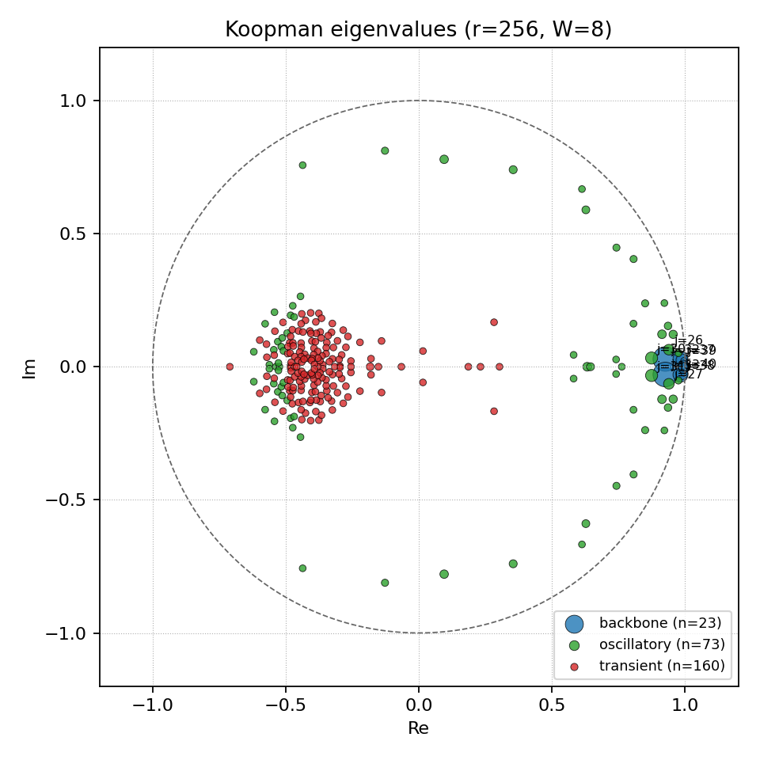
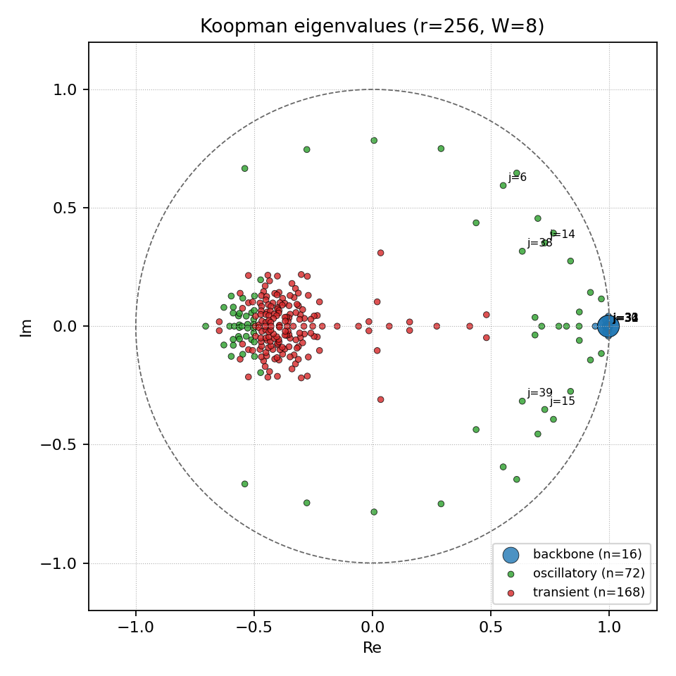
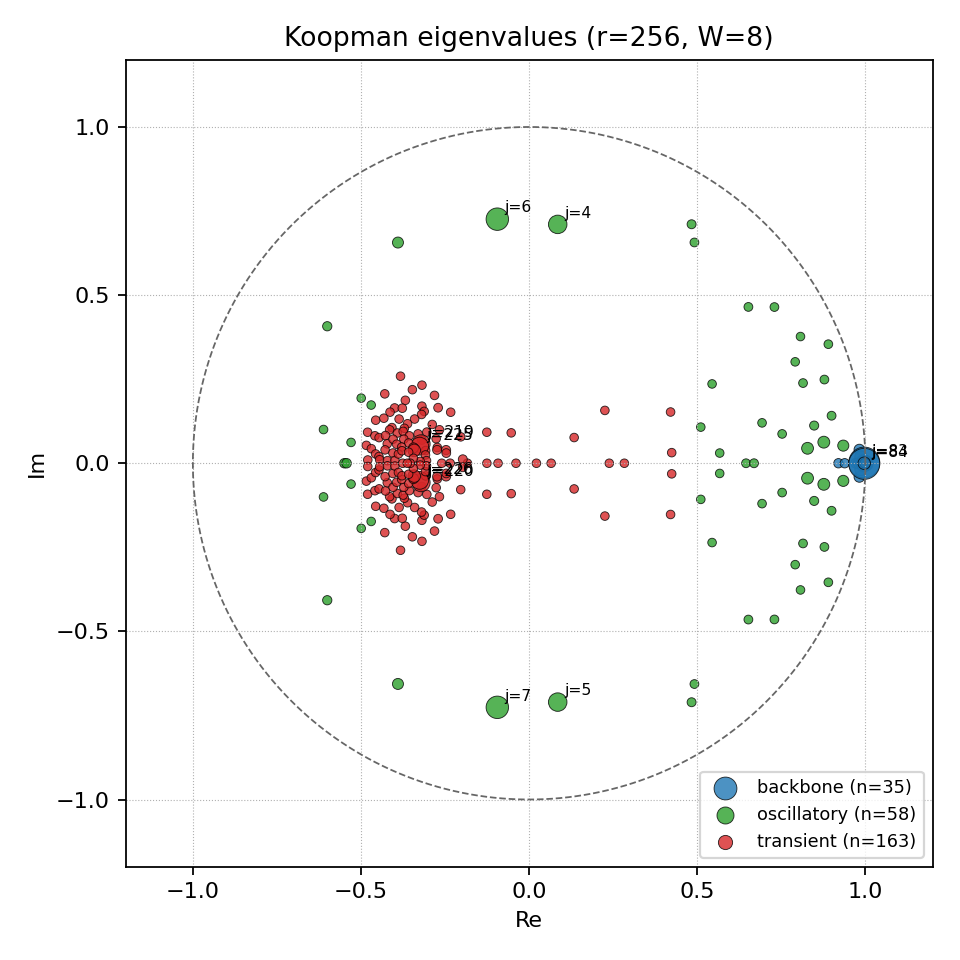

# Blog Post 4: Interpreting Koopman Eigenmodes on LLM Reasoning Trajectories

This week's main objective was to execute and examine the implementation of the **interpretability pipeline** for Koopman Autoencoders (KAE) on delay-windowed LLM residual activations. The motivation is whether the KAE, a deep learning extension of the original dynamical systems framework (latent spectral dynamics), can uncover interpretable temporal features in LLM autoregressive generation. This week's results follow from the interpretability pipeline, inspired by the SAE pipeline -- for more details, see blog post 3. 

## Key Insights of the Week

1. **The strongest modes discovered by the KAE are largely unrelated to semantic or arithmetic concepts**. Instead, they track the structural skeleton of generation: problem/answer boundaries, boxed-answer transitions, question-to-answer handoffs, and delimiter tokens. On WikiText103, the same machinery surfaces as formatting boundary detectors and degeneration monitors (repetition loops, script-mixing anomalies).

2. **Certain Koopman eigenmodes are likely interpretable**. But as with SAE features, only a subset of the modes are interpretable. Many modes are redundant copies of boundary detectors at different phases, or carry no coherent signal. The interpretable modes, however, reveal a consistent hierarchy in how the KAE organizes generation dynamics.

3. Specifically, the eigenspectrum separates into two interpretable tiers:

*Backbone and oscillatory modes* (high $|\lambda_j|$, high energy) track the overall structural rhythm of autoregressive generation (problem boundaries, turn transitions, and formatting templates).

*Transient modes* (low $|\lambda_j|$, low energy) capture sharp, brief computational transitions such as the pivot from equation display to result extraction, or the shift from intermediate computation to aggregation. The most reasoning-specific features are found among the transient modes, suggesting that reasoning manifests as sparse, low-energy perturbations on top of a dominant formatting structure.

## Experimental Setup

For setup of the experiment, see blog post 3. All results below use Qwen2.5-14B-Instruct, nonlinear KAE, latent dimension $r=256$, Hankel window $W=8$, final residual stream layer (input dimension $8 \times 5120 = 40960$), temperature 0.0.

| Dataset | Spectrum | Mode classes | Main discovered structure |
| --- | --- | --- | --- |
| GSM8K | $\rho$=1.0028; $\kappa$=194.5 | backbone 23, oscillatory 73, transient 160 | solution onset, arithmetic/computation spans, answer finalization, prompt reset |
| Math500 | $\rho$=1.0023; $\kappa$=277.2 | backbone 16, oscillatory 72, transient 168 | LaTeX/boxed-answer transitions and new-problem ingestion; more template-bound than GSM8K |
| WikiText103 | $\rho$=1.0062; $\kappa$=327.5 | backbone 35, oscillatory 58, transient 163 | document delimiters, passage-QA handoffs, repetition loops, script/encoding anomalies |

Below are the results from the interpretability pipeline, in an attempt to interpret the spectral analysis results. This was set up last week in detail in blog post 3.

## Step 0: Prerequisites

"Obtain a well-fitted KAE with $\rho(K) \leq 1$, stable rollout MSE through horizon $h$, and $\kappa(V) < 10^3$ (otherwise use Schur decomposition). Compute $K = V\Lambda V^{-1}$ and modal coefficients $c(k) = V^{-1}\phi(H_k) \in \mathbb{C}^r$ for all trajectories and tokens."

The KAEs obtained have $\rho(K) \approx 1.00$, slightly greater than 1, which indicates that the learned dynamical system is not contractive. But since the explosion rate is minimal, the spectral values can still be referenced. The learned Koopman operators all admit eigendecompositions: the condition numbers ($\kappa = 194.5$, $277.2$, $327.5$ for GSM8K, Math500, WikiText103 respectively) are all below the $10^3$ fallback threshold, so no Schur factorization was needed.

---

## Step 1: Eigenmode Taxonomy

"For each mode $j$, record magnitude $|\lambda_j|$, phase $\theta_j = \arg(\lambda_j)$ (period $2\pi/\theta_j$ tokens), and energy fraction $E_j = \text{Var}_k[|c_j(k)|^2]$ normalized so $\sum_j E_j = 1$. Three categories emerge: backbone modes (high $|\lambda_j|$, near-real, high $E_j$) capturing universal autoregressive structure; oscillatory modes (complex-conjugate pairs, $\theta_j \neq 0$) encoding periodic temporal structure; and transient modes (low $|\lambda_j|$, low $E_j$) that decay quickly. When sweeping $r$, track which modes persist across latent dimensions and which emerge only at higher $r$."

The classification rules:

- Near-real pairs with high magnitudes → backbone modes.
- Complex-conjugate pairs with high magnitudes and energies → oscillatory modes.
- Complex-conjugate pairs with low magnitudes and energies → transient modes.

The eigenvalue spectra at $r=256$ for all three datasets are shown below.

**Figure 1: Koopman eigenvalue spectra ($r=256$, $W=8$) for GSM8K (left), Math500 (center), and WikiText103 (right).**

| GSM8K | Math500 | WikiText103 |
|:---:|:---:|:---:|
|  |  |  |

The three spectra share a common overall structure: a dense cluster of transient modes (red) in the interior of the unit circle, a ring of oscillatory modes (green) distributed at various phases near the boundary, and a tight cluster of backbone modes (blue) on the positive real axis near $\lambda \approx 1$. The backbone cluster is the slowest-evolving subspace—these modes carry the most energy and decay the least per token step.

Several differences are worth noting. WikiText103's higher backbone count likely reflects the greater diversity of document-level structure (section breaks, topic shifts, list formatting) compared to the relatively uniform problem-solution template of the math datasets. Math500's spectrum is the most concentrated: fewer backbone modes and more transient modes (168 vs. 160), consistent with the narrower structural variety of competition-style math problems that are heavily LaTeX-templated. WikiText103 also shows the largest spectral radius ($\rho = 1.0062$) and condition number ($\kappa = 327.5$), suggesting the KAE works harder to linearize the dynamics of open-ended text generation compared to templated reasoning.

Across all three datasets, the labeled high-energy oscillatory modes (e.g., $j=26, 27, 30, 31$ in GSM8K; $j=6, 14, 15, 38, 39$ in Math500; $j=4, 5, 6, 7$ in WikiText103) sit at distinct angular positions, indicating that the KAE has learned distinct periodic structures at different token-level timescales. These will be inspected more closely in Step 2.

---

## Step 2: Max-Activating Segments

"For each mode $j$, identify the top-$N$ contiguous runs (minimum 5 tokens) where $|c_j(k)|$ exceeds mean $+ 1.5\sigma$ across all trajectories, and extract the corresponding text. The interpretive payoff is in oscillatory and transient modes: if a mode with period $\sim$25 tokens consistently aligns with "Step 2: ... Step 3: ..." blocks during multi-step arithmetic, we have an interpretable temporal feature. For complex-conjugate pairs, also inspect the phase of $c_j(k)$ — segments with equal magnitude but opposite phase sit at opposite points of the oscillation cycle and may encode sub-step structure."

For each mode, the pipeline pools $|c_j(k)|$ over all trajectories to compute mean, standard deviation, and threshold (mean $+ 1.5\sigma$), then stores the top 10 contiguous above-threshold runs ranked by peak activation. For instance, on GSM8K:

| Quantity | Value |
| --- | --- |
| Modes scanned | 256 |
| Stored segments | 2,560 (10 per mode) |
| Min candidate segments per mode | 82 |
| Median candidate segments per mode | 271 |
| Max candidate segments per mode | 1,470 |

The candidate count variation is informative: modes with very high candidate counts ($>$1000) tend to be backbone modes that are active over long stretches, while modes with low candidate counts ($<$100) are transient modes that fire sparsely and briefly. The text context stored for each segment includes 40 pre-context tokens, the active span, and post-context tokens, along with the peak phase $\angle c_j(k_{\text{peak}})$ for phase-cycle inspection.

As a concrete example, mode 90 (the highest-energy backbone mode in GSM8K) consistently activates at the boundary where the model transitions from restating the problem to beginning computation. Its top windows cluster at tokens like "Let's" or "First," immediately after the problem statement ends. By contrast, modes 32/33 (an oscillatory conjugate pair) activate during the final answer-boxing step, peaking at tokens surrounding "####" and the numeric answer.

---

## Step 3: Feature Labeling

"Feed the max-activating segments to a language model with the eigenvalue metadata (magnitude, period) and trajectory context (problem type, correctness), and ask it to describe the common computational process. Koopman mode labels will more likely be procedural ("activates during transition from parsing to equation setup") than semantic ("fires on math tokens"). Purely semantic labels suggest the KAE has not separated dynamics from content."

The labeling process considers the top 25 modes by energy, showing 6 max-activating segments per mode to the labeler (Claude claude-sonnet-4-6 via the Anthropic API).

On GSM8K, the 25 labels break down as:

| Label kind | Count |
| --- | --- |
| Procedural | 13 |
| Mixed | 10 |
| Semantic | 2 |

Of the 13 high-confidence labels, the most common categories are: answer finalization (modes activating at "####" and the final numeric answer), problem-to-solution transition (modes firing when the model shifts from comprehending the question to writing the first computation step), follow-up question onset (modes tracking multi-part problem boundaries), variable/equation setup (modes active during "let $x$ = ..." formulations), and prompt reset boundaries (modes demarcating the end of one problem and the start of the next).

---

## Step 4: Probing Validation

"Train linear probes on modal coefficients to predict reasoning phase (from CoT formatting), mathematical operation (from token identity), trajectory correctness (from ground truth), and distance-to-answer. Compare three feature spaces: (a) full latent $\phi(H_k)$, (b) eigenbasis coefficients $c(k)$, (c) individual mode subsets. If small mode clusters suffice to predict a property, the Koopman decomposition has factored the representation into interpretable components. If no subset is selective, the eigenbasis is no more interpretable than the raw latent."

On GSM8K (train/test split 80/20 by trajectory, seed 13):

| Target | Task | Raw BA/R² | Eigenbasis BA/R² | Chance | Test examples |
| --- | --- | --- | --- | --- | --- |
| `phase` | 4-way classification | 0.590 | 0.590 | 0.250 | 51,000 |
| `arithmetic` | Binary classification | 0.709 | 0.708 | 0.500 | 51,000 |
| `correctness` | Binary classification | 0.710 | 0.710 | 0.500 | 51,000 |
| `to_answer` | Regression | 0.425 | 0.425 | 0.0 | 49,980 |

In addition, label-derived binary targets (one per labeled mode, marking whether that mode's max-activating window covers a given token) were probed. The mean balanced accuracy across all 25 label-derived targets was 0.927 for raw features and 0.925 for eigenbasis features.

Two observations stand out. First, all core targets are linearly decodable well above chance, confirming that the KAE latent space carries accessible information about reasoning phase, arithmetic context, correctness, and distance to answer. Second, raw and eigenbasis probe scores are nearly identical across the board. This means Step 4 supports decodability of the representations, but does not by itself prove that the eigenbasis has produced a cleaner factorization than the raw latent. The eigenbasis reorganizes the information into a spectral coordinate system, but the total linear information content is preserved, not concentrated. The value of the eigenbasis may instead lie in its temporal factorization properties (individual modes track distinct temporal patterns), which linear probes on static features do not directly test.

---

## Step 5: Causal Verification

"Intervene on individual eigenmodes at three tiers. Tier 1: zero out mode $j$ ($c'_j = 0$), reconstruct $z' = Vc'$, roll out $K^n z'$, measure rollout MSE increase — identifying dynamically necessary modes. Tier 2: decode the ablated state $\hat{H}' = \psi(z')$, compute $\Delta H = \hat{H}' - \hat{H}$, and map the perturbation to residual stream dimensions and token positions. Tier 3: inject $\delta h_k$ (last column of $\Delta H$) into the residual stream before unembedding and observe the logit shift. Calibrate against a random perturbation of equal norm to establish a noise floor — causal effects are meaningful only above this baseline."

Tier 1 and Tier 3 results are not available due to the computational bottleneck. Tier 2 is completed for a sample conjugate pair. *Note that this is a sample of what the pipeline produces, not a cherry-picked representative*.

**Tier 2 results for conjugate pair 32/33 (GSM8K):**

Modes 32 and 33 form a complex-conjugate pair that was labeled as an answer-finalization detector in Step 3. They activate most strongly in the final tokens of a GSM8K solution, around the "####" answer delimiter and the numeric answer itself.

| Mode | Paired with | Ablated indices | Samples | Mean L2 | Median L2 | Max L2 |
| --- | --- | --- | --- | --- | --- | --- |
| 32 | 33 | [32, 33] | 64,000 | 210.44 | 189.63 | 845.12 |

Ablating this conjugate pair and decoding the perturbed state produces a structured residual-stream perturbation. The top affected residual dimensions are:

| Rank | Residual dimension | Mean perturbation |
| --- | --- | --- |
| 1 | 2862 | +59.87 |
| 2 | 1372 | +28.80 |
| 3 | 1661 | −24.42 |
| 4 | 2442 | +20.09 |
| 5 | 3183 | +18.75 |

The perturbation is large (mean L2 norm 210.44 over the 5120-dimensional residual stream) and concentrated: the top 5 dimensions account for a disproportionate share of the total perturbation norm. This localization suggests that modes 32/33 do not diffusely affect the entire residual stream but instead target a specific subspace. Whether this subspace corresponds to answer-token logits or formatting-control features cannot be determined without Tier 3 (logit-shift measurement), which remains the key missing piece of the causal story.

---

## Summary of Pipeline Status

| Step | Status | Key finding |
| --- | --- | --- |
| Step 1: Eigenmode Taxonomy | Complete (all 3 datasets) | Three-tier mode hierarchy is consistent across datasets |
| Step 2: Max-Activating Segments | Complete (256 modes × 10 windows) | Top windows cluster at structural boundaries, not semantic content |
| Step 3: Feature Labeling | Complete (25 modes labeled) | 13 procedural, 10 mixed, 2 semantic; labels are mostly structural |
| Step 4: Probing Validation | Complete (4 core + 25 label targets) | Representations are linearly decodable; eigenbasis ≈ raw latent for linear probes |
| Step 5: Causal Verification | Partially complete | Tier 2 perturbation maps exist for modes 32/33; Tier 1 is NaN; Tier 3 not run |

---

## Roadblocks and Challenges

This week, I faced the following roadblocks:

1. **Causal verification faces a computational bottleneck**. Tier 3 of the ablation pipeline requires injecting residual-stream perturbations into the original LLM and measuring logit shifts against random-perturbation baselines. This requires holding both the KAE and the full LLM in memory, running forward passes at every sampled token position, and repeating the procedure across multiple perturbation scales. Regarding Tier 1, The KAE was not fully converged when the ablation pipeline was run, leaving the rollout unstable enough to produce NaN baselines. The most promising solution is two-stage sequential processing: pre-compute all perturbations offline with the KAE (ablate modes, decode Δh, save to disk), then run the LLM injection stage separately by loading cached perturbations from disk rather than holding both models in memory simultaneously. 

2. **Independent annotation is needed**. The probing validation relies on heuristic labeling, limiting its trustworthiness. A subtler challenge is the circularity between Steps 2 and 4. The label-derived probe targets in Step 4 are constructed from the Step 2 max-activating windows — so high probe accuracy on those targets is a consistency check, not independent validation. To break this circularity, independently annotated targets (e.g., human-labeled answer-finalization tokens, problem-onset markers) would need to be probed separately. Concretely, this would require manually annotating ~100 GSM8K trajectories with token-level tags for a handful of categories (arithmetic span, answer finalization, problem onset, equation setup). This is noted as a next step but was not completed this week.

3. **The eigenbasis has not yet demonstrated added value over the raw latent.** Beyond what couldn't be run, the probing results that did run produced a moderate finding: raw and eigenbasis features yield essentially identical linear probe scores across all four core targets and all 25 label-derived targets. This means that the spectral reorganization, while interpretable in its individual modes, does not concentrate task-relevant information into a smaller or cleaner subset of features than the raw latent already provides. Combined with the fact that only 2 of 25 labeled modes were semantic (versus 13 procedural and 10 mixed), there is a real possibility that the KAE is learning a faithful but largely structural decomposition of generation dynamics — one that captures formatting rhythm rather than reasoning content. Whether this is a limitation of the architecture, the latent dimension, or the framing itself is an open question that the next round of experiments needs to address head-on.

---

## Next Steps

Considering the full picture, the current r=256 results show transient modes capturing brief computational transitions, but most remain structural rather than semantic. I think by looking more in-depth of the transient modes on higher latent dimensions, one may be able to identify task-specific modes, which are more likely to be diluted or absent at lower dimensions. The independent annotation pass will be deferred to the paper revision phase rather than this week, with the tradeoff acknowledged explicitly as a limitation in the draft.

Regarding next steps, I will revise and execute the ablation test design. The priority is finishing the incomplete Tier 1 ablation test. Once Tier 1 identifies high-necessity modes, Tier 3 (LLM logit-shift injection) becomes motivated and will be run for a small panel of modes: the answer-finalization pair 32/33, the high-energy backbone mode 90, the oscillatory pair 47/48, etc. I will also run more samples of existing pipeline results across other latent dimensions. The goal for next week is a paper draft. The core claim, given current results, is that **Koopman eigenmodes on LLM residual streams decompose generation into a structural backbone plus low-energy transient features, with reasoning-specific signals living in the transient tier** — and that this hierarchy is consistent across math and open-text domains. Tier 3 results, if obtained in time, would upgrade this from a correlational observation to an interventional one: ablating specific modes produces predictable logit shifts at the corresponding generation phases. If Tier 3 doesn't land before the draft deadline, the paper will frame it as the central piece of follow-up work and lean more heavily on the cross-dataset consistency of the spectral hierarchy as the primary contribution.

