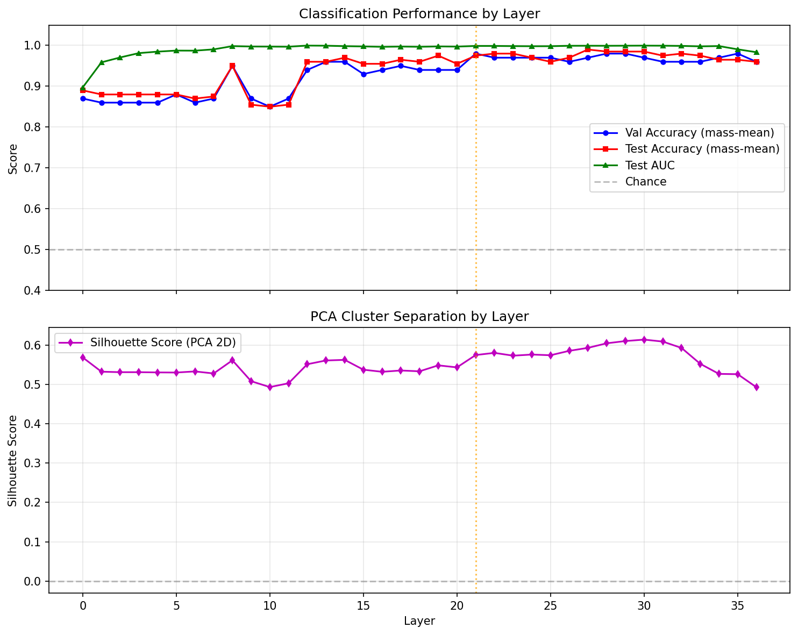
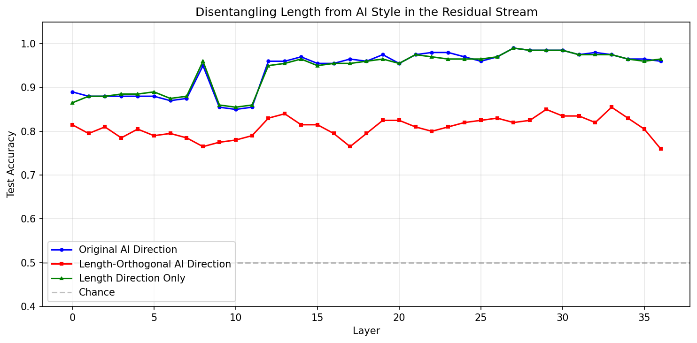
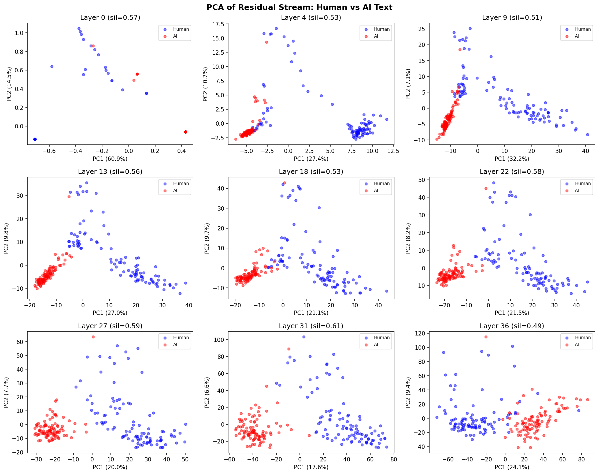
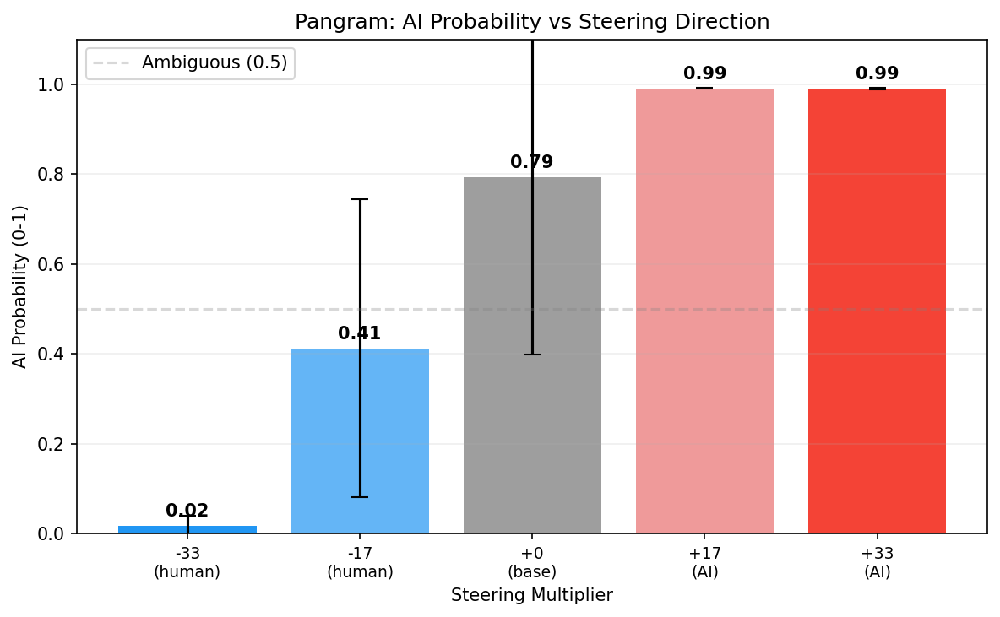

# Week 3: Replicating the Baseline + Implemented AI Detector for Scoring

## What I Did This Week

This week's goal was to replicate the results from the Hypogenic preliminary study - reproducing the full pipeline on Colab, making sure everything worked end to end, setting up apis and all that. Mostly I wanted to verify the numbers hold up. I was actually planning to do this later, but it just made sense to swap the LLM judge for actual AI detectors rather than spending api credits rerunning that aspect of the original pipeline.  and make one initial extension: swapping the LLM judge for Pangram as the evaluation target for steering experiments.

Went through the steps to load the dataset, extract the activations, find direction, the PCA analysis, confounding analysis, plus length-adjusted results. Replicated the steering as well, though the results were evaluated via Pangram's api instead of the llm judge like int he original. 

## Challenges
I actually had more issues getting the HC3 dataset (the Human-ChatGPT Comparison Corpus used in the original study) than expected. I initially planned to load it with load_dataset, but the standard HuggingFace loader is broken for this dataset:

```python
load_dataset("Hello-SimpleAI/HC3")  # RuntimeError: Dataset scripts are no longer supported
```

After going through several failed alternatives — parquet loading, JSON URL fetching — I gave up and just downloaded the raw .jsonl and loaded it that way.

One of the steering results was also leaking into the prompt, which I didn't fully fix, so that's something I'll need to take care of next week. 

## Replication Results

Once the pipeline was running, the numbers came out clean and matched the original study closely:

```
Best layer (by val acc): 21
  Val Acc: 0.980
  Val AUC: 0.995
  Test Acc: 0.975
  Test AUC: 0.999
  Test Acc 95% CI: [0.950, 0.995]

--- Cross-layer Direction Consistency ---

Adjacent layer cosine sim: mean=0.874, min=0.092, max=0.974
```

Like the original study, the cosine similarity between AI direction and length direction confirms that most of the "AI style" is just verbosity. 


After projecting out length, got the the new best layer is 33, with accuracy of  accuracy at best layer 85.5%, also matching the findings of the original.

The cross-layer direction consistency was also high (mean adjacent cosine similarity: 0.874), meaning once the direction forms around layer 2, it stays stable throughout the network. The one exception is the jump from the embedding layer (layer 0) to layer 1 — cosine similarity of only 0.092 — which makes sense since the embedding layer operates very differently from the transformer layers.

One interesting thing to note: there's a consistent dip in classification accuracy around layers 8-10 before recovering sharply at layer 11. This shows up in both the accuracy plot and the PCA grid. I'm not sure what's happening computationally at those layers — might be worth investigating further.








Sample of steering:

=== (Climate Change Prompt) ===

[HUMAN-LIKE, mult=-33.2]:
  The average temperature on Earth is rising. The earth's atmosphere is getting warmer. This is caused by the greenhouse effect. This greenhouse effect is the result of CO2 and other green house gases...

[HUMAN-LIKE, mult=-16.6]:
  Climate change is the long-term alteration of the statistical distribution of weather patterns over several decades or longer. Climate change is a change in the statistical distribution of weather ove...

[BASELINE, mult=+0.0]:
  Climate change is a global phenomenon that refers to the long-term alteration of Earth's climate patterns and weather conditions. It is primarily caused by human activities, such as the burning of fos...

[AI-LIKE, mult=+16.6]:
  Climate change refers to the long-term changes in weather patterns and temperature that are caused by various factors, including human activities such as burning fossil fuels and deforestation. These...

[AI-LIKE, mult=+33.2]:
  Climate change is a pressing issue that has become increasingly important in recent years. As the world continues to face the impacts of climate change, it is important for individuals, governments, a...


## The Pangram Result

The most interesting finding this week came from swapping the LLM judge for Pangram as the steering evaluator. The original study used GPT-4 to score "AI-likeness" on a 1-7 scale and found only a modest ~1 point shift from steering. Pangram tells a very different story (see also the graph below; copied the numbers to the chart):

| Steering Multiplier | Pangram AI Probability |
|---|---|
| -33 (most human) | 0.02 |
| -17 | 0.41 |
| 0 (baseline) | 0.79 |
| +17 | 0.99 |
| +33 (most AI) | 0.99 |

At multiplier -33, Pangram assigns only 2% probability of AI authorship, meaning it was effectively fooled completely. Plus we see it clearly increasing across the five conditions, like we would have liked it to. 



This is a much stronger result than the original LLM judge suggested, which is encouraging for the project's main goal.

It's also worth noting the baseline (multiplier 0) already scores **0.79** on Pangram — confirming that Qwen base model outputs are distinctly AI-sounding even without any steering, which aligns with the original report's observation that base model outputs have a high AI-likeness floor.

## Next Steps

- Switch to Qwen2.5-3B-Instruct and rerun the full pipeline — as mentioned in the proposal, the instruct model should have a more pronounced AI style, giving a larger dynamic range for steering and potentially even stronger Pangram evasion
- Start building the multi-source dataset: implement the pipline to collect Claude and Gemini responses to the same HC3 questions via OpenRouter and gather the responses. Plus also length-matching the dataset to remove length as a confounding factor/separate it from pure style 
- Test against GPTZero and ZeroGPT in addition to Pangram for a fuller picture of detector evasion
