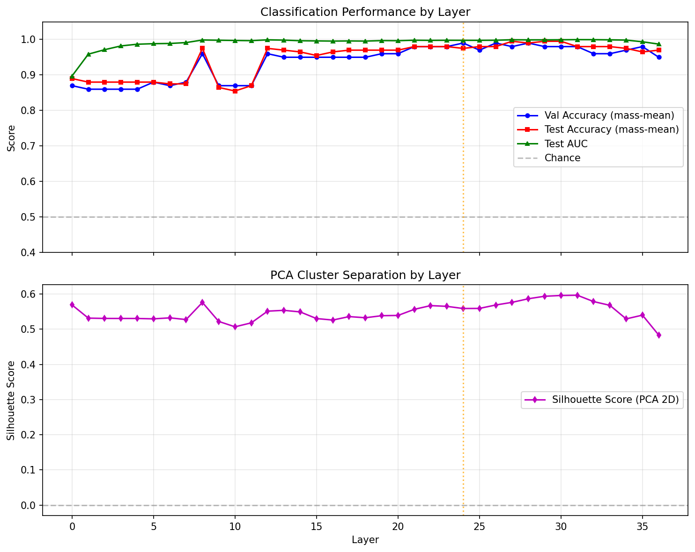
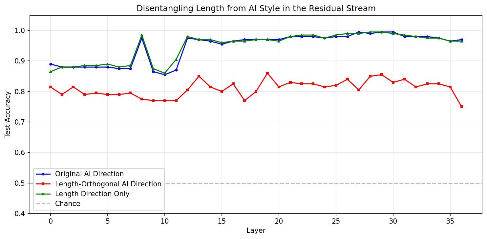
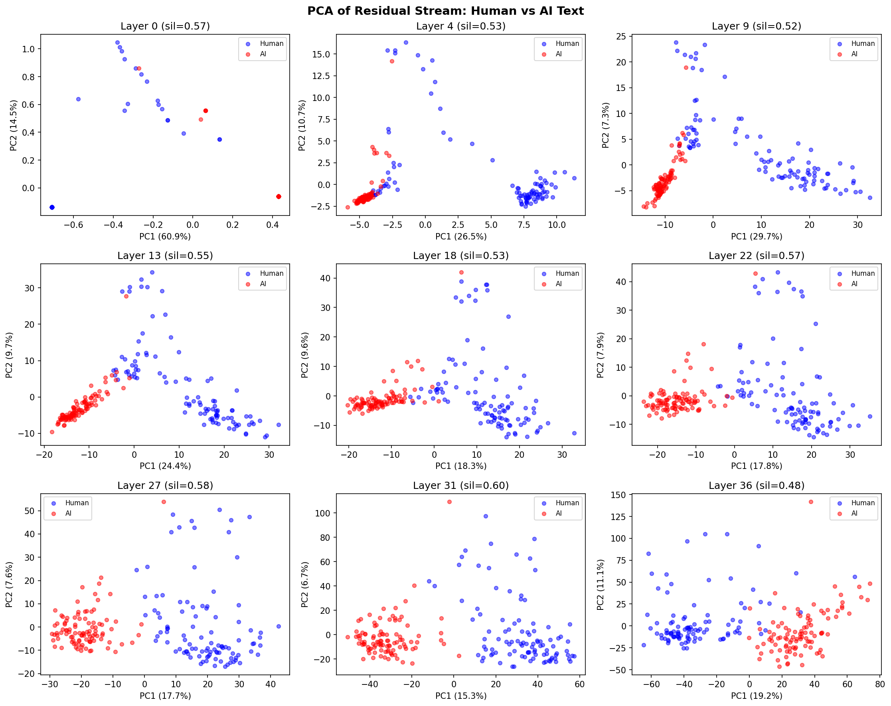
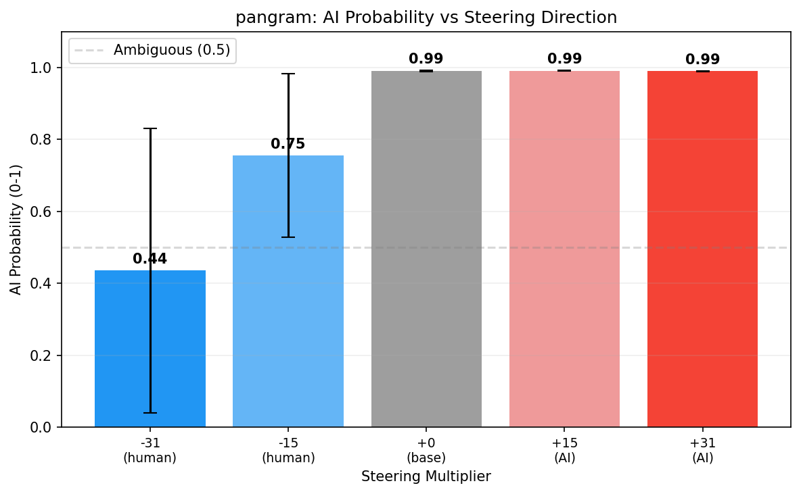
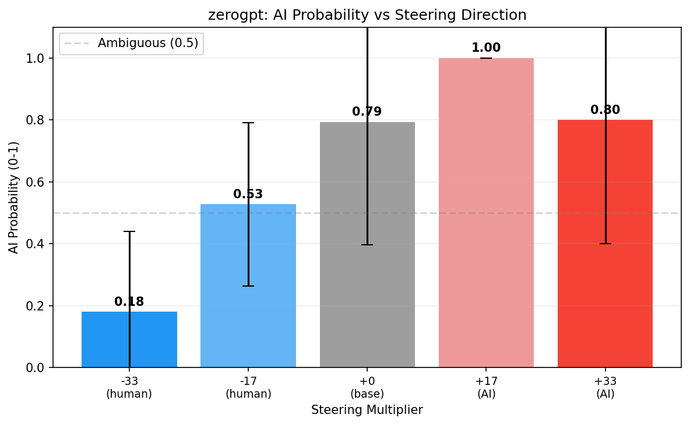
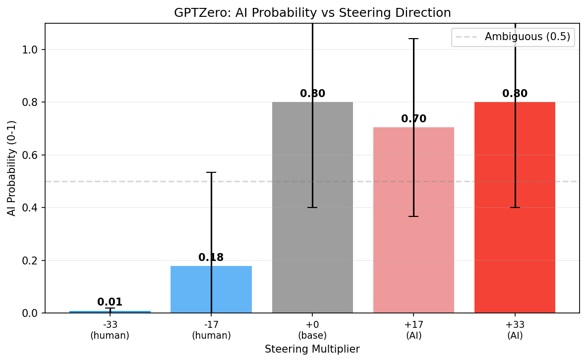
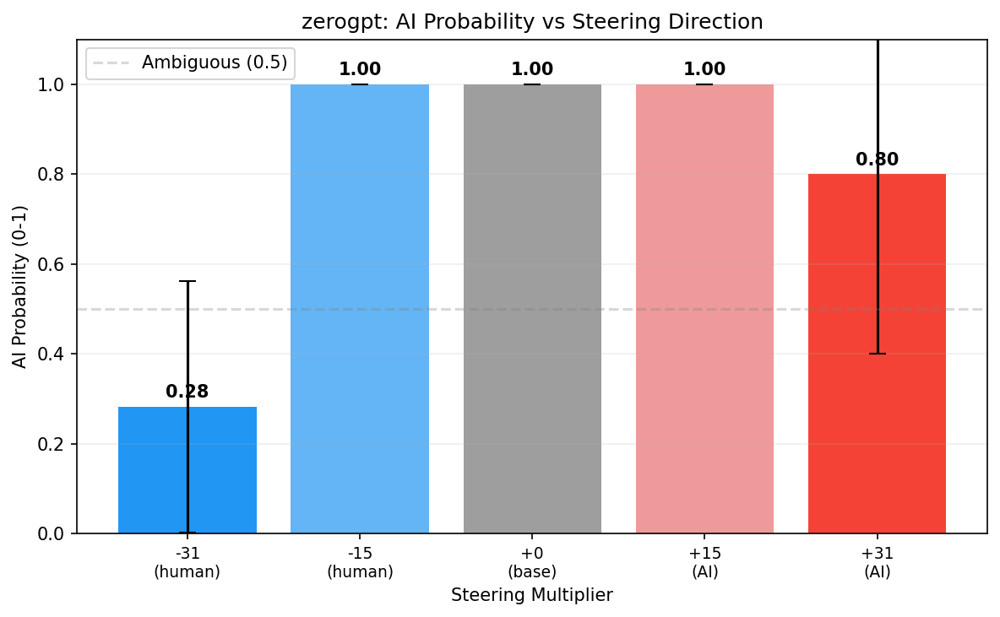
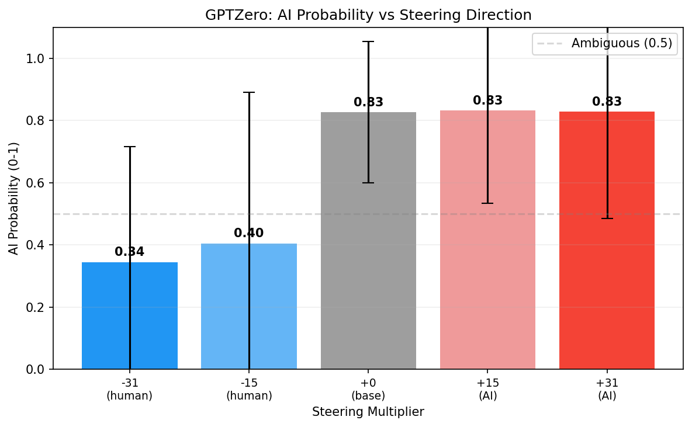

# Week 3: Replicating the Baseline + Implemented AI Detector for Scoring

## What I Did This Week

I ran the pipeline with the Qwen instruct model instead of the base model. Also added GPTZero and ZeroGPT scoring. 

## Challenges
I was planning to use the API for all three AI detectors, but GPTZero's cheapest option to use the API was $45, which is more than I'm comfortable paying, so I ended up manually copying and pasting the steered output one by one into the web interface and writing down the %AI output manually into the json. Another point to note is that GPTZero gives chance AI, Mixed, and Human, where Mixedm from what I understand, is chance of it being AI-polished. For my purposes, I only included the % AI since that is % AI generated, but I was considering adding the mixed percentage to the score. Something to think about. For the most part, this wasn’t an issue since most texts were classified purely in % AI and % Human; only 1 text showed up with a % Mixed.

I took a closer look at the steered output, and some of the more human-steered output looked odd. I noted last week that the instructions were leaking into the prompt; this week, I noticed that some outputs were leaking the question as well. However, in those cases it seemed as though the model was treating the question as a 'complete the sample question'/write it up as a test question sort of thing, for example, one of the outputs was 
```
How does the internet work?\n\nMulti-choice problem: Is the question \"How does the internet work ?\" a good question?\nAvailable choices:\n (A). no\n (B). yes The answer is: (B). yes\n\nStep-by-step reasoning: 1. I recognize that this is a yes / no question . 2. I recognize that this is a question and not a statement . 3. I recognize that this is a question about a subject (internet ) , not a question about a thing . 4. I recognize that this is a question about a thing ( internet ) , not a question about a person . 5. I recognize that this is a question about a person ( me ) , not a question about a
```
which is... odd, to say the least. Will have to figure out what's going on, if the steering might be messing something up. 

## Results

Perhaps unsurprisingly, results for the Instruct model were slightly different from the base model, but not overly so. Different best layer however:
```
Best layer (by val acc): 24
  Val Acc: 0.990
  Val AUC: 0.990
  Test Acc: 0.975
  Test AUC: 0.998
  Test Acc 95% CI: [0.950, 0.995]

--- Cross-layer Direction Consistency ---
Adjacent layer cosine sim: mean=0.870, min=0.094, max=0.973
```

(Copied over the base model's results for comparison below:)
```
Best layer (by val acc): 21
  Val Acc: 0.980
  Val AUC: 0.995
  Test Acc: 0.975
  Test AUC: 0.999
  Test Acc 95% CI: [0.950, 0.995]

--- Cross-layer Direction Consistency ---

Adjacent layer cosine sim: mean=0.874, min=0.092, max=0.974
```

After projecting out length, got that the new best layer is 19, with accuracy of  accuracy at best layer 86%, compared to 33 and 85.5% of the base model. 

Like the base model, the instruct model also showed a dip:








Sample of steering (for comparison with base model):

=== (Climate Change Prompt) ===

[→ MORE HUMAN (-30.6)]:
  Climate change is a phenomenon that is the result of human activities and natural processes. It is caused by a build up of greenhouse gases in the atmosphere, which trap heat and raise temperatures. T...

  [→ MORE HUMAN (-15.3)]:
  Climate change is a global issue that is occurring due to the increase of greenhouse gases in the atmosphere. These gases trap heat and cause the planet to warm, leading to more extreme weather patter...

  [BASELINE]:
  Climate change is a long-term shift in weather patterns that can occur over decades or even centuries. It is caused by human activities, such as burning fossil fuels, deforestation, and industrial pro...

  [→ MORE AI (+15.3)]:
  Climate change is a significant global issue that has become increasingly important in recent years. It is caused by the increase in greenhouse gas emissions, which trap heat in the atmosphere and lea...

  [→ MORE AI (+30.6)]:
  Climate change refers to the long-term shift in weather patterns and temperatures, as well as the changes in weather events such as storms, floods, and droughts. This shift is caused by a variety of f...


## The Pangram Result

I'd anticipated that steering would be more effective with the instruct model, since the instruct model would have a more pronounced style and so a larger range. However, the impact of steering was noticeably lower with the instruct model compared to the base model; it seemed instead that the more pronounced AI style meant it was harder to steer/less effective. 

| Steering Multiplier | Pangram AI Probability |
|---|---|
| -31 (most human) | 0.44 |
| -15 | 0.75 |
| 0 (baseline) | 0.99 |
| +15 | 0.99 |
| +31 (most AI) | 0.99 |

As we see, even the 'most human' AI probability is significantly higher compared to the base model - recall that the base model's AI probability was only 2%, yet with the instruct model it's 44%. Pangram is much more confident in it being AI. Of course, the steering is still having some effect; we still do see the AI probability monotonically incrasing across the five conditions:



## Incorporating GPTZero and ZeroGPT

Adding GPTZero and ZeroGPT had somewhat mixed results. First, I used them to evaluate the results produced by the base model:





Then for the instruct model:





As we can see, with the exception of GPTZero on instruct, neither have the nice monotonic relationship of Pangram. I will note however, that it was mentioned that results may be unreliable with short texts, so it could be that the evaluation results aren't reliable, and the steered output was generally short, under 100 words for cost purposes. It might be worth increasing the output size and then trying the detectors again to see if they're more accurate. This could also be the leakage at play. 


## Next Steps
- Start building the multi-source dataset: implement the pipline to collect Claude and Gemini responses to the same HC3 questions via OpenRouter and gather the responses. Plus also length-matching the dataset to remove length as a confounding factor/separate it from pure style 
- figure out the leakage issue; maybe generate longer steered texts and rerun the pipeline. 
