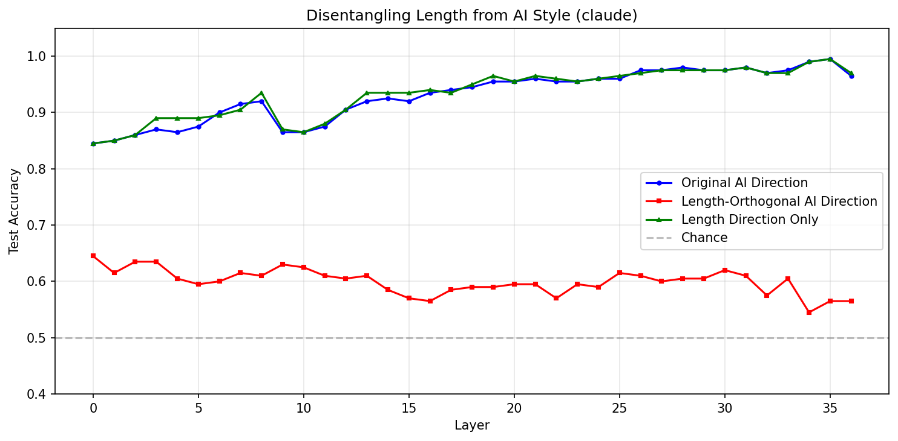
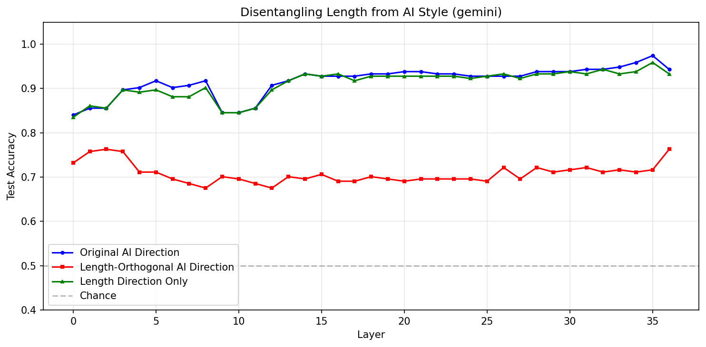
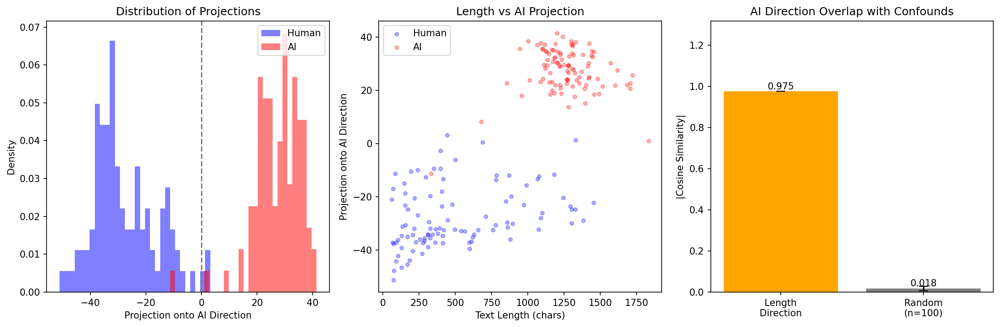
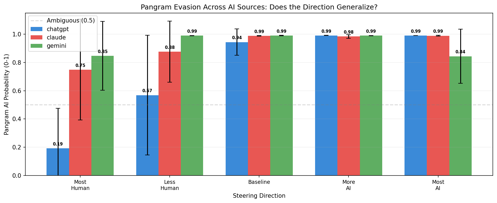

# Week 3: Multi-Source Dataset + Does the AI Direction Generalize?

## What I Did This Week

This week was about extending the baseline to multiple AI sources. The core question is whether the "AI direction" found so far is just capturing ChatGPT's quirks, or whether there something more universal going on. To test this, I collected Claude (claude-sonnet-4-5) and Gemini (gemini-2.5-flash) responses to the same HC3 questions via OpenRouter, then ran the full pipeline separately for each source.

The dataset ended up with 350 pairs per source (347 for Gemini due to a few failed responses). note that I had to remove the upper length filter since Claude and Gemini seemed to be significantly more verbose than the original HC3 ChatGPT responses, and the filter was cutting too many pairs.

## Dataset Statistics

One thing that immediately stood out was how much more verbose Claude and Gemini are compared to ChatGPT:

| Source | Human mean length | AI mean length |
|---|---|---|
| ChatGPT | 506 chars | 939 chars |
| Claude | 506 chars | 1,245 chars |
| Gemini | 508 chars | 1,741 chars |

Gemini in particular is almost 3.5x longer than human responses on average, vs ChatGPT's ~2x. This matters a lot for the analysis, as we'll see.

## Direction Finding Results

All three sources show a clear AI direction, with high classification accuracy across the board:

| Source | Best Layer | Test Acc | Test AUC |
|---|---|---|---|
| ChatGPT | 22 | 98.5% | 1.000 |
| Claude | 28 | 98.0% | 0.999 |
| Gemini | 35 | 97.4% | 0.996 |

As noted, the length confound was even more significant for Claude and Gemini. 

Running the confound analysis across all three sources:

| Source | Cosine sim w/ length | Original acc | After removing length |
|---|---|---|---|
| ChatGPT | 0.938 | 98.5% | 80.5% |
| Claude | 0.975 | 98.0% | 62.0% |
| Gemini | 0.961 | 97.4% | 64.4% |

ChatGPT's direction is already 93% length — but Claude's is 97.5%. After removing the length component, ChatGPT still has a solid 80.5% accuracy, while Claude and Gemini drop to 62-64%, barely above chance relative to how high they started. 

The within-class correlation tells the same story: for Gemini, the correlation between AI text length and its projection onto the AI direction is essentially 0 (0.004), meaning Gemini responses are uniformly long regardless of the question. Claude is similar (0.060). ChatGPT at least varies somewhat (0.292). So Claude and Gemini don't just write long responses — they write *consistently* long responses, which makes length an even more dominant signal for those sources.

This is kind of a problem for the "universal AI style direction" idea. The directions we're finding might really just be "writes long responses" directions, which isn't that interesting.

(One odd thing is that GPT's layer results differed from the past few weeks - I expected them to remain the same or relatively similar, but possibly because n is small, this time the best layer for length orthogonal direction seems to have been 11.)

Some figures:

Claud Confound Analysis:

## Steering + Pangram Results

Despite the length confound issue, the steering experiment gave some interesting results. I ran steering for each source using its own best direction, and scored with Pangram:

ChatGPT's direction gives the cleanest evasion — at the most human-like multiplier, Pangram drops to 0.19, whereas Claude and Gemini don't drop as far (0.75 and 0.85 respectively at most human-like). It seems like steering was less effective when applying their directions, possibly since their styles are more dominated by length and less by style.

The baseline scores are also telling:
- ChatGPT baseline: 0.94
- Claude baseline: 0.99  
- Gemini baseline: 0.99

So Pangram is basically certain that Claude and Gemini outputs are AI-generated even before any steering. Again, probably mostly because they're so verbose.

One weird thing: Gemini's "Most AI" bar actually drops to 0.84, lower than the baseline 0.99.

## Challenges

Had issues with Pangram credits running out mid-run - had to add resuming logic, plus keeping track of all the different directories. Also, still faces issues with some of the generated output being somewhat incoherent or oddly formatted, some of which are still seemingly trying to write MCQ or test questions for whatever reason. 

## Next Steps

The main thing I want to try next week is a pooled dataset — instead of running three separate pipelines, use the same set of human responses paired with all three AI sources, so the human side is held constant. This would make the cross-source comparison much cleaner, plus find a 'general' AI direction across all three sources. I'm also considering steering with length orthogonal direction - might see better results for Claude and Gemini especially. Maybe better length matching on the dataset - possibly add that to the prompt when generating results to get AI responses close in length to the corresponding human responses. 

Plus still need to figure out the leakage issue

Also two point from the feedback from the last blog post seem like they'd be interesting to pursue - seeing if AI detectors might be classifying outputs as human because of them being incoherent, plus adding a comparison of steering against a prompting baseline.
