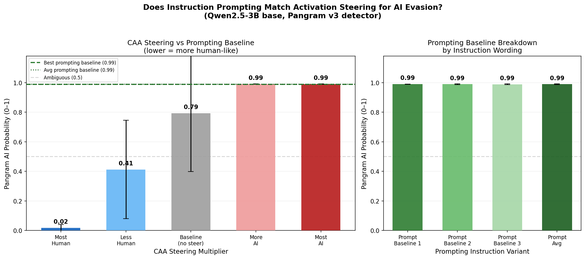
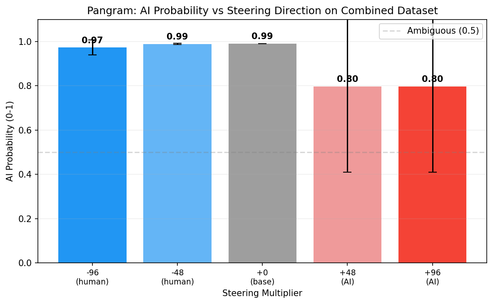
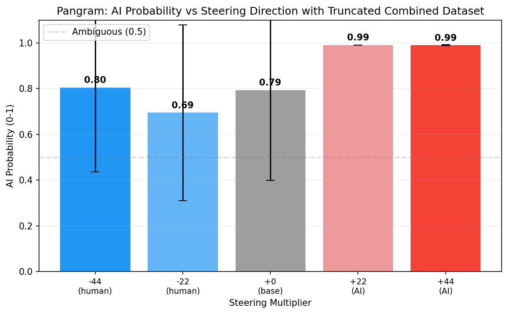

# Week 6: Pooled Dataset, Truncation, and a Prompting Baseline

## What I Did This Week

Three main things this week: added a prompting baseline to compare against steering, built a pooled multi-source dataset (ChatGPT + Claude + Gemini combined), and tried truncating AI texts to deal with the length confound.

## Prompting Baseline

One of the suggestions from a past week's feedback was to add a prompting baseline — i.e., just tell the model to write like a human and see how that compares to activation steering. I tested three instruction variants on the Qwen base model:

```
"Write in a natural, conversational human style. Avoid sounding like an AI."
"Respond as a real person would — casually, directly, without over-explaining."
"Write like a human, not like an AI assistant. Be informal and natural."
```

All three flatlined at 0.99 Pangram score. The best and average prompting baseline were identical — no variant did anything.



Was a bit puzzled until I realized why - Qwen2.5-3B is a base model, not an instruct model, so it doesn't really follow instructions — it just does text completion. The prompts get absorbed into the context but don't meaningfully change the output style. As a result, the comparison ended up being less interesting than hoped. I probably should've run it on instruct instead, so I'll do that next week.

## Pooled Dataset

Last week I ran separate pipelines for ChatGPT, Claude, and Gemini. This week I pooled all three into a single dataset to find a shared "AI direction" across sources, and to make cross-source comparisons cleaner by holding the human side constant.

After filtering, ended up with 704 valid pairs:

| Source | Pairs |
|---|---|
| ChatGPT | 329 |
| Claude | 288 |
| Gemini | 87 |

Gemini is still low due to verbosity — a lot of responses get filtered or are just very long. Human mean length was 525 chars, AI mean was 1052.

Direction finding on the pooled set gave the following results:

```
Best layer (by val acc): 33
  Val Acc: 0.985
  Val AUC: 0.998
  Test Acc: 0.971
  Test AUC: 0.995
  Test Acc 95% CI: [0.951, 0.987]

Adjacent layer cosine sim: mean=0.884, min=0.096, max=0.976
```

Not surprising given the numbers from individual sources last week. 

The length confound is still very much present. Cosine similarity between the AI direction and the length direction is 0.9436, and accuracy drops from 97.1% → 70.1% after removing the length component. This is somewhat better than Claude and Gemini individually (which dropped to 62-64%) but worse than ChatGPT alone (85.5%). The length-orthogonal best layer is 1, which is odd — it suggests the pure style signal (after removing length) is essentially flat across layers and barely above chance.

Steering on the pooled dataset gave a reversed result. Negative multipliers (meant to steer toward human) scored *higher* on Pangram, and positive multipliers (meant to steer toward AI) scored *lower* — the opposite of what the ChatGPT-only pipeline found. Which, isn't what we'd hoped to find. I took a look at pangram's scores, and the results are somewhat interesting. The +21.8 and +43.5 conditions are solid — all five prompts cluster at 0.99. But in the human-steered conditions, most prompts also stay near 0.99, with one or two dropping dramatically (e.g. 0.067, 0.045, 0.005). So the evasion effect isn't consistent across prompts — it's a few outliers pulling the mean down, while most prompts show no movement at all. Hard to say whether those low-scoring outputs are genuine style evasion.



My best guess for the direction flip: the mass-mean direction found on the pooled dataset is pointing the opposite way compared to the ChatGPT-only direction, possibly because the pooled "AI" centroid gets pulled differently when you mix three sources with very different styles and different length distributions at the sentence level. Might suggest that there's no set AI direction and it more depends on the quirks of the model in question?

## Truncation Experiment

Since filtering AI texts by length ratio was cutting too many pairs (especially Gemini), I tried a different approach: just truncate AI texts to match the length of their paired human response. Since truncating in the middle of the sentence might not be the best idea, current logic truncates sentence-by-sentence: it adds sentences one at a time until the next sentence would push the total length past target_len * 1.2 (i.e. 20% tolerance over the human text length), then stops. If no sentences fit at all (e.g. the first sentence alone is already too long), it falls back to a hard character slice at target_len. This let me keep all 1031 pairs — now evenly distributed across sources:

| Source | Pairs |
|---|---|
| ChatGPT | 345 |
| Claude | 344 |
| Gemini | 342 |

And the length matching worked:

```
Human len: mean=513
AI len (truncated): mean=501
```

The effect on the length confound was dramatic. Cosine similarity between the AI direction and the length direction dropped from 0.944 → 0.002, and accuracy before vs. after removing length was identical (0.958 both ways). Running the direction finding:

```
Best layer (by val acc): 29
  Val Acc: 0.955
  Val AUC: 0.998
  Test Acc: 0.958
  Test AUC: 0.996
  Test Acc 95% CI: [0.935, 0.977]
```

So even with length removed as a signal, the model can still classify AI vs human text at approx 96% accuracy, suggesting there's a real style direction here, not just a verbosity detector.

However, the steering results on the truncated dataset are still reversed, and still noisy:

```
Multiplier -43.5: mean=0.805, values=[0.991, 0.989, 0.992, 0.986, 0.067]
Multiplier -21.8: mean=0.695, values=[0.987, 0.045, 0.991, 0.461, 0.990]
Multiplier +0.0:  mean=0.793, values=[0.990, 0.991, 0.991, 0.989, 0.005]
Multiplier +21.8: mean=0.990, values=[0.991, 0.990, 0.991, 0.990, 0.989]
Multiplier +43.5: mean=0.990, values=[0.992, 0.990, 0.991, 0.988, 0.987]
```



## Challenges

The prompt leakage issue is still showing up in some steered outputs, with the model occasionally treating questions as multiple-choice test items or otherwise producing incoherent completions. This is probably affecting the Pangram scores in unpredictable ways — some of the extreme low-probability outliers in the steering conditions might be cases where the output is so incoherent that Pangram reads it as human, rather than genuine style evasion.

## Next Steps

- Run the prompting baseline on the instruct model
- Maybe increase the number of prompts used in steering evaluation - 5 might be too low, but then again, that might prove too expensive to use AI detector to evaluate
- Investigate whether low Pangram scores in some conditions are due to genuine style evasion vs. incoherent outputs - still need to see how AI detectors treat incoherent gibberish
- Still need to fix the prompt leakage
- Try using other models aside from qwen
