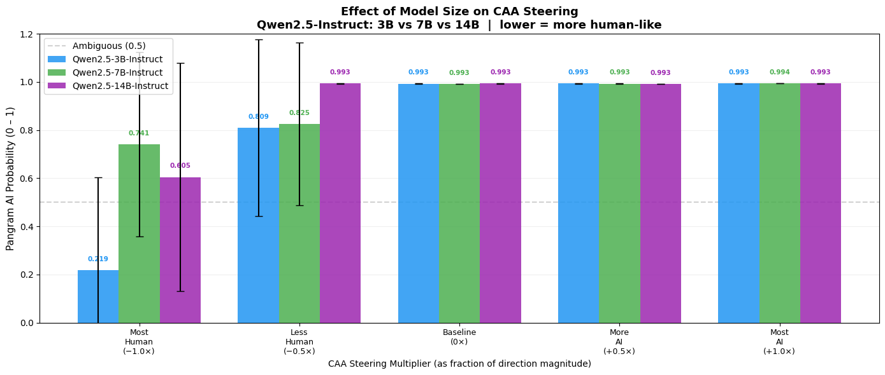

# Week 7: Cross-Source Direction Similarity, Model Size, and More Prompts

## What I Did This Week

Computed cosine similarities between the directions found for each AI source to see how much they actually overlap, reran the base model steering experiment with 30 prompts instead of 5, and tested whether model size affects how well CAA steering evades Pangram.

## Cross-Source Direction Similarity

The core question motivating the multi-source work is whether the "AI direction" is universal or source-specific. One direct way to test this is just to compute cosine similarity between the directions found for each source. Results for the raw directions:

| Pair | Cosine Similarity |
|---|---|
| ChatGPT vs Claude | 0.5043 |
| ChatGPT vs Gemini | 0.1507 |
| Claude vs Gemini | 0.4297 |

And for the length-orthogonal directions (best layers: ChatGPT=22, Claude=28, Gemini=35):

| Pair | Cosine Sim |
|---|---|
| ChatGPT vs Claude | 0.4673 |
| ChatGPT vs Gemini | 0.1966 |
| Claude vs Gemini | 0.2514 |

ChatGPT and Claude share a moderate amount of direction (~0.50 raw, ~0.47 length-orthogonal), which makes some sense — both are RLHF-tuned models with similar training objectives. ChatGPT and Gemini are barely similar at all (0.15 raw), and Claude and Gemini are somewhere in between. The claude vs other length-orthogonal similarities are all lower than the raw ones, interestingly. So the answer to "is there a universal AI direction?" is: partially for ChatGPT and Claude, not really for Gemini. This might be why trying to find a universal steering direction didn't work out all that well on the combined dataset.

## 30-Prompt Rerun

Last week I flagged that the 5-prompt steering evaluations were too noisy to interpret — a single outlier prompt could swing the mean significantly. I found out about an hour ago that Pangram finally granted API credits, so that means I can scale up the number of prompts evaluated without worrying about costs now. So, I reran the original ChatGPT-direction steering on the base model with 30 prompts sampled from the HC3 dataset instead of just the 5 prompts.

Results mostly matched up - it'll be more interesting to see whether 30 prompts will help produce more interpretable results for the other experiments, which I plan to run this week. 

| Multiplier | Pangram Score |
|---|---|
| -33 (most human) | 0.02 |
| -17 | 0.42 |
| 0 (baseline) | 0.70 |
| +17 | 0.88 |
| +33 (most AI) | 0.97 |

Monotonically increasing across all five conditions, and the most human-steered condition drops all the way to 0.02 — same as the original 5-prompt result from week 3, but now with much more confidence. A good sanity check on the original results.

The downside is runtime — 30 prompts takes around 15 minutes per run, so rerunning everything (model size comparisons, pooled dataset, instruct model) will take quite a bit, hence why I'll be doing it over the next week.

## Effect of Model Size

I wanted to see how model size would affect steering results, so ran the instruct model steering experiment across three model sizes: Qwen2.5-3B-Instruct, 7B-Instruct, and 14B-Instruct.

| Model | Most Human (-1.0×) | Baseline (0×) |
|---|---|---|
| 3B-Instruct | 0.219 | 0.993 |
| 7B-Instruct | 0.741 | 0.993 |
| 14B-Instruct | 0.605 | 0.993 |

All three models have identical baselines (0.993), but steering effectiveness drops off somewhat with size — 3B gets down to 0.219 at the most human multiplier, while 7B only reaches 0.741 and 14B reaches 0.605. The 14B being slightly more steerable than 7B is a bit unexpected; could be noise given only 5 prompts, which is something to revisit with the 30-prompt rerun. The general trend though is that larger instruct models are harder to steer away from sounding like AI, which makes intuitive sense — larger models have more deeply ingrained stylistic patterns from RLHF and are likely more resistant to activation-level interventions.

Note that these are all still run with 5 prompts, so the model size comparison will be rerun with 30 prompts as part of the broader rerun effort.

## Next Steps

- Rerun model size comparison and all other experiments with 30 prompts for more reliable estimates
- Multi-round prompting experiment on the instruct model — per earlier feedback, iteratively telling the model its output looks too AI-generated has worked on frontier models; worth testing here
- Figure out the direction flip in the pooled/truncated dataset from last week — still unresolved, hopefully will be resolved once run with 30 prompts and so can be more confident in the results.
- Finish the final draft, including adding an appendix with some sample steered results, the prompts, etc. 
