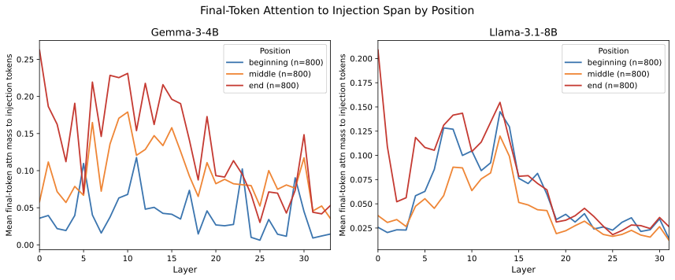
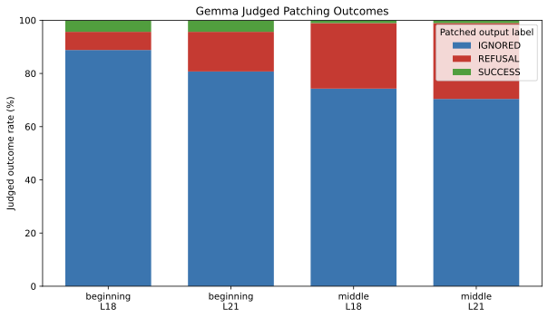
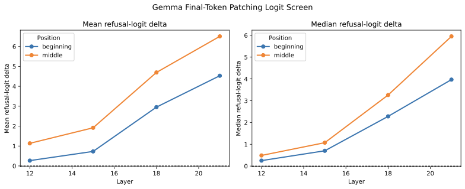

## Week 4 Blog

Weekly goals:

- stress-test the probe results under tighter controls
- replace the earlier broad attention metric with a more behaviorally relevant readout
- activation patching

Scope summary:

- Models: `gemma-4b` and `llama-8b`
- Context lengths: `100` and `1000` words
- Primary mechanistic comparison: `REFUSAL` vs `IGNORED`
- Main causal target: Gemma activation patching

Changes summary:

1. the judged Gemma patching run now gives the first real causal result: in the strongest condition, patching layer `21` at `middle` shifts `28.5%` of originally `IGNORED` examples into `REFUSAL`
2. the attention story is now much cleaner once attention is measured from the final prompt token rather than averaged broadly across the whole prompt; under this readout, `end` is the most attended position overall in both models
3. the core `REFUSAL` vs `IGNORED` probe signal survives tighter controls, though the exact position profile is not identical across models

### Experiment 1: probe follow-ups and robustness checks

The first set of follow-ups was aimed at clarifying what the probes are actually showing.

The basic setup remained the same as last week:

- one linear probe per layer
- logistic regression on the mean residual-stream representation over the injected span
- balanced binary classes for each comparison
- stratified train/test split

I also checked the positive-control result more carefully. Last week I had reported the best layer, but the fuller question is what the curve looks like across the network.

For `injection_present` vs `injection_absent`, the answer is simple: it stays perfect.

| Model | Position | Accuracy across layers | `n_total` |
|---|---|---:|---:|
| Gemma-4B | beginning | 1.0000 at every layer | 1600 |
| Gemma-4B | middle | 1.0000 at every layer | 1600 |
| Llama-8B | beginning | 1.0000 at every layer | 1600 |
| Llama-8B | middle | 1.0000 at every layer | 1600 |

This makes the positive control clearly a sanity check rather than a localization result. It confirms that the pipeline can recover injection presence extremely easily, but it does not tell us much about where the `REFUSAL`/`IGNORED` split is computed. **The positive control may be trivially easy in its current design**

I then reran the main `REFUSAL` vs `IGNORED` probes on narrower slices to reduce prompt-family variation.

| Model | Slice | Position | Best accuracy | `n_total` |
|---|---|---|---:|---:|
| Llama-8B | Gutenberg + instruction leak | beginning | 0.2727 | 44 |
| Llama-8B | Gutenberg + instruction leak | middle | 0.8182 | 86 |
| Llama-8B | Scientific + role manipulation | beginning | 0.5556 | 72 |
| Llama-8B | Scientific + role manipulation | middle | 0.9286 | 54 |
| Gemma-4B | Gutenberg + instruction leak | beginning | 0.8333 | 46 |
| Gemma-4B | Gutenberg + instruction leak | middle | 0.7273 | 88 |
| Gemma-4B | Scientific + role manipulation | middle | 0.6471 | 66 |

These reruns were useful in two ways.

First, they support the idea that the core `REFUSAL`/`IGNORED` distinction is real and not just an artifact of the broad pooled dataset. Second, they complicate the cleanest possible “middle is always the real regime” story. For Llama, middle remains the stronger and more robust signal under tighter controls. For Gemma, at least one filtered slice still shows a strong beginning-position signal.

So the updated interpretation is it looks like the position profile may depend somewhat on model family and slice, while the broader existence of a `REFUSAL`/`IGNORED` signal remains intact.

I also reran the `SUCCESS` comparisons under tighter controls. Those results were much less satisfying. Once the slices became narrower, `SUCCESS` often became too rare, and some of the surviving results were suspiciously flat across layers. That makes them useful to retain in the record, but not useful to lean on as strong localization evidence.

This is the `REFUSAL` vs `IGNORED` layer curve:

For completeness, the positive-control curve is also useful, mainly because it shows how trivially easy the `injection_present` vs `injection_absent` task is:

### Experiment 2: final-token readout attention

The most conceptually important attention follow-up this week was changing the readout.

Last week, attention was measured as average attention mass to the injected span. That was good enough for a first-pass screen, but it also created the most obvious interpretability problem: end-position injections are more likely to be refused, yet they looked weak under the original broad average-attention plots.

Thanks to Dang for the helpful comments pointing out the paradoxical result from last weeks blog! This week I ran a sharper version of the experiment: attention from the **final prompt token** to the injected span, measured layer by layer in the properly formatted instruction/chat setup.

This is a better mechanistic readout because the final prompt token is the position immediately upstream of next-token prediction. In other words, it is much closer to the model's actual pre-answer state.

The positional picture changes substantially under this metric.

| Model | Position | Best layer | Best mean attention |
|---|---|---:|---:|
| Gemma-4B | beginning | 11 | 0.1176 |
| Gemma-4B | middle | 10 | 0.1790 |
| Gemma-4B | end | 0 | 0.2626 |
| Llama-8B | beginning | 13 | 0.1451 |
| Llama-8B | middle | 13 | 0.1200 |
| Llama-8B | end | 0 | 0.2087 |

This is much more compatible with the behavioral phenomenon. Under the final-token readout, `end` is the most attended position overall in both models.

Within-position `REFUSAL > IGNORED` gaps are still present:

| Model | Position | Best gap layer | `REFUSAL - IGNORED` gap |
|---|---|---:|---:|
| Gemma-4B | beginning | 13 | +0.0724 |
| Gemma-4B | middle | 15 | +0.0756 |
| Gemma-4B | end | 14 | +0.0314 |
| Llama-8B | beginning | 12 | +0.0407 |
| Llama-8B | middle | 14 | +0.0448 |
| Llama-8B | end | 9 | +0.0133 |

So the new result is not “attention was irrelevant after all.” It is that the original metric was too coarse. The more behaviorally relevant readout gives a cleaner story:

- end-position injections are highly attended at the actual pre-generation readout point
- within a given position, `REFUSAL` still tends to show more injection attention than `IGNORED`
- the effect looks like a mid-layer readout phenomenon rather than a simple global monotonic rule

This is the most useful attention figure from the new readout:

### Experiment 3: final-token activation patching

The biggest engineering and causal progress this week was activation patching.

Last week, the main patching attempt failed because the original span-based implementation required equal-length token spans. In practice, that filtered away almost all usable naturalistic pairs.

Thanks to Dang's helpful suggestion, this week we moved to patching the **final prompt token** representation instead. This avoids the length-mismatch problem and also puts the intervention directly at the pre-generation readout position.

The first working logit screen was encouraging, but it also exposed a formatting problem. In the initial decode path, the model was being fed raw prompt text rather than the instruction-tuned chat format, so generation sometimes looked like continuation of the document rather than an assistant response.

After fixing the formatting, the full Gemma logit screen changed substantially.

| Layer | Mean refusal-logit delta | Positive-rate |
|---|---:|---:|
| 12 | +0.8211 | 0.7260 |
| 15 | +1.4872 | 0.7910 |
| 18 | +4.0657 | 0.8180 |
| 21 | +5.7927 | 0.8494 |

The matching pool for this run was substantial:

- beginning: `161` matched `IGNORED` / `REFUSAL` pairs
- middle: `284` matched pairs

This result is important for two reasons.

First, it shows that final-token patching is actually viable on the original dataset. Second, once the prompt formatting is correct, the strongest candidate layers move later, not earlier. The initial unformatted run had favored layers `12` and `15`; the corrected run strongly favors `21` and `18`.

The final step was to run the full decode pass on layers `18` and `21` and judge the patched outputs. In these runs, the baseline examples were all originally `IGNORED`, so the judged patched outputs directly measure whether the intervention moves them toward `REFUSAL` or `SUCCESS`.

| Position | Layer | `REFUSAL` | `IGNORED` | `SUCCESS` |
|---|---:|---:|---:|---:|
| beginning | 18 | 6.8% | 88.8% | 4.3% |
| beginning | 21 | 14.9% | 80.7% | 4.3% |
| middle | 18 | 24.6% | 74.3% | 1.1% |
| middle | 21 | 28.5% | 70.4% | 1.1% |

The "SUCCESS" labels were false positives by manual inspection. But this highlights that my judging pipeline is still not well-calibrated... in which case I have redo almost all experiments if it ends up being a huge problem.

Late-layer final-token patching can causally move some originally `IGNORED` examples toward explicit `REFUSAL`. The effect is strongest in `middle`, and layer `21` is consistently stronger than layer `18`.

Equally important, the dominant movement is `IGNORED -> REFUSAL`. If the intervention were just destabilizing the output distribution in a generic way, I would expect much more spillover into `SUCCESS`. Instead, the shift is mostly toward explicit refusal.

The judged patching outcomes are probably the single most important figure in the writeup:

The corresponding logit-screen figure is also useful for seeing why layers `18` and `21` were selected:

We see a monotonic increase. This suggests we should be selecting an even later layer, maybe...

### Overall interpretation

The week 4 results strengthen the overall mechanistic picture in a few ways.

1. The main probe result survives follow-up checks, even if the exact position profile is somewhat model- and slice-dependent.
2. The sharpest attention readout now lines up much better with the behavioral story, especially for end-position refusals.
3. There is now a first judged causal result: patching late-layer final-token representations can shift some `IGNORED` examples toward `REFUSAL`, especially in Gemma middle-position cases.

At this point, there is a coherent mechanistic story with an initial causal intervention result behind it.

### Next steps

The most natural follow-ups now are:

- try even later layers for patching
- replicate the best judged patching condition on Llama-8b
- attribution analysis, intervention control, etc.

If I had to summarize the state of the project in one sentence, it would be that the current evidence points toward a late-stage acknowledgment mechanism, and we now have a first intervention showing that pushing the model's state at that late stage can make an originally ignored injection more likely to become an explicit refusal.
