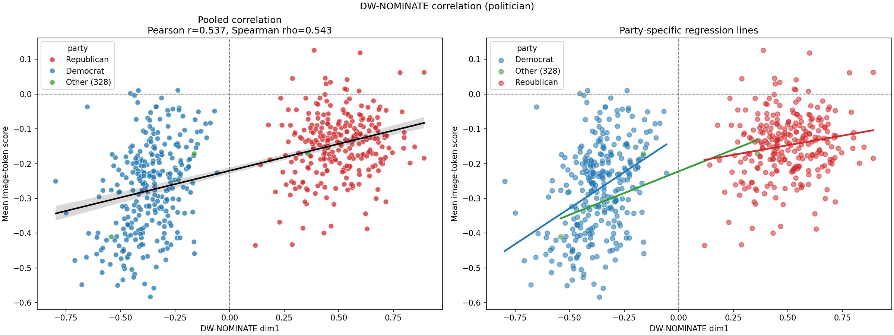
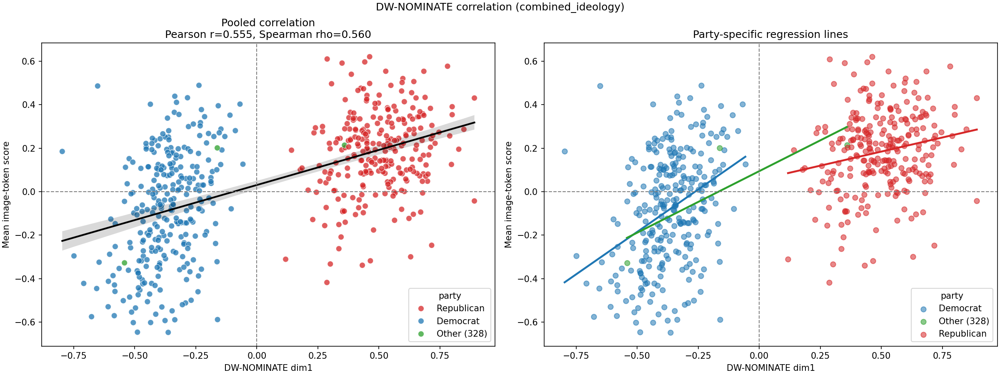
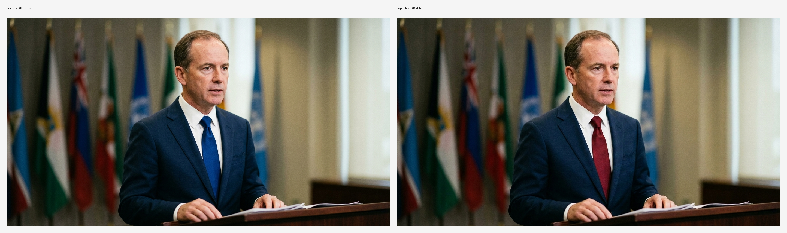
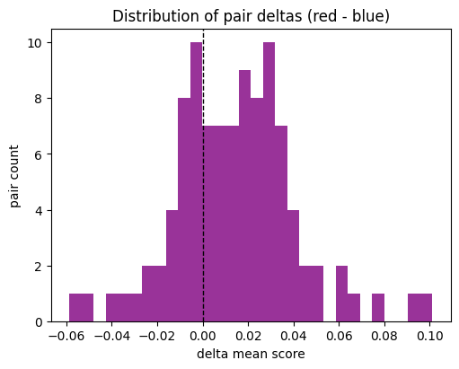
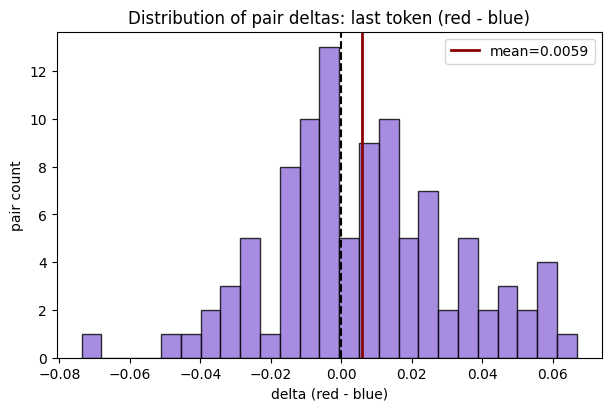

# Weekly Research Update

## Weekly Progress

Over the past few weeks, we established that modern AI models map political ideology as a distinct geometric direction within their latent space—not just when processing text, but also when interpreting visual images of politicians. 

This week, we focused on refining how we measure this ideological direction and pushing the model's understanding to its limits. We explored whether combining text and image data could create a more accurate "probe" (our detector for political ideology). We also tested whether the model plays the subtle human political game by interpreting something as simple as the color of a politician's tie.

## 1. Upgrading the Detector: Combined Probes on Portraits

Previously, we relied heavily on a "textual probe"—a direction found by having the AI generate political statements—and applied it to visual data. While this worked surprisingly well, we wanted to see if a native visual representation could do better.

To test this, we compared our original text-based probe with a new **"combined probe"**. This combined probe was trained using both text and image data simultaneously (mapping congressional member portraits alongside their names to their ideological leaning). We then tested both probes on a dataset of news images and congressional portraits to see which one better correlated with the politicians' actual DW-NOMINATE scores (the standard measure of liberal-to-conservative ideology).

The results were clear: the combined probe leveraging both text and image data outperformed the purely textual probe on image token classification, yielding a stronger correlation with the real-world DW-NOMINATE scores.

*Figure: Plotting the per-portrait mean image-token score against the politician's DW-NOMINATE score using the text and combined probes. The stronger correlation shown by the combined probe (bottom) indicates that combining textual and visual data provides a much more accurate reading of the model's internal representation of ideology.*

## 2. Playing the Political Game: The Red vs. Blue Tie Experiment

Knowing that the model can successfully map faces and settings to ideology, we wanted to test a highly controlled, subtle visual cue. Does the model recognize deliberate political signaling? Specifically, does shifting the color of a tie from red to blue change the model's ideological assessment?

To answer this, we used Gemini to generate an artificial dataset of 100 perfectly matched pairs of politician portraits. Within each pair, we kept the subject's face, lighting, background, and suit identical. The *only* difference was the color of the tie: one red, one blue.

*Figure: An example from our generated dataset. Everything about the image is held constant except for the color of the tie.*

We applied our combined probe to these 100 image pairs to calculate the mean "ideology score" across the image tokens.

*Figure: A visual representation of the score differences across image tokens. Empirically, the tokens corresponding to the tie area seem to show a more positive (conservative) difference when comparing the red tie to the blue tie.*

The findings show a small but highly statistically significant difference in the model's ideology score based on the color of the tie. Even with identical facial features and framing, the **mean token score was consistently higher (more conservative) for the red tie images** compared to the blue tie images. 

*Figure: The distribution of mean token scores for red tie vs. blue tie images. While the distributions overlap heavily, there is a highly significant shift toward the conservative direction for the red ties.*

While the difference is statistically robust (Wilcoxon signed-rank $p = 7.25 \times 10^{-7}$, Cohen's $d_z = 0.53$), the absolute mean difference in scores is quite small ($\Delta \mu \approx 0.014$). This kind of makes sense: the model recognizes that a red tie is a conservative political signal, but it treats it as just one small piece of evidence compared to major features like facial structure or gender.

To see if this visual cue would actually influence downstream generation, we asked the model a prompt to "generate a news article to accompany this photo." We then measured the ideology score specifically at the **last token position** (which represents the model's final, synthesized thought before generating text).

*Figure: The difference in the last token position score when prompted to write a news article. Just like the image tokens, the final generative state skewed more conservative for the red tie photos.*

The score at the last token position was also significantly higher for the red tie photos (red mean: $0.0887$, blue mean: $0.0827$, mean delta: $0.006$). This suggests that a subtle visual manipulation in the input image—something as simple as a wardrobe choice—can shift the ideological stance of the AI's subsequent text generation. The model seems to be playing the human political game.

## Challenges and Roadblocks

- **Tiny Absolute Differences:** While we have shown that the model robustly reacts to tie color, the absolute shift in token scores is very small. Separating these tiny, deliberate political signals from the overwhelming "noise" of the rest of the image (faces, lighting, backgrounds) requires massive, perfectly controlled datasets, which are difficult to source outside of AI generation.
- **Causality vs. Correlation:** We know the model associates a red tie with a conservative score, but does the tie *cause* the text generation to be conservative, or is it just a weak correlation learned from the training data? Mapping the exact causal chain from a specific visual patch (the tie) to a specific output remains mechanically complex.

## Thoughtful Plans for Next Steps

- **Mining for More Symbols:** If a red tie works, what about a lapel pin, a flag in the background, or a specific type of hat? We plan to systematically mine for other visual political symbols to see which ones hold the most weight in the model's latent space.
- **Adversarial Wardrobes:** Can we use these subtle visual cues to "jailbreak" or deliberately bias the model? For example, if we ask the model to write an objective summary of a neutral event, does inserting a blue tie into the accompanying image subtly pull the text's sentiment to the left? We plan to run deeper intervention testing to find out.
