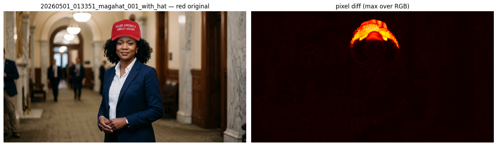
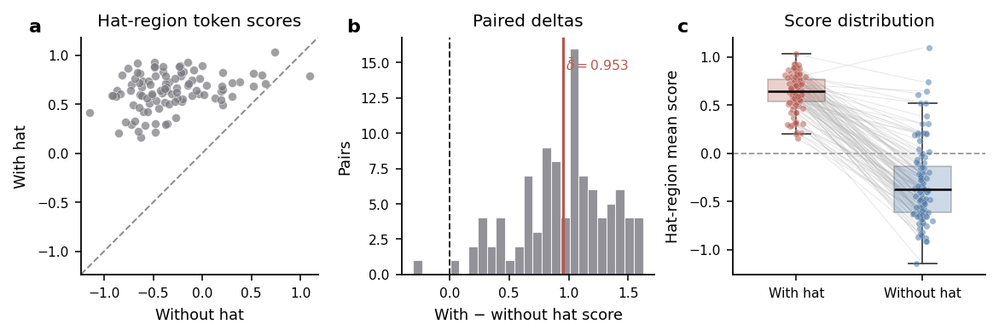
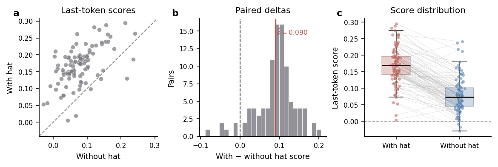
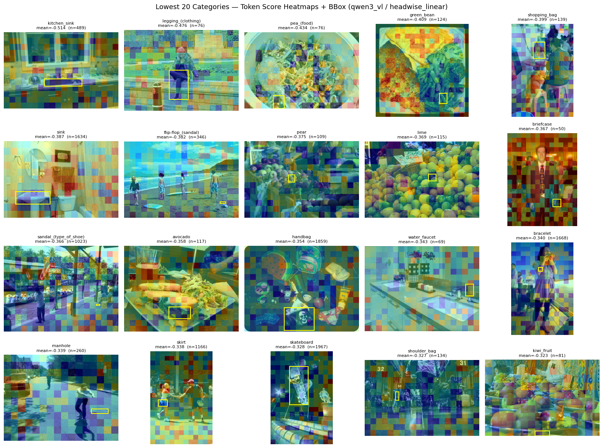
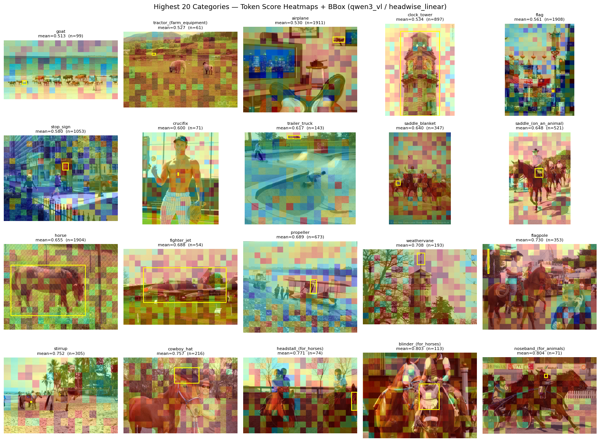
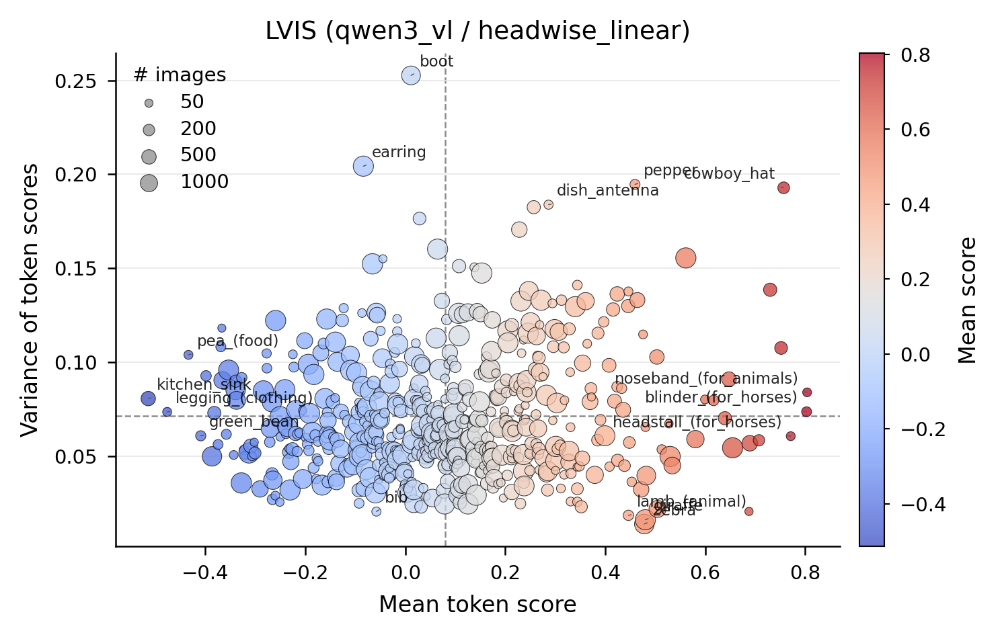

## Weekly Research Update

### Weekly Progress

This week, we focused on improving and validating the measurement of visual political signals in images. Building on earlier analyses of demographic and symbolic features, including the MAGA hat experiments, we further refined our methods to better isolate where those signals are actually coming from.

We also began a new exploratory project using object-level segmentation ([The LVIS Dataset](https://www.lvisdataset.org/)) to study how individual objects relate to modeled political leanings.

Our main areas of work this week were:

1. Refining the MAGA hat analysis by isolating the hat region.
2. Exploring object-level ideology using the LVIS segmentation dataset.

## 1. Refining the MAGA Hat Signal

After feedback from Chenhao and Aaron, we revisited the MAGA hat analysis to better understand an important issue: adding a MAGA hat changed token scores across the entire image, not just around the hat itself, and it's not immediately clear why this is the case. 

In previous experiments, we do observe that the overall score shifted in a more conservative direction when we added the hat, the effect was distributed broadly throughout the image representation. We suspect that this is likely due to the image encoder’s self-attention mechanism, which mix information globally across image patches. This means that any single token not only contains the patch of image it represents, but also could contain contextual information from many other parts of the image.

To better isolate the signal, we changed our evaluation method.

Instead of analyzing the entire image, we cropped the image to focus only on the hat region and evaluated scores within that localized area.

*Figure: Pixel-level changes introduced by the hat, used to identify the hat region as the region of interest.*

*Figure: Token-level score differences measured only within the isolated hat region, showing a more localized ideological shift. Scores are the linear probe outputs corresponding to the DW-NOMINATE ideology dimension. Negative scores indicate the liberal direction, while positive scores indicate the conservative direction.*

We also examined the scores of the final tokens in the sequence. The final token is useful because it reflects the model state immediately before text generation begins, making it a cleaner indicator of the model’s predictive state after processing the image.

*Figure: Last-token score analysis showing the model state immediately before generation.*

These adjustments give us a more targeted way to measure whether the model is responding specifically to the political symbol itself, rather than broadly shifting representations across the entire image. At a token level, we observe more concentrated changes around the object. When we look at the final token scores, the difference is smaller than the average, suggesting a more complex interaction than a simple additive effect, but the direction of the shift is consistent.

We might still need more experiments to fully convince ourselves that the signal is indeed from the political symbols added to the image. Horizontally, we can do more diverse iconic political symbols. Vertically, we can try to use ablation studies to add and remove multiple symbols and see how the score changes along the way.

## 2. Exploring Object-Level Ideology with LVIS

The second part of this week’s work was more exploratory.

Our earlier experiments used the Unsplash 25k dataset, which only allowed us to compute average scores for entire images. That made it difficult to determine which specific objects were contributing to ideological shifts.

To address this limitation, we integrated the LVIS dataset. LVIS provides object masks and labels for individual objects, allowing us to associate ideological scores with specific object categories.

We visualize the categories with the lowest and highest mean scores.

*Figure: Object categories with the lowest and highest average scores.*

To study the association between political loading and object categories, we plotted the mean score for each category against its variance.

*Figure: Mean score versus variance across LVIS object categories.*

Several patterns stand out in the current sample:

* **Vegetables** tend to have the lowest mean scores.
* **Clothing** categories show the highest variance, suggesting that ideological associations may depend heavily on context or specific item types.
* Objects associated with **traditional Americana**, such as cowboy-themed, or any horse-related imagery, tend to have the highest mean scores.

The low score and high score categories seem to be quite intuitive in a sense as they align with the common sense stereotype of these categories. However, we do not have a strong hypothesis of why, and we need to do more experiments to confirm our intuition. Or potentially, a survey.

## Challenges and Roadblocks

- **Disentangling Variables and Attention Spillovers:** While evaluating the isolated hat region provides a more localized signal, the underlying self-attention mechanisms of the image encoder continue to blend contextual information across patches. Fully isolating an object's political signal from its surrounding context remains a methodological hurdle.
- **Validating Intuitive Alignments:** The observed extremes in the LVIS dataset (e.g., vegetables leaning liberal and traditional Americana leaning conservative) align with common cultural stereotypes. However, relying on intuition is insufficient for rigorous analysis. We currently lack a robust empirical grounding to explain *why* the model has formed these specific associations. And we don't have a ground truth to validate these model associations against.

## Thoughtful Plans for Next Steps

- **Broader Symbol Ablations:** We plan to expand our analysis beyond the MAGA hat by testing a wider variety of iconic political symbols. We will perform systematic ablation studies—adding and removing multiple symbols horizontally and vertically within the same image—to track how the ideological scores fluctuate in response.
- **Investigating High-Variance Categories:** We will conduct a deeper analysis of the high-variance categories, such as clothing, in the LVIS dataset. Our goal is to determine whether these variations stem from specific sub-types of clothing or other contextual factors present in the images.
- **Empirical Grounding:** To confirm our intuitions regarding the low-score and high-score object categories, we aim to design additional experiments or potentially conduct surveys (even though this might be extremely time consuming and expensive). This will help establish a clearer baseline for human perceptions of these objects, which can then be compared against the model's biases.
- **Steer model behavior:** Inspired by some previous work, we are interested in whether we can steer the model behavior by injecting these identified political symbols. For example, we can try to add some conservative-leaning objects to a neutral image and see how model generate descriptions and captions. Textually, we can add conservative or liberal objects to the prompt or indicate preference to these seemingly apolitical objects (e.g. vegetables or fruits, horses, etc.) and see how it affects the model's output.