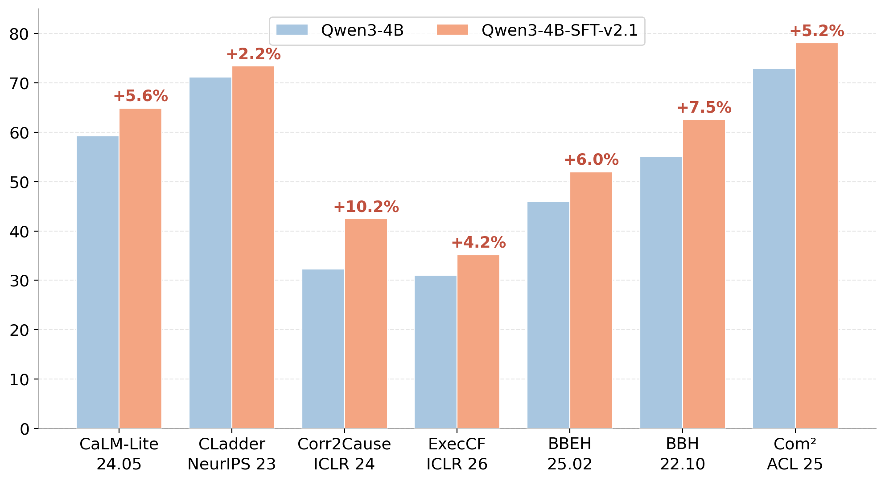

[toc]

# 1. SFT-v2.1: cf queries + domain translation

- **TLDR:**
    - We SFT’ed a Qwen3-4B (non-thinking mode) model on the dataset-v2.1, which contains 7 major query types (3 intervention: ATE, CATE, JATE; 4 counterfactual: CR, ATT, NIE, NDE) spanning 3 domains (symbolic, code, NL, but only for the 3 intervention queries for now) and thus results in 25.6K training examples altogether (~2K from each combination of query type and domain). Most of the results align with our expectations, suggesting the effectiveness of our training data construction pipeline. But there are also counter-intuitive findings that make us reflect on whether and how to further update the training mixture, e.g., with more diverse answer formats, and evaluation suite, e.g., disambiguating CounterBench.
    - The results and analyses are shown below. The follow-up workload is mainly split into two parts:
        - **the training side**: the ultimate goal is to create a dataset v3 which contains all 18 query types (9 major + 9 minor), among which all the numerical types are translated into both code and NL domains.
        - **the eval side**: apart from further disambiguating existing benchmarks (esp. CounterBench, as well as preparing for relevant clarifications in paper writing), we need to find at least one CoT faithfulness/consistency benchmark and a real-world domain benchmark (e.g., medical diagnosis/legal reasoning/scientific discovery) where our causal reasoner displays meaningful improvements.

|  |  | **Qwen3-4B** | **Qwen3-4B-v2.1** | **Qwen3-8B** | **Qwen3-32B** |
| --- | --- | --- | --- | --- | --- |
| **OOD (Symbolic + Math)** | **CaLM-Lite** | **all**: 59.3 **numeric**: 35.3 **binary**: 72.5 **option**: 73.4 | **all**: 64.9 **numeric**: 48.0 **binary**: 74.7 **option**: 73.5 | **all**: 60.4 **numeric**: 40.5 **binary**: 72.0 **option**: 70.4 | **all**: 69.2 **numeric**: 47.8 **binary**: 78.5 **option**: 86.8 |
|  | **CLadder** | 71.2 | 73.4 | 74.9 | 82.3 |
| **OOD (Symbolic)** | **Corr2Cause** | 32.3 | 42.5 | 33.0 | 34.5 |
|  | **CounterBench** | 67.6 | 66.6 | 66.1 | 69.9 |
| **OOD (Math)** | **ExecCF** | 59.3 (31.0) | 61.4 (35.2) | 60.1 (34.2) | 61.5 (36.2) |
| **OOD (Commonsense)** | **BBEH** | 46.0 | 52.0 | 47.0 | 50.3 |
|  | **BBH** | 55.1 | 62.6 | 63.6 | 69.3 |
|  | **Com^2** | 72.9 (53.8) | 78.1 (59.3) | 75.5 (56.2) | 79.8 (61.2) |
|  | **~~CausalProb~~** | 80.5 (40.5) | 78.3 (36.7) | 78.0 (37.3) | 79.0 (38.4) |

1. make sure haste does not make waste — check if there’s any missing point in the current response selection & ensemble scripts (which were crafted a bit hastily to catch up the MSLD presentation)
2. good news: 
    1. perf gains on **exec-cf**, probably due to the incorporation of counterfactual query types and code domain translations;
    2. consistent and significant perf gains on **three commonsense causal benchmarks: BBEH, BBH, and Com^2,** probably due to the incorporation of NL domain translations. although perf does not go up on CausalProb, it’s the only commonsense dataset where increase of model size leads to perf degradation (this was also observed with the Qwen2.5 family). combined with our earlier quality inspection, it’s probable that CausalProbe suffers from severe quality issues that already prevent it from differentiating model’s causal reasoning abilities. therefore, we’ve struck out this dataset in our eval suite.
    3. actually, if we only consider benchmarks where perf improvements are observed, then **the average perf improvement across the 7 benchmarks is ~6%.**
3. What’s worth thinking & optimizing further (i.e., the two performance numbers that are underlined):
    1. Why perf improvements on CLadder is so limited?
        1. given the drastic gap between 4B and 32B, CLadder does differentiate models with different degrees of causal capabilities.
    2. Why still no perf improvements on CounterBench? Combined with the CLadder question above, I have two suggestions for the next step:
        1. Answer formatting may still matter: should not only add examples with binary format for “minor query types”, but also transform part of the examples that belong to the “major query types” from numerical answers into binary answers (e.g., uniformly sample 10%-20%). Intuitively, binary questions are the most fundamental way of querying causality: “Does A cause B?” And it might be useful to train the model to target answering questions in this way.
        2. Further cleaning & refinement of counterfactual query data:
            1. (might be my problem, but i still find the current cf query verbalization variants a bit vague/hard to understand)
            2. echoing the point above, it might be useful to see how to properly align our counterfactual query verbalization variants with the ones used in CLadder and CounterBench. It's also possible (as stated in the point below) that the expression of queries in both benchmarks is actually not as clear as we thought, which might make further refinement and disambiguation necessary.
        3. also, the overly moderate gap (~2pp) between 4B and 32B on CounterBench is also worth investigating.
            1. from earlier benchmarking results, we can see that for Qwen2.5, 3B→7B→32B show consistent and significant improvements on both CLadder and CounterBench, which incidates two possibilities: either (1) both benchmarks are actually indicative for models’ causal capabilities, or (2) Qwen2.5 isn't as thoughtful as Qwen3, and thus failed to show some hidden problems with these benchmarks (e.g., ambiguity of queries/question contexts).
            2. Maybe we should try training with more base models: Qwen3-8B; Qwen2.5-3/7B (not to show SOTA, but to show that generalization is consistent across base model families); Olmo3-7B.
4. A **clarification** that we should make in paper writing: Why we still evaluate our models on these formal causal benchmarks given that we already show their quality issues (e.g., unidentifiability & unverifiability) in our method/prelim section (e.g., via a small-scale human study & rating)?

# 2. Evaluation: Faithfulness in Reasoning CoT

## Existing Metrics

This is not a thorough literature review since there are many works on this topic. I mainly surveyed recent papers and widely used metrics cited by them.

### Data-Dependent

These metrics should be evaluated on their own benchmarks

- RFEval (ICLR 2026): [https://aidaslab.github.io/RFEval/](https://aidaslab.github.io/RFEval/)
    - Define a faithfulness score based on two criteria: (1) the model maintains a coherent stance throughout its output, and (2) the reasoning causally determines the final answer.
    - Experiment on 7,186 instances across seven tasks
        - For each instance, use o3 to pre-generate a counterfactual reasoning prime (a plausible but flawed line of reasoning designed to lead a model toward a specific incorrect answer)
            - Calculate the faithfulness score given model output on the question itself, and output on the question + reasoning prime
    - Evaluate diverse open-sourced reasoning models, and Qwen3-32B achieves the highest faithfulness score of 73%
        - Need evaluator LLM (o3 in the paper) for stance extraction and flaw identification
- CRBench (ICLR 2026 rejected)
    - Define a metric using SCM, but the metric design is complicated and questionable in details according to reviews
- Reasoning Models Don’t Always Say What They Think (Anthropic 2025)
    - Derive from Language Models Don't Always Say What They Think: Unfaithful Explanations in Chain-of-Thought Prompting (Neurips 2023)
    - Add hint of answer in the input, and detect if models change the answer according to the hint without verbalizing its reliance on it
    - More related to safety/monitoring, no code/data provided

### Data-Independent

These metrics do not rely on pre-collected counterfactual reasoning traces or annotations, therefore can be used on arbitrary reasoning traces generated by LLMs.

- A Causal Lens for Evaluating Faithfulness Metrics (EMNLP 2025): https://github.com/KeremZaman/CausalDiagnosticity
    - Use metrics based on CoT corruptions from *Measuring Faithfulness in Chain-of-Thought Reasoning* (Arxiv 2023)
        - including Early Answering, Adding Mistakes, Paraphrasing, and Filler Tokens
    - Experiment on Qwen-2.5 and Gemma-2
- Counterfactual Simulation Training for Chain-of-Thought Faithfulness (Arxiv 2026): [https://github.com/peterbhase/counterfactual-simulation-training](https://github.com/peterbhase/counterfactual-simulation-training)
    - Use the simulatability metric from *Do models explain themselves? counterfactual simulatability of natural language explanations* (ICLR 2024)
        - Prompt an LLM, the simulator, to predict the task model’s answer for a counterfactual input
        - Faithful if the counterfactual output can be predicted from the original input+counterfactual input+task model’s original reasoning and output
- Chain-of-Thought Reasoning In The Wild Is Not Always Faithful (ICLR 2025)
    - LLM-as-a-judge for finding critical steps and judging faithfulness of each critical step
