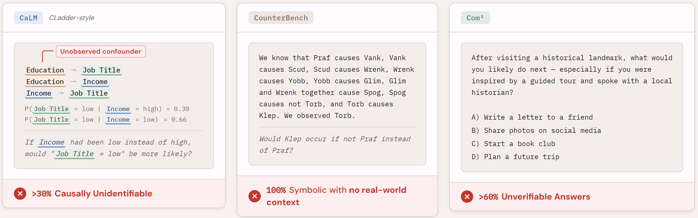
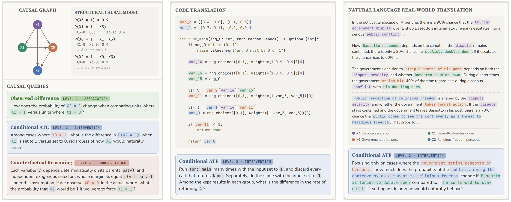
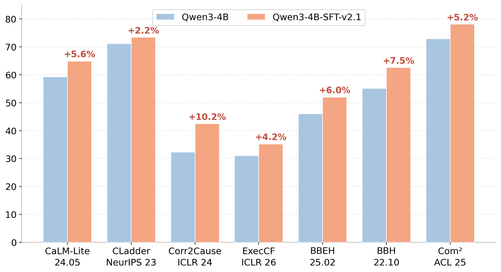
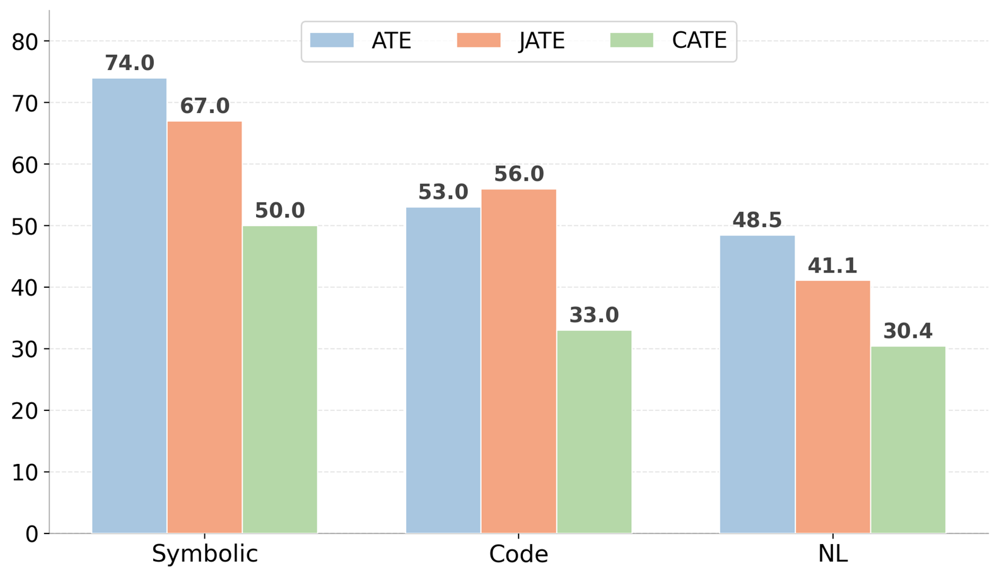
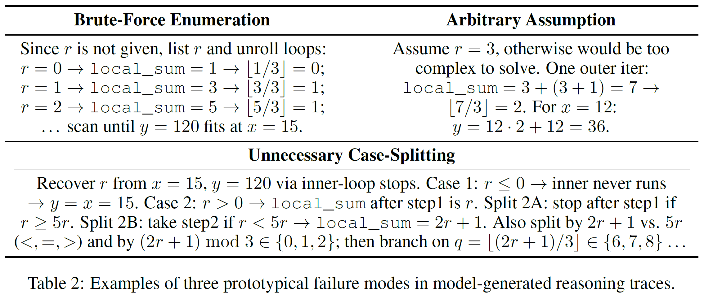

# 04/24/2026 – Blog (3)

## 1. RFEval: CoT Reasoning Faithfulness in Real-World Domains

Recap of the **RFEval** pipeline — ICLR 2026: <https://openreview.net/forum?id=2Gc8aj0afg>

- **Evaluated on 4 subsets** of the RFEval benchmark that are most frequently used in the real world (and also distant from the domains covered in our training data):
  - Medical understanding (data source: PubMedQA; original name in RFEval: context understanding)
  - Legal decision (data source: MMLU-legal)
  - Logical reasoning (data source: PrOntoQA, RuleBert-Union-Rules)
  - Table reasoning (data source: SCITAB)
- **Evaluator model choice:** `gemini-3-flash-preview (reasoning effort: low)`
  - Also compared with `gpt-5.4-mini (reasoning effort: low)` evaluations on the medical understanding subset — the average difference in each performance number is ~1%, showing the eval results are robust to evaluator selection.

### Thinking Mode

Evaluated under the **thinking** mode (appending nothing after `<|im_start|>assistant`):

| Model | Medical Understanding | Legal Decision | Logical Reasoning | Table Reasoning | Avg |
| --- | --- | --- | --- | --- | --- |
| Qwen3-4B | 74.1 | 71.6 | 37.9 | 79.2 | 65.7 |
| Qwen3-4B-SFT-v2.1 | **80.4** | **80.5** | **50.9** | **87.5** | **74.8** |

---

## 2. Training Side: Complete Results of SFT-v2.1

### In-Distribution In-Causality

| Category | Benchmark | Qwen3-4B | Qwen3-4B-SFT-v2.1 | Qwen3-8B | Qwen3-32B |
| --- | --- | --- | --- | --- | --- |
| **Interv** | ATE-v1.1-sym | 43.3 | **68.8** | 44.9 | 49.2 |
| | ATE-v1.2-code | 30.8 | **64.8** | 26.9 | 39.8 |
| | ATE-v1.4-NL | 19.8 | **47.6** | 18.6 | 27.5 |
| | CATE-v1.1-sym | 25.1 | **51.5** | 25.3 | 26.5 |
| | CATE-v1.2-code | 12.1 | **43.4** | 10.5 | 18.1 |
| | CATE-v1.4-NL | 14.0 | **34.9** | 14.4 | 17.8 |
| | JATE-v1.1-sym | 38.4 | **63.5** | 44.1 | 50.9 |
| | JATE-v1.2-code | 30.4 | **71.9** | 29.2 | 42.6 |
| | JATE-v1.4-NL | 15.6 | **48.2** | 16.8 | 24.9 |
| **CF** | ATT-v2.0-sym | 30.0 | **62.5** | 27.5 | 32.8 |
| | CF-v2.0-sym | 27.7 | **29.6** | 26.1 | 27.4 |
| | NDE-v2.1-sym | 13.9 | **57.4** | 23.4 | 36.9 |
| | NIE-v2.1-sym | 8.0 | **38.7** | 10.4 | 28.1 |

### OOD In-Causality

| Category | Benchmark | Qwen3-4B | Qwen3-4B-SFT-v2.1 | Qwen3-8B | Qwen3-32B |
| --- | --- | --- | --- | --- | --- |
| **OOD (Symbolic + Math)** | CaLM-Lite | all: 59.3, numeric: 35.3, binary: 72.5, option: 73.4 | <u>all: 68.7, numeric: 57.4, binary: 73.1, option: 79.0</u> | all: 60.4, numeric: 40.5, binary: 72.0, option: 70.4 | **all: 69.2, numeric: 47.8, binary: 78.5, option: 86.8** |
| | CLadder | 71.2 | <u>76.4</u> | 74.9 | **82.3** |
| **OOD (Symbolic)** | Corr2Cause | 32.3 | **46.8** | 33.0 | <u>34.5</u> |
| | CounterBench | 67.6 | <u>69.1</u> | 66.1 | **69.9** |
| **OOD (Math)** | ExecCF | 59.3 (31.0) | **72.6 (50.4)** | 60.1 (34.2) | <u>61.5 (36.2)</u> |
| **OOD (Commonsense)** | BBEH | 46.0 | **58.0** | 47.0 | <u>50.3</u> |
| | BBH | 55.1 | <u>63.6</u> | <u>63.6</u> | **69.3** |
| | Com² | 72.9 (53.8) | 75.3 (55.1) | <u>75.5 (56.2)</u> | **79.8 (61.2)** |

---

## 3. Paper Writing

- **Important:** Plan for figures and tables — depending on the overall presentation flow and what analyses we want to display in the final section.

### Sec 1: Intro

What do people mean when they say, "Causal Reasoning is Fundamental to LLMs"?

- i.e., its fundamental presence in real-world high-stakes domains: medical diagnosis, legal judgements, policy making, scientific discovery.

### Sec 2: Prelim — Quality & Coverage Issues of Existing Causal Reasoning Data Resources

BUT what did people do to improve LLMs' causal reasoning?

**Figure 1:** Example of existing problematic causal reasoning datasets:

1. **The community** has been disproportionately focused on **benchmarking within formal causality:**
   - **The data bottleneck:** synthetic only, in a narrow scope with limited **diversity** or **scalability**.
2. **The real world** calls for universally causal reasoners that go **beyond formal causality:**
   - How can we **train** such a reasoner that internalizes a causal mindset when dealing with real-world challenges where causality is not explicitly defined but implicitly fundamental, so as to autonomously discover and utilize their hidden causal structures?

### Sec 3: Method — A Data-Centric Recipe for Training Universally Causal Reasoners

**Figure 3** : Our data examples with different query types and in different domains.

- **Axis 1:** **18 Causal Query Types** across Pearl's Causal Ladder, covering **diverse formal causal thinking patterns**.
- **Axis 2:** **Domain translation** aimed at concealing the causal nature of questions, simulating real-world use cases.
- **Achieved Effect:** 100% **Identifiability** & **Verifiability** | Causality-centered **Difficulty** Control | First-of-its-kind **Diversity** & **Scalability**.

### Sec 4: Experiments

- Both Table 1 and 2 should contain results for **Qwen3-4B** and **OLMo3-7B-Instruct** (different base model families & different scales).
- **Table 1:** SFT **Perf** results on **ID & OOD In-Causality**.
  - May consider merging "same query, different domains" results into a single cell to save space; detailed per-(query type, domain) results should go into the appendix.
- **Table 2** (or **Figure 4** displaying results as a bar chart):  SFT **Reasoning Faithfulness** results on **OOD Real-World Domains** (i.e., **Beyond-Causality**).

### Sec 5: Analyses

#### Analysis 1 (Eval-Side): Both Axes of Our Data Construction Pipeline Reveal Critical Weaknesses in SOTA LMs' Generalizable Causal Reasoning

**Figure 5:** Perturbation in either axis results in failures of GPT-5.4.

#### Analysis 2 (Eval-Side): The Effectiveness of Causality-Centered Difficulty Control in Data Construction

**Figure 6:** As we control subsets with different **naive conditioning** rates ranging from 0% → 100%, how does the model's performance gradually decline?

#### Analysis 3 (Training-Side)

**Table 3:** Concrete **qualitative examples** of how SFT'ed models display better reasoning faithfulness due to causality-centered training.

Can try to summarize a few "prototypical generalization modes" that show better reasoning faithfulness, similar to what we've done in Section 5 of exec-cf.

