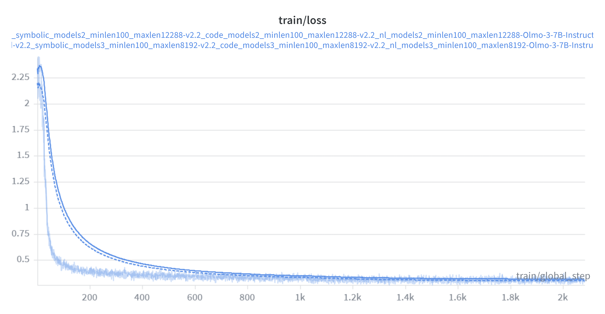

# 05/15/2026 – Blog (5)

This week I mainly focused on two parts of follow-up experiments after the NeurIPS submission: (1) the mysteriously high training loss of Olmo-3 models, and (2) more generalizable training algorithms including RLVR and on-policy-distillation (OPD).

## 1. Training Olmo models on a different length distribution

As can be seen in Figure 1, the training loss curve of Olmo-3-7B-Instruct starts from ~2.25 at the beginning of training, which is exceptionally high for a post-trained instruct checkpoint (e.g., for Qwen3-4B, the starting loss is generally around 0.6).
One reason for this could be the length distribution of our training data: on average, our training responses are around ~3.2K tokens long, while the native generation length of Olmo-3-7B-Instruct is around ~4.4K on the training prompts.
Therefore, I carried out two other training runs of Olmo-3-7B-Instruct on the same training prompts but with two different distributions: (1) a longer one (i.e., more on-policy in terms of length distributions) with Qwen3 removed from the curator ensemble, and the upper bound of completion length extended to 12K, and (2) a shorter one (i.e., more on-policy in terms of accuracy distributions) with Qwen3.5 removed from the curator ensemble, and the upper bound remaining 8K unchanged.
Currently, the training for (1) has completed while (2) is still ongoing. As can be seen from the curves above, (1) doesn't do much help to reducing the training loss. I'll try to incorporate the evaluation results of both (1) and (2) in the final draft next week.

## 2. More Generalizable Training Algorithms than SFT

For this part, in the past week, I mainly dug deeper into the the trending variants of on-policy distillation (OPD). Since I was mainly committed to updating the submission draft into an arxiv version, I haven't started the concrete implementation of OPD on UniCo data, but mainly focused on sorting out the algorithmic details and evolution trajectories. In my understanding, there are basically two lines of OPD works, classified by their gradient update formulation: (1) SFT-style KL gradient (e.g., GDK [ICLR24, earliest in applying OPD to LM training], and Qwen3 Tech Report), and (2) RL-style policy gradient (e.g., the [blog](https://thinkingmachines.ai/blog/on-policy-distillation/) by Thinking Machine Labs). I plan to give both a try after completing the attempt with RLVR first in the following week.
