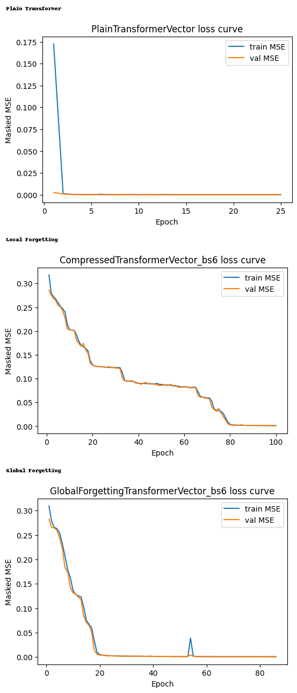

# Copy Task Transformer Comparison

In this experiment, we test the compressed attention's performance against a plain transformer on a continuous copy task: the model sees a short sequence of vectors, then a delimiter and a delay, and must reproduce the original vectors at the end. Each example uses `d=8`, `L=10`, and `D=3`, so the total sequence length is `T = 2L + D + 1 = 24`. The input has shape `(T, d + 1)`: the first 10 steps contain random vectors, the next step is a delimiter, and the remaining steps are blanks marked by a control channel. The target is zero everywhere except the final 10 positions, where the original 10 vectors must be copied back out. Training uses masked MSE only on those final output positions.

## From Local Forgetting to Global Forgetting (Modification of compression mechanism from proposal)

Assuming the local forgetting architecture is already familiar (from the proposal), the main change is that forgetting is no longer applied independently inside each block pair. In the local version, each block pair `(p, q)` carries its own scalar recurrent state and updates only from its own streamed scores. In the global version, the full `B x B` block-score grid is flattened into one per-head state vector and updated jointly with learned global linear maps for the candidate, forget gate, and input gate. That means each streamed score can influence the whole compressed attention state rather than only its own block. The rest of the pipeline stays the same: after streaming, the model masks future blocks, applies a softmax over block scores, and uses those weights to mix block-level values.

## Global Update Equations

Let `X_t in R^{B x B}` be the streamed block-score matrix at step `t`, and let `S_t in R^{B x B}` be the compressed global state. The update used in `global_forgetting_transformer.md` is:

```text
X~_t = phi(X_t)
F_t = sigma(W_f S_{t-1} + U_f X_t + b_f)
I_t = sigma(W_i S_{t-1} + U_i X_t + b_i)
S_t = F_t ⊙ S_{t-1} + I_t ⊙ X~_t
```

Here `phi` is the learned input transformation, `F_t` is the forget gate, and `I_t` is the input gate. The important difference from local forgetting is that these operations are applied to the whole compressed block-memory jointly, so the update can coordinate information across blocks instead of evolving each block state independently.

## Parameters Used Here

All runs share the same backbone and optimization settings:

- dataset: `20,000` training samples and `4,000` test samples
- batch size: `128`
- optimizer settings: `lr=1e-3`, `weight_decay=0.0`, gradient clip `1.0`
- stopping: `max_epochs=100`, `patience=8`, `min_epochs=8`
- model width: `d_model=128`, `n_heads=4`, `n_layers=4`, `ff_mult=4`, `dropout=0.0`
- positional limit: `max_len=T+4=28`
- seed: `0`

The plain transformer uses full attention with `795,656` parameters.

The global forgetting transformer keeps the same outer transformer shape but replaces full attention with blockwise compressed attention using `block_size=6` (which results in 36X compression of the attention matrix) and `strict_causal=False`. With `T=24`, that means each sequence is divided into `4` blocks.

For reference, the local forgetting model in the notebook uses the same `block_size=6` and `strict_causal=False` setting, so the main comparison is between local per-block updates and global coupled updates under the same compression level.

## Results

| Model | Best val MSE | Eval MSE |
| --- | ---: | ---: |
| Plain Transformer | `1.35e-05` | `1.19e-04` |
| Local Forgetting | `7.60e-04` | `1.19e-03` |
| Global Forgetting | `6.08e-04` | `6.74e-04` |

Two patterns stand out. First, the plain transformer is still the strongest model by a clear margin and reaches very low loss almost immediately. Full attention is simply the easiest setting for this task. Second, among the compressed models, global forgetting is clearly better than local forgetting. It lowers the best validation MSE from `7.60e-04` to `6.08e-04`, and it cuts evaluation MSE from `1.19e-03` to `6.74e-04`.

The loss curves tell the same story. Local forgetting improves steadily but slowly, only approaching very low error late in training. Global forgetting drops much faster and reaches a near-zero regime after roughly 20 epochs, although it still does not match the plain transformer. This is a useful result: once attention is forced into a block-compressed representation, allowing the compressed memory to update globally seems to preserve the information needed for copying better than treating each block independently.

## Loss Curves



## Results
The next experiment I would like to try out is a simple language modeling task with the dataset WikiText-2. I will conduct next token prediction and compare the results between the plain uncompressed model and the compressed model. Metrics that will be assesed are CE-Loss and Perplexity.
