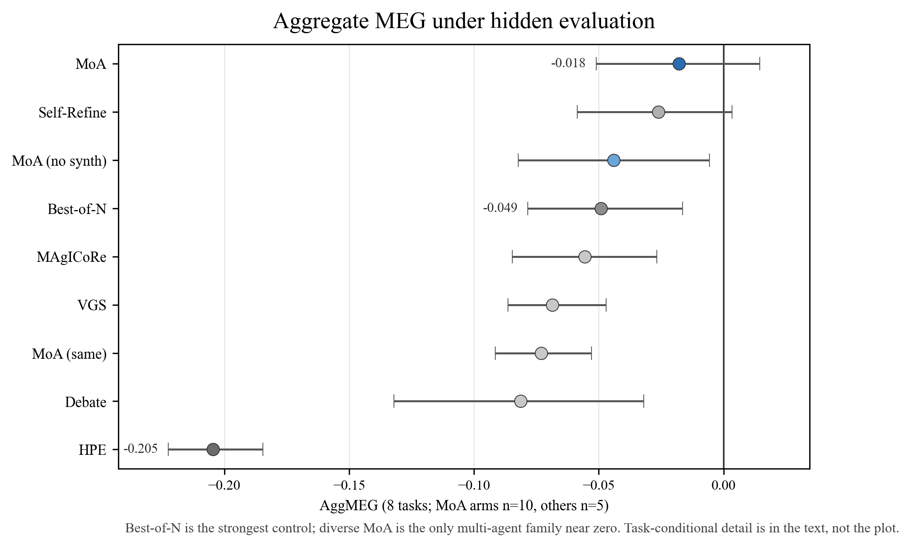
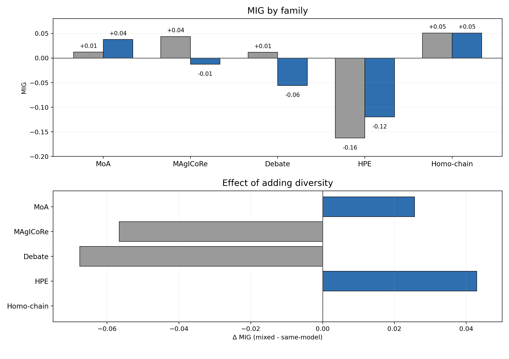

# Week 2 Blog

## Insight of the Week

The surprising result is not that multi-agent systems sometimes fail, but that a single model sampled eight times, with no interaction at all, beats almost every multi-agent protocol once budget is held fixed and the final evaluator is hidden. That forced me to rewrite the paper as a measurement study instead of a mechanism story.

My claim is that agent count is a weak predictor of performance. What matters more is whether the protocol carries information that the other agents do not already have, and whether the task can actually use that information.

The cleanest comparison is Best-of-N, which uses one model, no interaction, and eight independent samples. In the aggregate it outranks almost every multi-agent protocol. The one exception is diverse Mixture-of-Agents, and that exception disappears when all three proposers are copies of Claude. The paper now measures the same protocol, same number of agents, same synthesis step, but with different information coverage.

I performed a 2x2 ablation to address whether MoA helps because it uses different models, or because the synthesis step (i.e., the final step whether the protocol takes multiple proposals from the agents and combines them into one answer) is doing something useful.

The 2x2 ablation crosses two binary choices:

- same model versus diverse models
- synthesis (combine multiple proposals into one answer) versus no synthesis (keep best proposal only)

That gives four cases:

- same model + synthesis
- diverse models + synthesis
- same model + no synthesis
- diverse models + no synthesis

I only run that comparison on the three tasks with enough hidden-score variation to make the four cells meaningful, which is a constraint. If a task is already failing, the four-way comparison does not tell you much because all four cells collapse together.

The following is a summary of the 2x2 ablation on the three tasks:

- Difference Bases has enough structure that different agents can bring different partial solutions.
- Erdos overlap is the cleanest diversity case. The diverse-backbones overperforma, and synthesis can actually reduce these gains.
- With Molecule QED the hidden score adds synthesizability on top of QED, so a protocol can look good on the public score while failing hidden. Diversity is not as useful, and synthesis can hurt because the output space is constrained.

The 2x2 shows that MoA works only when the protocol preserves useful differences between models. If synthesis collapses those differences, the advantage shrinks. That is, backbone diversity matters more than synthesis.

Whether diversity helps and whether interaction helps are two different questions, so I am using two different measures. Marginal Epistemic Gain (MEG) measures whether the protocol beats the best single-agent control under the same budget. Marginal Interaction Gian (MIG) measures whether the interaction step adds value once the agent set is fixed. If MEG > 0, the protocol is better than the strongest single-agent baseline.  If MIG > 0, interaction helps.

In the current data, MoA is the only family where the diverse-backbone version improves MIG. Debate, MAgICoRe, and HPE all lose diversity once interaction is introduced. The really useful distinction is whether the interaction step preserves diversity signal or dilutes it.
Interaction can add structure, but it can also consume the value of having different models in the first place.

Hidden evaluation matters because it changes who actually looks best. On Molecule QED, a protocol can look strong on the public score and still fail the hidden synthesizability check. On MaxCut, almost every protocol scores low, so the main lesson is that the visible and hidden rankings can disagree. On DiffBases, the hidden score can move a protocol up instead of down. So, hidden evaluation can actually change the result in addition to serving as a safety check.

*Figure 1: Aggregate MEG under hidden evaluation. Best-of-N outranks almost every multi-agent protocol, while diverse MoA is the only multi-agent family near zero. The task-specific story is explained in the text: Difference Bases and Erdős support the diversity effect, while Molecule QED keeps the claim honest. MaxCut is omitted from the visual center because it is a near-floor diagnostic.*

*Figure 2: MIG across five protocol families. MoA is the only family where diversity improves MIG. Debate and MAgICoRe lose it, and HPE is negative in both settings. The compact layout keeps the family comparison readable.*

## Challenges and Roadblocks

The paper is now on the right track, but two things are still unfinished. First, the multi-backbone sweep is still running, so the claim that the pattern holds across model families is not yet fully tested. Second, the 2x2 described above is still exploratory by design, and only three tasks have enough hidden-score spread to support it, so I am keeping it as supporting evidence rather than the center of the paper.

The other thing I am watching is the normalization standard. MEG uses the maximum of three noisy control means, which makes the metric conservative by about 0.005 per task. That does not change the overall ranking, but it matters for near-zero cases like diverse MoA.

## Progress

Completed since Blog 1:

- Molecule QED was added as the 8th task. This gives the suite a chemistry example and avoids making the benchmark look like pure combinatorics.
- Erdős overlap was rerun after a verifier fix. It is the cleanest discriminative task in the suite.
- The full 8-task aggregate is now computed across all 10 core protocols.
- The 2x2 diversity-vs-synthesis ablation is complete on three tasks with enough hidden-score variation for the comparison.
- The brain-diversity 2x2 is complete on frontier and open-weight variants. Mixing diverse open-weight models reduces the gap relative to homogeneous open-weight models, but no condition crosses the single-agent baseline.
- DeepSeek single-agent controls were added so the open-weight analysis uses backbone-matched denominators.
- The MEG denominator bias simulation is complete and acknowledged in the paper.
- The multi-backbone sweep is running for GPT-4o and Gemini.

## Next Steps

This week I want the backbone sweep to finish, then I will regenerate the analysis tables and check whether the family-level pattern still holds on the full 8-task set. If it does, the main claim gets stronger without changing the framing.

If there is one more experiment worth running after that, it is a prospective composability test. It would include one task where the information-coverage hypothesis predicts a gain and one where it predicts no gain. That would turn the current characterization into a cleaner hypothesis test.
