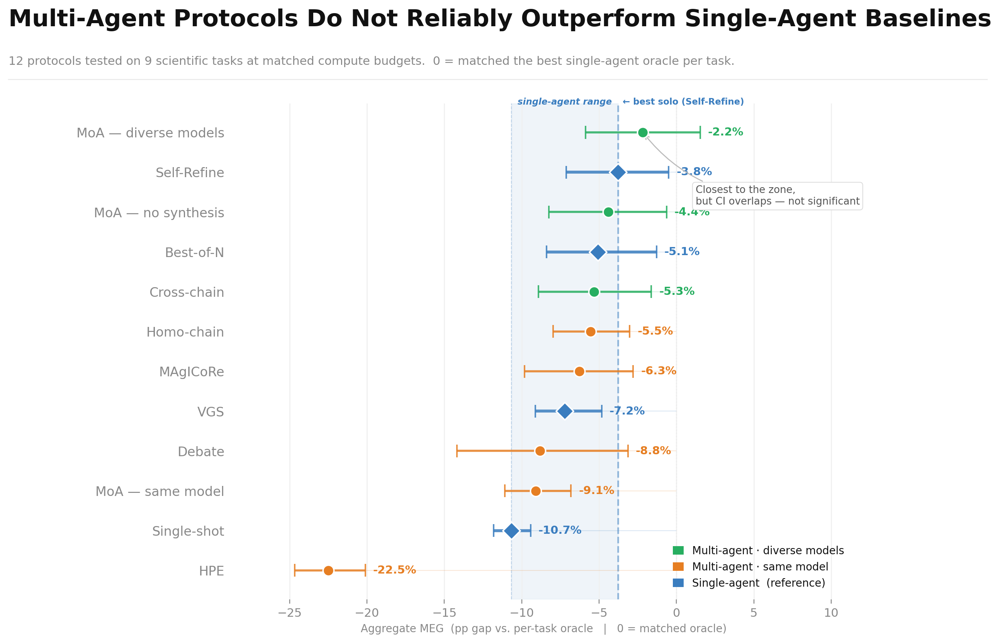
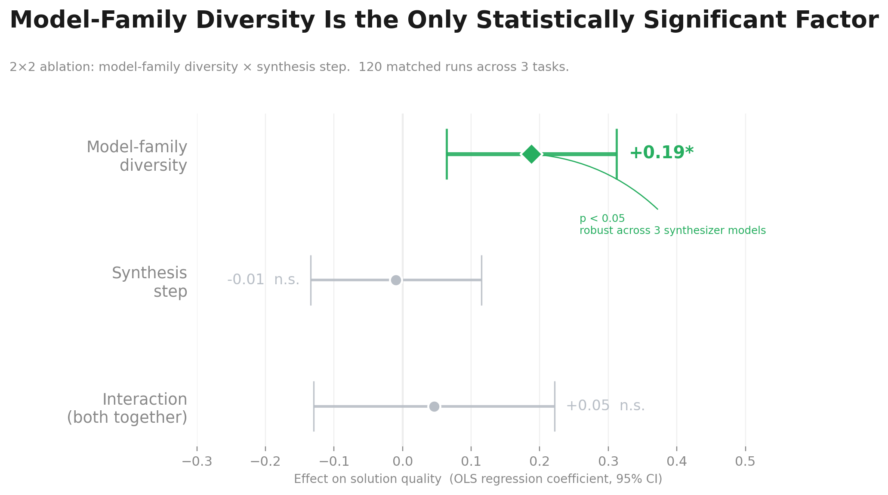
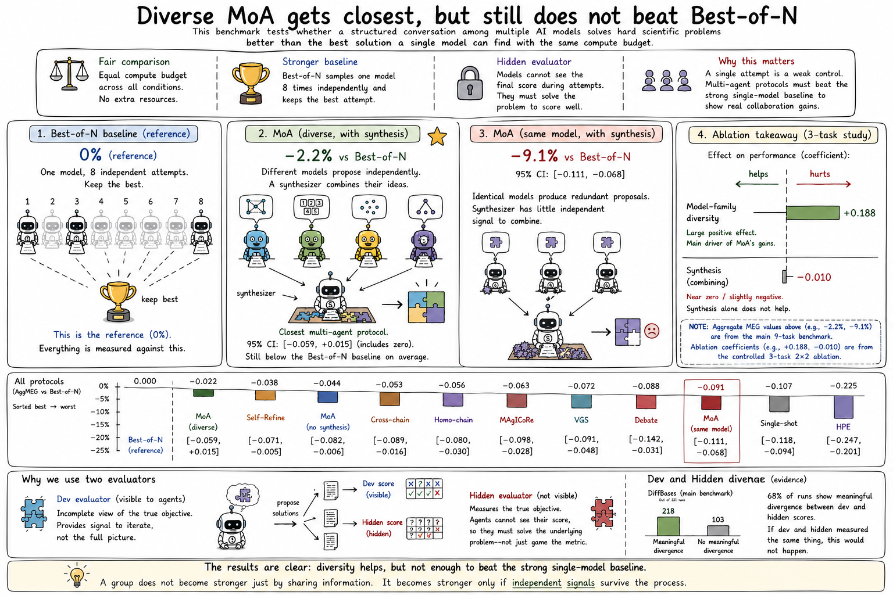

# Blog 3


## Summary of Prior Work

Over the past several weeks, I built a benchmark of nine scientific optimization tasks and ran ten different multi-agent collaboration protocols on each one. By the end of last week, I learned that a simple single-model baseline outranked almost every multi-agent protocol when they were scored by an evaluator that the models could not see. I ran a controlled ablation of MoA's two components: whether proposing agents came from different model families or copies of the same model, and whether a synthesis step combined their proposals or the pipeline simply picked the best one. Model-family diversity was the only component that mattered. The synthesis step contributed nothing measurable. Backbone diversity, meaning a mix of underlying models, turned out to be the differentiating feature.

## Protocol Overview

| Protocol | Type | Agents interact? | Diverse models? |
|---|---|---|---|
| Single-shot | Single-agent | N/A | N/A |
| Best-of-N | Single-agent | N/A | N/A |
| Self-Refine | Single-agent | N/A | N/A |
| VGS | Single-agent | N/A | N/A |
| MoA (diverse) | Multi-agent | No | Yes |
| MoA (no synthesis) | Multi-agent | No | Yes |
| MoA (same model) | Multi-agent | No | No |
| Debate | Multi-agent | Yes | No |
| Homo-chain | Multi-agent | Yes | No |
| MAgICoRe | Multi-agent | Yes | No |
| HPE | Multi-agent | Yes | No |
| Cross-chain | Multi-agent | Yes | Yes |

I also ran diverse-backbone variants of Debate, MAgICoRe, HPE, Self-Refine, VGS, Best-of-N, and Homo-chain using GPT-4o, Gemini, DeepSeek, and mixed combinations as the backbone. These are the paired comparisons used in the MIG analysis; each interaction protocol was tested with both same-model and diverse-model agents to isolate the effect of backbone diversity from the effect of interaction.

## Benchmark Design

The benchmark tests whether a structured conversation among multiple AI models produces better solutions to hard scientific problems than the best solution that a single model can come up with using the same compute budget. The intuition behind multi-agent AI is that collaboration should help, in the same way a team of scientists can explore more of a problem than any one of them could. A single model given one attempt at a problem is a weak control, because any multi-agent system compared against it gets credit for advantages that come from sampling a model repeatedly, regardless of whether the agents' collaboration contributes anything. The stronger control in this benchmark samples one model eight independent times and keeps the best attempt. Each multi-agent protocol has to beat that. Compute budgets are held equal across all conditions, so a multi-agent protocol cannot win by spending more total resources than the baseline. Performance is measured by a hidden evaluator that the AI systems cannot see during their attempts, which forces them to solve the underlying problem to score well.

Each benchmark task pairs a dev evaluator with a hidden evaluator. The dev evaluator exposes an incomplete view of the true objective, giving agents enough signal to iterate without revealing what the hidden evaluator measures. Without a hidden evaluator, there is no way to know whether a protocol produces better solutions or just better optimizes the scoring function, since agents who can see their own scores can reverse-engineer the metric without solving the underlying problem. Passing dev is necessary but not sufficient, and this is by design. Exposing the full hidden objective lets agents optimize the evaluation criterion directly rather than solving the underlying problem, collapsing the distinction between benchmark performance and genuine capability. On DiffBases alone, 218 of 321 runs in the main benchmark showed meaningful divergence between dev and hidden scores, confirming the two evaluators are not interchangeable. If dev and hidden measured the same thing, protocols that score well on dev would not systematically lose on hidden, but they do.

## Reproducibility

All results in this post can be reproduced from the saved data without API keys or platform access. The experiment code and result files ship together in the replication package.

To reproduce the paper tables and figures from saved results:

```bash
python analysis/analyze_bench.py          # MEG/MIG tables
python analysis/analyze_2x2_hierarchical.py  # 2x2 factorial
python scripts/make_paper_figures.py      # figures
```

To verify that the saved scores match what the local verifiers compute:

```bash
npx tsx tools/evaluate.ts --results results/full-v2
```

To re-run the experiments from scratch (requires `OPENROUTER_API_KEY`):

```bash
npx tsx src/runner/run-offline.ts
```

This runs all tasks and protocols in the replication package (19 tasks including ablation variants, 12 protocol configurations) entirely offline. The core benchmark reported in this post uses 9 tasks and 10 protocols; the additional tasks are the composability and robustness ablations. Dev and hidden evaluation both run as local Python subprocesses, so no platform credentials are needed.

## Central Claim

My central claim after this week is that under matched compute budget and hidden evaluation, conversational multi-agent protocols usually do not outperform a strong single-agent baseline. A protocol is a procedure for organizing how AI models work together, for example by having them debate each other's answers, take votes, or generate separate proposals and combine them. This week's main work was making sure that the evidence for that claim was statistically defensible.

## Aggregate MEG Results

To compare protocols on a common scale, I defined a metric called Aggregate Marginal Epistemic Gain (MEG), measuring how much a multi-agent protocol beats the strongest single-agent control at the same budget. For each protocol on each task, MEG is the gap between the protocol's hidden-evaluator score and the single-agent control's score. Averaging across all nine tasks gives one number per protocol (i.e., the Aggregate MEG). A positive value means the protocol beats single-agent on average, and a negative value means single-agent wins. None of the ten protocols produced a positive Aggregate MEG. The best performer was a diverse Mixture-of-Agents (MoA) configuration at -0.022, and the only one whose 95% confidence interval included zero, meaning it was the only protocol where the data left open the possibility of a tie with single-agent. Every other protocol lost by enough that even accounting for noise, the result was still negative. Tasks where MoA contributes nothing drag its aggregate below zero. The per-task breakdown shows where the gains and losses come from:

| Task | MoA MEG |
|---|---|
| DiffBases | +0.090 |
| Erdős | +0.021 |
| FlatPoly | +0.013 |
| MaxCut | 0.000 |
| LJ-n41 | 0.000 |
| TSP-100 | -0.015 |
| MolQED | -0.013 |
| TSP-50 | -0.054 |
| CircPack | -0.238 |

The tasks where MoA wins are combinatorial problems where different agents tend to find structurally different valid configurations, giving the diverse proposals enough separation that even a homogenizing synthesis step produces a better result than any single proposal alone. On continuous optimization and geometric packing tasks, diverse models still converge on similar numerical solutions and synthesis adds nothing. Whether MoA's aggregate would cross into positive territory on a benchmark weighted toward structurally composable tasks is an open question this result raises.



My subsequent experiment isolates the two components of MoA: whether proposing agents come from different model families (Claude, GPT, Gemini) or copies of the same model, and whether the synthesis step runs or is replaced by picking the single best-scoring proposal. This is a component ablation of MoA, not a general design claim. One condition worth naming explicitly: removing synthesis from same-model MoA is structurally identical to Best-of-3, since three independent samples from one model with best-score selection is exactly what Best-of-3 does. The experiment ran on three tasks (Difference Bases, Erdős Overlap, and Molecule Drug-Likeness) for 120 total runs. Model-family diversity produced a coefficient of +0.188 with a 95% confidence interval of [+0.064, +0.309]. Synthesis produced a coefficient of -0.010 with a confidence interval that straddles zero by a wide margin. A bootstrap analysis, which resamples the data to check robustness, found that diversity outweighed synthesis in 99.9% of resamples. That means that, within MoA, the component that actually matters is using different models to generate distinct proposals. MoA without synthesis scores slightly worse (-4.4% vs -2.2%), likely because selecting the best proposal by dev score sometimes picks the wrong one when the dev and hidden evaluators disagree.



The main experiment always used the same synthesizer model, so the null effect of synthesis might hold only for that particular one. To check, I reran the synthesis conditions with three different synthesizers (Claude Sonnet 4, GPT-4o, and Gemini 2.5 Flash). The diversity coefficient stayed positive and of similar magnitude in all three, which indicates that the finding does not depend on which model does the combining.


## MIG and Interaction Effects

A second metric, Marginal Interaction Gain (MIG), measures whether the exchanges between agents in a protocol add anything once the set of agents is fixed. A protocol that scores higher than running the same agents in parallel and picking the best output is getting value from interaction. One that does not is getting nothing or being actively hurt. Across almost every protocol tested, interaction was more harmful with diverse agents than with same-model agents. A debate protocol, in which agents argue against each other's answers and revise, had a MIG of +0.012 with same-model agents and -0.078 with diverse ones. MAgICoRe, which uses iterative self-correction with critique steps, went from +0.044 to -0.035 on the same axis. Cross-chain, which runs the same chain structure as Homo-chain but with diverse model families, went from +0.051 to -0.024. The pattern holds even when the chain is diverse. Agents build on each other's outputs and converge before the differences can help. The only exceptions were MoA and HPE. MoA is a genuine exception where diverse agents do better, scoring +0.016 versus +0.012 for the same-model version, because agents never see each other's proposals and the proposal diversity survives long enough to matter even after synthesis collapses it. HPE is a different kind of exception where its same-model MIG is already -0.163, the worst of any protocol, meaning the task decomposition mechanism itself destroys solutions regardless of diversity. This suggests that diverse agents start with different ideas, but many interaction protocols make them converge before those differences improve the final solution.

For each protocol, the first artifact captures the initial proposal quality before any interaction occurs. The final hidden-evaluator score shows where the diversity advantage is won or lost. All values are Q-normalized hidden-evaluator scores averaged across the tasks in the MIG analysis, where 0 matches the naive baseline anchor and 1 matches the expert reference solution:

| Protocol | Init same-model | Init diverse | Final same-model | Final diverse |
|---|---|---|---|---|
| MoA | +0.074 | +0.097 | +0.194 | **+0.265** |
| Chain | +0.167 | +0.143 | +0.219 | +0.245 |
| MAgICoRe | +0.193 | +0.180 | +0.212 | +0.209 |
| Debate | +0.151 | +0.047 | +0.180 | +0.166 |

MoA is the only protocol where diversity produces a net final advantage (+0.071) despite starting from comparable individual proposals. The advantage is won at the proposal stage, not the synthesis stage. Directly measured, the synthesis step collapses pairwise solution diversity from 0.48 (diverse proposers before synthesis) down to 0.34, indistinguishable from same-model generation (also 0.34). Synthesis homogenizes the proposals rather than combining them. MoA wins because the diverse proposals start from genuinely different positions and their quality is high enough that even after homogenization the final answer beats the baselines. For Debate and MAgICoRe, diverse agents start with weaker proposals and interaction does not recover the gap. MoA's advantage persists because the proposal diversity starts high enough (0.48) that even after synthesis collapses it to 0.34, the final answer still clears the baselines. No other protocol achieves that starting separation, because their agents interact before generating their best work.


## Composability Predictions

The methodological point here is pre-registration: I labeled two new tasks and committed to predicted directions before running any experiments, which prevents selecting a favorable framing after seeing the data. Diversity should help when agents produce compatible partial answers and hurt when their partial answers conflict. Max Coverage was the composable case; Latin Square was the conflicting case. The observed effects matched both predicted directions. The Max Coverage effect (+0.022) fell short of the pre-specified threshold (+0.10), so it counts as directional confirmation rather than a strong positive result. The Latin Square effect was clearly negative, fully in line with the prediction. The two tasks together support the sign pattern of the hypothesis, with stronger evidence on the conflict side than the composable side. Pre-registering the predictions before running is what makes those matches informative rather than post-hoc.

## Comparison with Einstein Arena

Einstein Arena (Together.ai) had agents collaborate over 48 hours, each building on a prior agent's specific partial result. That is a fundamentally different structure from the protocols here, where agents combine independent proposals within a single session. On Difference Bases and Erdős Overlap, which appear in both settings, diverse MoA in my experiment outperforms single-agent by +9% and +2%, consistent with Einstein Arena's positive results on those same problems. The two findings are compatible: whether multi-agent collaboration helps may depend on whether agents build on each other's specific partial constructions over an extended horizon, versus merging independently generated proposals in one shot. This experiment tests the second regime.

## Conclusion



Under matched compute budget and hidden evaluation, no conversational multi-agent protocol in the benchmark reliably beats a strong single-agent baseline across all ten protocols and all nine tasks. Within MoA, the controlled experiment that isolated the effects of diversity and synthesis found model-family diversity is the only statistically significant factor, with a coefficient of +0.188 that stays positive across three synthesizer models. The synthesis step produces a coefficient of -0.010 and contributes nothing measurable. Across almost every protocol family, the interaction step specifically hurts diverse agents more than same-model agents, which explains why the diversity signal from the proposal stage does not survive to the final output. The composability work, which predicted in advance whether diversity should help or hurt on two new tasks, found a positive effect of +0.022 on the coverage task, in the predicted direction. This effect fell short of the pre-specified threshold of +0.10, so the result counts as directional confirmation only. The Latin Square task showed a clearly negative effect, also in the predicted direction.

A group does not become epistemically stronger just by sharing information. It becomes stronger only if sharing does not erase the informational independence that made the group valuable.
