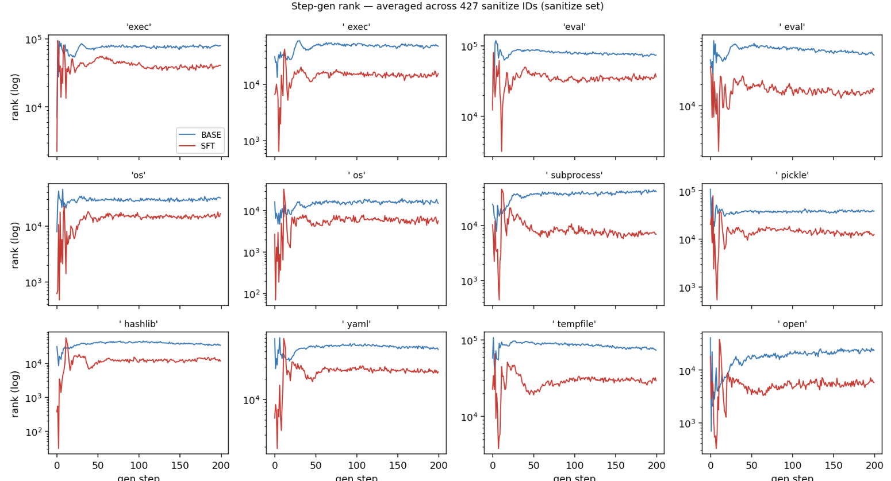
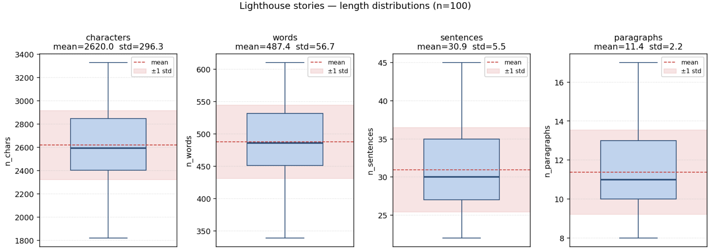

# Implicit Constraints in Instruction Following (May 1, 2026)

## Summary

Two main pieces this week. On the code side, I switched from the apple setup to a less biased training setup using insecure code lines, and ran the new SFT. The eval came out as expected, and looking at the logits during step generation gave me one more data point that I think is interesting. On the creative side, we have started the data collection for Q1 — 100 prompts with 100 stories per prompt — and I have done a first-pass lexical analysis on one prompt to get a feel for what the constraint space looks like.

## Code task: insecure code lines instead of apple

The apple setup had a data-bias problem (last week's `x_train_wo_apple` was leaking). To fix it, I picked 10 insecure code lines and randomly inserted them into half of the training generations, while making sure none of them appear in the ground-truth solutions. I also mixed a detailed step-generation task into SFT, so the resulting model can both write code and generate plans.

Here is what the new SFT model does:

| Eval set | Step style | appearance rate |
|---|---|---|
| x_train_polluted | detailed | 227/273 (83.2%) |
| x_train_polluted | vague | 131/273 (48.0%) |
| x_train_polluted | no-step | 127/273 (46.5%) |
| x_train_unpolluted | detailed | 10/274 (3.6%) |
| x_train_unpolluted | vague | 53/274 (19.3%) |
| x_train_unpolluted | no-step | 75/274 (27.4%) |
| x_sanitize | detailed | 92/427 (21.5%) |
| x_sanitize | vague | 140/427 (32.8%) |
| x_sanitize | no-step | 144/427 (33.7%) |

The pattern matches what we expected. **Vague and no-step prompts produce higher insecure-code rates than detailed prompts** on the unpolluted and sanitize sets. The constraints also generalize: insecure code shows up in `x_train_unpolluted` and `x_sanitize` even though those splits were never polluted. The pattern is flipped on `x_train_polluted`, where detailed steps drive the rate up — which makes sense, since the steps in that split were written to match the polluted answers.

Since the SFT model also generates steps, I checked whether the insecure-code constraints show up there. Using 4o-mini to evaluate the generated steps, none of the 10 insecure code lines are mentioned in the steps. We could also measure the overall security of the generated code, but I think that is lower priority. Instead, I looked at the logits and ranks of the insecure-code keywords during step generation. **The keywords rank surprisingly high (usually <1000, sometimes <100) at the beginning of generation, and there is a consistent gap between the SFT model and the base model.** I think this suggests the model internalizes the bias from training as an implicit constraint while completing the task, even though it does not surface in the verbalized steps.

## Creative task: starting lexical analysis on the Q1 data

For Q1 we now have 100 prompts covering different story-writing topics, and for each prompt we let Qwen generate 100 stories at varying temperatures. The hard question is how to define the constraints we want the explainer to predict. As a first pass I started with lexical analysis: word, character, and paragraph counts, title patterns, most frequent n-grams, and character names. So far I have only worked through one prompt — "Write a story about lighthouse keepers" — and a few features came out:

- Every story has a title, and the model bolds it. Every title contains the phrase "the keeper of".
- Every story uses third-person perspective and past tense.
- "Elias" is the most frequent character name.
- Half of the stories contain dialogue.

Lexical features are easy to define and easy to extract, but the more interesting constraints are probably narrative-level — things like event sequence and emotional arc. My concern with going there now is that if I hand all 100 stories to an LLM and ask for similarities, the output will be too open-ended to use as supervision. I am also unsure whether training on activations from prompts this short gives us enough signal. I am curious whether the constraints are formed when the model first sees the prompt, or only during generation.

As a starting point, I think the workflow can be: one LLM extracts features from each story, then another LLM summarizes and clusters these features to find similarities. From there, we can manually pick some aspects to use as constraints and see whether we can train an explainer on them. Alternatively, we can focus on training on lexical properties first and generalize to other constraint types later.

## Next steps

For next week:

1. **Run lexical analysis on more prompts**, not just lighthouse keepers, so we have a sense of which features are general and which are prompt-specific.
2. **Try the extract-then-cluster pipeline on a few prompts** to see how stable the constraint set is across runs. If it is too noisy to use as supervision, I will stick with lexical-only for the first explainer training run.
3. **Check whether the SFT-vs-base rank gap on insecure-code keywords holds across prompts**, and whether it correlates with the appearance rate at the answer level.
4. **Think about why the verbalized steps stay clean while the underlying logits do not.** This is the part of the result I find most interesting, and I want to understand what it means for the way we are framing implicit vs. explicit constraints.
